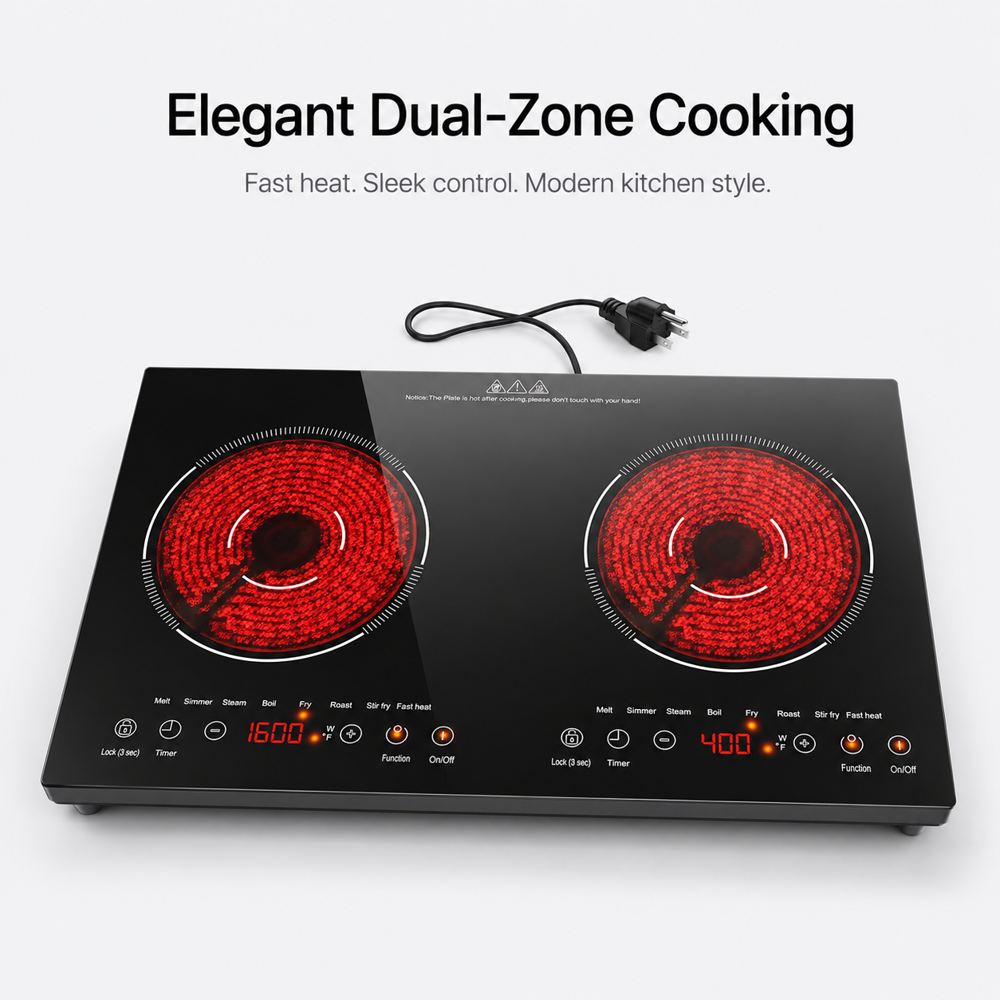
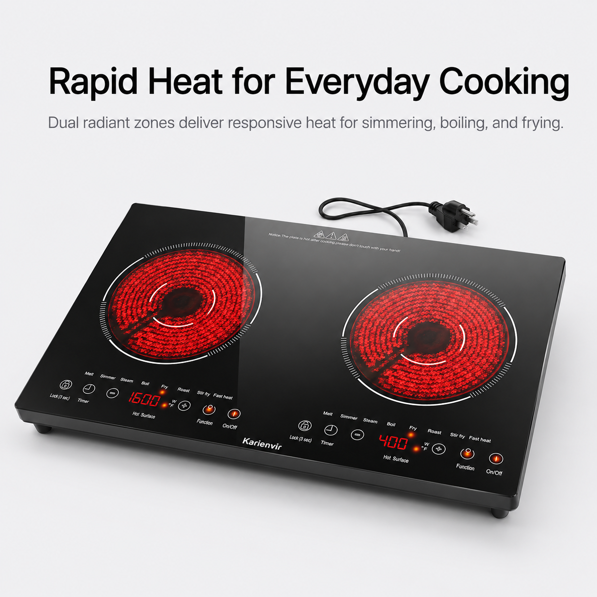
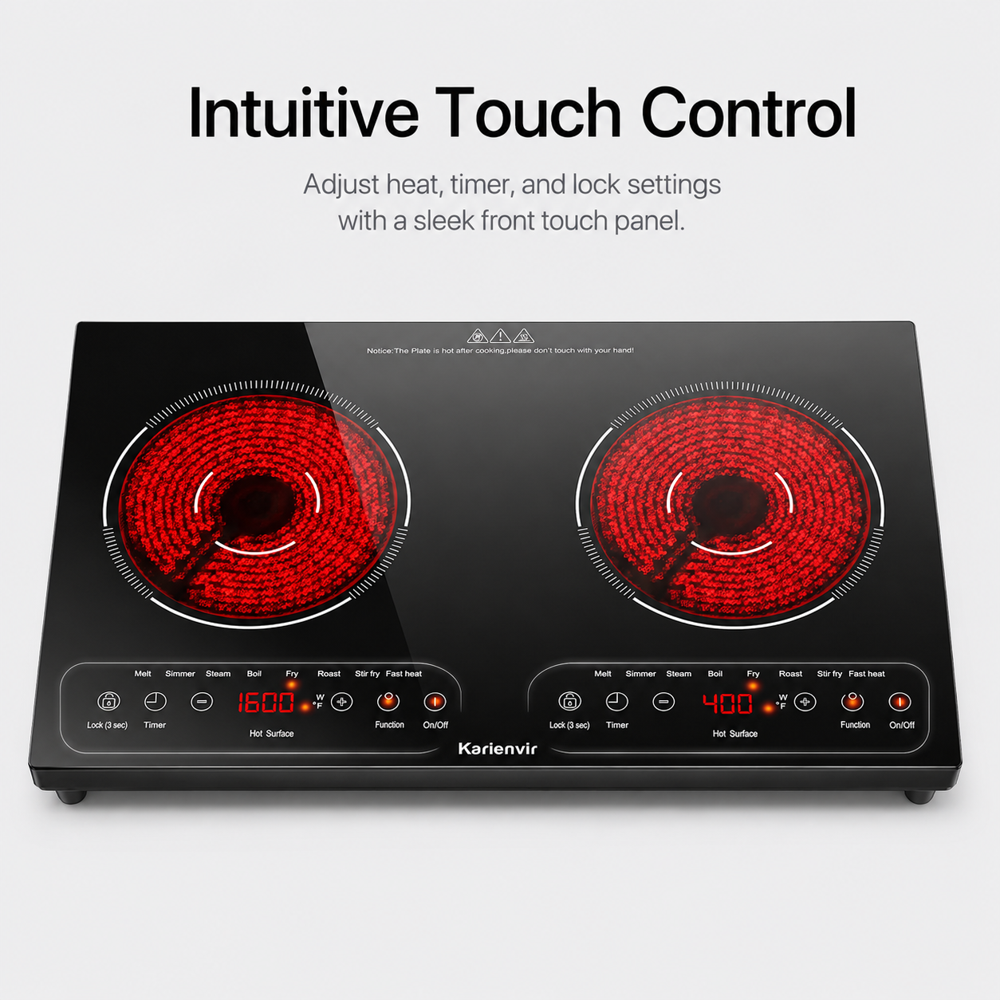
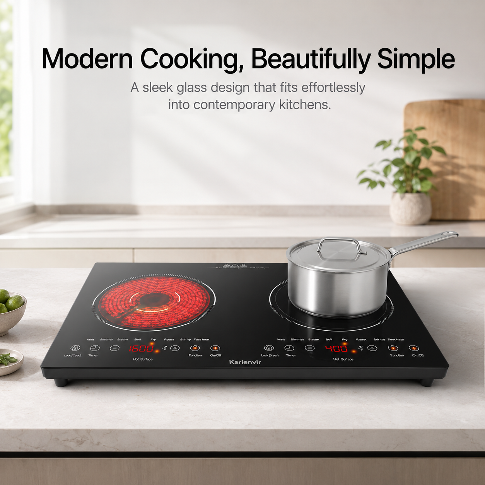
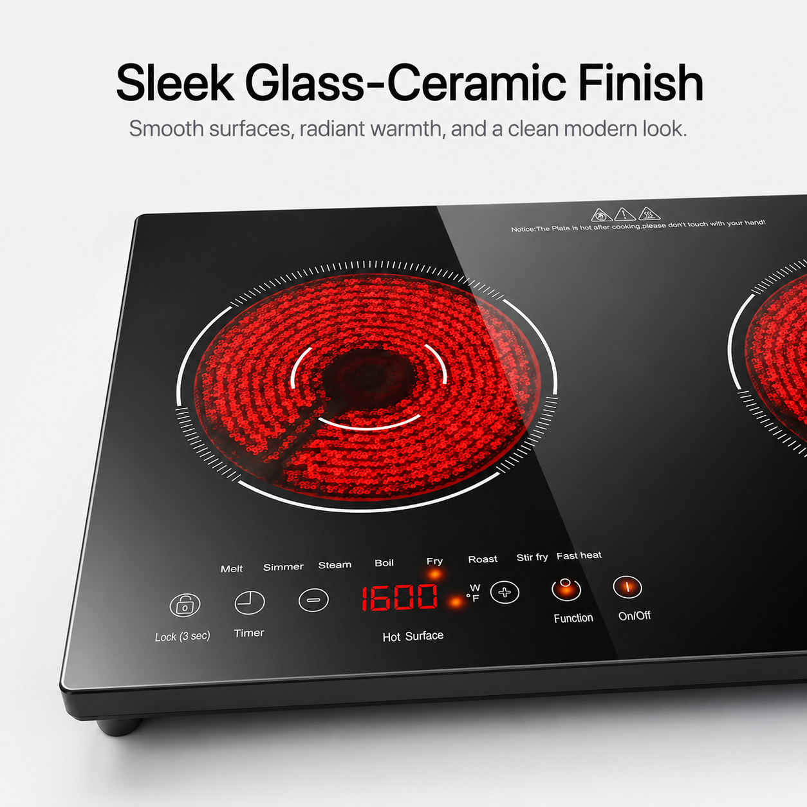
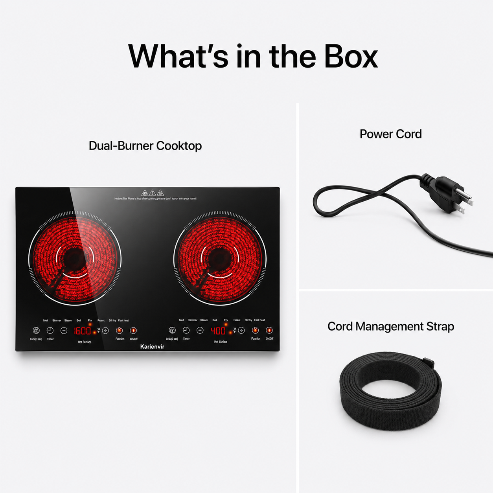

# 双灶电陶炉 Apple-inspired 极简高级电商图案例

> **Dual-Burner Cooktop · Apple-inspired Minimalist Product Image Case Study**  
> 本文档记录一个双灶电陶炉产品，从普通 Amazon 电商图思路到 Apple-inspired 极简高级电商视觉的完整案例。  
> 内容包括：风格提炼、改造逻辑、6 张生成图、逐图中文提示词、逐图英文提示词、负面提示词、新手复用流程与 GitHub 目录建议。

---

## 目录

1. [案例目标](#1-案例目标)
2. [产品与风格定位](#2-产品与风格定位)
3. [改造逻辑](#3-改造逻辑)
4. [通用风格口令](#4-通用风格口令)
5. [Case 01 · Elegant Dual-Zone Cooking](#5-case-01--elegant-dual-zone-cooking)
6. [Case 02 · Rapid Heat for Everyday Cooking](#6-case-02--rapid-heat-for-everyday-cooking)
7. [Case 03 · Intuitive Touch Control](#7-case-03--intuitive-touch-control)
8. [Case 04 · Modern Cooking, Beautifully Simple](#8-case-04--modern-cooking-beautifully-simple)
9. [Case 05 · Sleek Glass-Ceramic Finish](#9-case-05--sleek-glass-ceramic-finish)
10. [Case 06 · What's in the Box](#10-case-06--whats-in-the-box)
11. [通用负面提示词](#11-通用负面提示词)
12. [新手复用方法](#12-新手复用方法)
13. [完整操作流程](#13-完整操作流程)
14. [结果检查清单](#14-结果检查清单)
15. [GitHub 目录建议](#15-github-目录建议)
16. [开源发布注意事项](#16-开源发布注意事项)

---

# 1. 案例目标

很多 Amazon 商品副图存在类似问题：

- 信息太多；
- 小字太多；
- 表格太复杂；
- 参数堆砌；
- 促销标题过多；
- 多个圆形放大图同时出现；
- 画面像说明书；
- 产品质感不够高级。

本案例的目标不是简单“换白色背景”，而是重新设计产品视觉语言。

```text
普通 Amazon 功能图
        ↓
提取产品与核心卖点
        ↓
删除复杂参数和杂乱元素
        ↓
采用 Apple-inspired 极简视觉语言
        ↓
单图只表达一个主要卖点
        ↓
形成可复用的提示词案例
```

一句话理解：

> **旧图提供产品、卖点和场景；新风格提供构图、留白、光影和信息表达方式。**

---

# 2. 产品与风格定位

## 2.1 产品类型

**英文：**

```text
Dual-Burner Electric Cooktop
Dual-Zone Radiant Cooktop
Portable Glass-Ceramic Cooktop
```

**中文：**

```text
双灶电陶炉
双区辐射电陶炉
便携式玻璃陶瓷电炉
```

## 2.2 产品核心视觉特征

- 黑色玻璃面板；
- 超薄矩形机身；
- 两个圆形加热区；
- 红色辐射发热效果；
- 前置触控区域；
- 双区独立结构；
- 电源线和插头；
- 现代厨房家电外观。

## 2.3 风格名称

**中文名称：**

```text
苹果启发式极简高级商品图风格
```

**English Name：**

```text
Apple-inspired minimalist premium product image style
```

## 2.4 风格关键词

```text
clean light gray background
generous negative space
large product hero composition
minimal sans-serif typography
soft natural lighting
premium commercial photography
restrained feature communication
clean product page layout
realistic materials
refined reflections
calm modern visual tone
```

---

# 3. 改造逻辑

传统电商图常见结构：

```text
大标题
+ 长说明
+ 参数表
+ 多个圆形放大图
+ 功能图标
+ 多种颜色
+ 多个卖点同时出现
```

Apple-inspired 极简逻辑：

```text
一个主要产品
+ 一个主要卖点
+ 一句主标题
+ 一句副标题
+ 大面积留白
+ 柔和光线
+ 极简信息表达
```

## 3.1 保留什么

```text
产品类型
产品真实结构
核心卖点
真实使用场景
必要参数
```

## 3.2 删除什么

```text
复杂表格
大量小字
促销式大标题
多色参数块
多个圆形小窗
重复说明
不必要图标
品牌宣传徽章
低端促销感
```

## 3.3 单图单卖点

| 图片 | 核心卖点 |
|---|---|
| 01 | 双灶现代设计 |
| 02 | 快速加热 |
| 03 | 触控操作 |
| 04 | 现代厨房适配 |
| 05 | 玻璃陶瓷面板质感 |
| 06 | 包装内容物 |

---

# 4. 通用风格口令

## 4.1 中文风格口令

```text
Apple-inspired 极简高级电商产品图风格，浅灰白背景，大面积留白，产品主体突出，现代无衬线字体，黑色或深灰色标题，柔和自然光，高级商业摄影质感，真实产品材质，自然玻璃反光，克制的功能表达，单图只表达一个核心卖点，整体像高端科技品牌官网产品页。
```

## 4.2 English Style Prompt

```text
Apple-inspired minimalist premium product image style, clean light gray and white background, generous negative space, strong product hero composition, simple black or dark gray sans-serif typography, soft natural lighting, premium commercial photography, realistic materials, refined glass reflections, restrained feature communication, one clear selling point per image, calm and elegant product page layout.
```

## 4.3 推荐尺寸

```text
2048 × 2048 px
1:1 square composition
```

---

# 5. Case 01 · Elegant Dual-Zone Cooking

## 5.1 生成图



## 5.2 图片主题

```text
Elegant Dual-Zone Cooking
Fast heat. Sleek control. Modern kitchen style.
```

## 5.3 中文提示词

```text
生成一张 2048×2048 px 的 Amazon 副图，采用 Apple-inspired 极简高级电商产品图风格。

画面主体是一台现代双灶电陶炉。产品具有黑色玻璃面板、超薄矩形机身、两个圆形红色辐射加热区和前置极简触控区域。电源线自然出现在产品后方。

产品以完整正面偏俯视视角展示，放置在纯净浅灰白背景中。产品主体占据画面主要视觉区域，周围保留充足留白。

顶部只保留两行文字：

Elegant Dual-Zone Cooking

Fast heat. Sleek control. Modern kitchen style.

字体采用现代无衬线字体。主标题黑色、较大、简洁。副标题深灰色、较细。

整体视觉要求：像高端科技品牌官网产品页，浅灰白背景，大面积留白，柔和棚拍光线，高级商业摄影质感，黑色玻璃面板具有自然细腻反光，红色加热区真实、清晰但不过度发光。

不要复杂表格，不要参数堆砌，不要大量小字，不要圆形功能放大图，不要杂乱图标，不要促销横幅，不要低端海报感，不要拼图，不要说明书式排版。
```

## 5.4 English Prompt

```text
Create a 2048x2048 Amazon secondary product image in an Apple-inspired minimalist premium product style.

The hero subject is a modern dual-burner electric cooktop with a black glass panel, ultra-slim rectangular body, two circular red radiant heating zones, and a sleek front touch control area. Let the power cord appear naturally behind the product.

Show the complete cooktop from a clean front three-quarter top angle on a light gray-white studio background. Make the product the dominant visual subject and preserve generous negative space.

Top text only:

Elegant Dual-Zone Cooking

Fast heat. Sleek control. Modern kitchen style.

Use modern sans-serif typography. The main headline is large and black. The subtitle is smaller and dark gray.

Visual direction: premium technology product page, clean light gray-white background, generous negative space, soft studio lighting, premium commercial photography, realistic black glass reflections, clear but restrained red radiant heating zones.

No complex tables, no excessive parameter text, no tiny text blocks, no circular feature callouts, no cluttered icons, no promotional banner, no cheap poster look, no collage, no instruction-manual layout.
```

---

# 6. Case 02 · Rapid Heat for Everyday Cooking

## 6.1 生成图



## 6.2 图片主题

```text
Rapid Heat for Everyday Cooking
Dual radiant zones deliver responsive heat for simmering, boiling, and frying.
```

## 6.3 中文提示词

```text
生成一张 2048×2048 px 的 Amazon 副图，采用 Apple-inspired 极简高级厨房家电产品图风格。

画面主体为一台现代双灶电陶炉，黑色玻璃陶瓷面板，两个圆形红色辐射加热区同时点亮。采用轻微俯视和斜前方视角，让双灶结构、触控区域和超薄机身清晰可见。

产品放置在纯净浅灰白背景中，不需要真实厨房场景。产品占画面主要区域，保留充足留白。

顶部文字：

Rapid Heat for Everyday Cooking

Dual radiant zones deliver responsive heat for simmering, boiling, and frying.

使用简洁黑色主标题和深灰色副标题，现代无衬线字体。

突出红色辐射加热区的真实发热纹理。黑色玻璃面板反光自然，不能像塑料。整体为高级商业摄影和科技官网产品页质感。

不要复杂参数表，不要八宫格食物图，不要大量功能图标，不要促销元素，不要橙色横幅，不要拼图，不要说明书式排版。
```

## 6.4 English Prompt

```text
Create a 2048x2048 Amazon product image in an Apple-inspired minimalist premium kitchen appliance style.

Show a modern dual-burner electric cooktop with a black glass-ceramic panel and two circular red radiant heating zones glowing at the same time. Use a slight top-down front three-quarter angle so the dual-zone structure, touch controls, and ultra-slim body are clearly visible.

Place the product on a clean light gray-white studio background with no kitchen scene. Make the product the dominant hero subject and preserve generous negative space.

Top text:

Rapid Heat for Everyday Cooking

Dual radiant zones deliver responsive heat for simmering, boiling, and frying.

Use clean black headline typography and a smaller dark gray subtitle in a modern sans-serif font.

Highlight realistic radiant heating texture. The black glass surface must show refined natural reflections and must not look like plastic. Premium commercial photography and high-end product page visual quality.

No complex power charts, no food grid, no excessive feature icons, no promotional elements, no orange banner, no collage, no instruction-manual layout.
```

---

# 7. Case 03 · Intuitive Touch Control

## 7.1 生成图



## 7.2 图片主题

```text
Intuitive Touch Control
Adjust heat, timer, and lock settings with a sleek front touch panel.
```

## 7.3 中文提示词

```text
生成一张 2048×2048 px 的 Amazon 副图，采用 Apple-inspired 极简高级产品功能展示风格。

画面主体是一台双灶电陶炉，采用正面偏俯视角度。黑色玻璃面板和两个红色加热区完整显示。

重点突出产品前方的触控操作区域。触控区域整体清晰、现代、简洁，可通过柔和轮廓光或极淡的透明边框强调左右控制区，但不要使用传统放大圆圈或复杂箭头。

顶部文字：

Intuitive Touch Control

Adjust heat, timer, and lock settings with a sleek front touch panel.

使用现代无衬线字体，主标题黑色，副标题深灰色。

整体为浅灰白背景，大面积留白，产品主体居中，高级棚拍光线，真实黑色玻璃材质。

不要复杂功能表，不要说明书式箭头，不要大量小字，不要圆形放大图，不要图标堆叠，不要低端促销风。
```

## 7.4 English Prompt

```text
Create a 2048x2048 Amazon secondary image in an Apple-inspired minimalist premium feature presentation style.

Show a dual-burner electric cooktop from a clean front top angle. Display the black glass surface and both red radiant heating zones clearly.

Emphasize the front touch control area. Keep the control interface visually clean, modern, and refined. A subtle outline glow or very light translucent framing may gently emphasize the left and right control zones, but do not use traditional circular magnifiers or complex arrows.

Top text:

Intuitive Touch Control

Adjust heat, timer, and lock settings with a sleek front touch panel.

Use modern sans-serif typography, black main headline, dark gray subtitle.

Use a clean light gray-white background, generous negative space, centered product hero composition, premium studio lighting, and realistic black glass material.

No complex function table, no instruction-style arrows, no excessive small text, no circular magnifier, no icon clutter, no low-end promotional style.
```

---

# 8. Case 04 · Modern Cooking, Beautifully Simple

## 8.1 生成图



## 8.2 图片主题

```text
Modern Cooking, Beautifully Simple
A sleek glass design that fits effortlessly into contemporary kitchens.
```

## 8.3 中文提示词

```text
生成一张 2048×2048 px 的 Amazon 高级副图，采用 Apple-inspired 极简高级厨房家电生活方式风格。

画面主体是一台现代双灶电陶炉，黑色玻璃面板，超薄矩形机身，放置在现代浅灰白石材厨房台面上。

采用正面略微俯视构图。左侧加热区呈现真实克制的红色辐射发热效果。右侧炉区放置一只简洁的不锈钢锅具。

背景为现代浅色厨房，白色或暖灰墙面，浅色石材台面，柔和自然窗光。背景只允许少量极简绿植和木质砧板，不要杂乱厨房用品。

顶部文字：

Modern Cooking, Beautifully Simple

A sleek glass design that fits effortlessly into contemporary kitchens.

整体视觉高级、轻盈、安静、现代。产品与厨房环境自然融合，像高端家电官网产品页。

不要复杂参数，不要功能图标，不要圆形小图，不要多卖点堆砌，不要杂乱餐具，不要低端厨房广告风。
```

## 8.4 English Prompt

```text
Create a 2048x2048 Amazon lifestyle product image in an Apple-inspired minimalist premium kitchen appliance style.

The hero product is a modern dual-burner electric cooktop with a black glass panel and ultra-slim rectangular body, placed on a contemporary light gray-white stone kitchen countertop.

Use a clean front slightly top-down composition. Let the left heating zone show a realistic restrained red radiant glow. Place a simple stainless steel pot on the right cooking zone.

The background is a modern light-colored kitchen with a white or warm gray wall, pale stone countertop, and soft natural window light. Allow only a few minimal decorative elements such as a small green plant and wooden cutting board. Keep the kitchen uncluttered.

Top text:

Modern Cooking, Beautifully Simple

A sleek glass design that fits effortlessly into contemporary kitchens.

The overall visual should feel premium, airy, calm, and modern. Let the product blend naturally into the kitchen like a high-end appliance product page.

No complex parameters, no feature icon grid, no circular callouts, no multiple selling points, no cluttered cookware, no low-end kitchen advertising style.
```

---

# 9. Case 05 · Sleek Glass-Ceramic Finish

## 9.1 生成图



## 9.2 图片主题

```text
Sleek Glass-Ceramic Finish
Smooth surfaces, radiant warmth, and a clean modern look.
```

## 9.3 中文提示词

```text
生成一张 2048×2048 px 的 Amazon 高级产品细节副图，采用 Apple-inspired 极简高级商业摄影风格。

画面展示双灶电陶炉的局部近景特写。重点表现黑色玻璃陶瓷面板、左侧红色辐射加热区、简洁触控区域和超薄边缘结构。

采用斜前方近景构图，让玻璃面板占据画面主要区域。玻璃表面必须有自然、细腻、克制的高光和反射，表现真实玻璃陶瓷材质。

顶部文字：

Sleek Glass-Ceramic Finish

Smooth surfaces, radiant warmth, and a clean modern look.

背景为浅灰白纯净背景。使用柔和棚拍光线和高级商业摄影质感。

不要复杂说明，不要功能图标，不要表格，不要箭头，不要拼图，不要促销设计。产品材质不能像廉价塑料。
```

## 9.4 English Prompt

```text
Create a 2048x2048 Amazon detail product image in an Apple-inspired minimalist premium commercial photography style.

Show a close-up detail view of a dual-burner electric cooktop. Focus on the black glass-ceramic surface, the left red radiant heating zone, the sleek touch control area, and the ultra-slim edge structure.

Use a close front three-quarter angle so the glass surface dominates the composition. The glass must show natural, refined, restrained highlights and reflections, clearly communicating realistic glass-ceramic material.

Top text:

Sleek Glass-Ceramic Finish

Smooth surfaces, radiant warmth, and a clean modern look.

Use a clean light gray-white background, soft studio lighting, and premium commercial photography quality.

No complex explanation, no feature icon grid, no tables, no arrows, no collage, no promotional design. The product material must not look like cheap plastic.
```

---

# 10. Case 06 · What's in the Box

## 10.1 生成图



## 10.2 图片主题

```text
What's in the Box
```

## 10.3 中文提示词

```text
生成一张 2048×2048 px 的 Amazon 包装内容副图，采用 Apple-inspired 极简包装清单展示风格。

使用浅灰白纯净背景和极简分区式布局。

顶部居中主标题：

What's in the Box

左侧大区域展示一台完整双灶电陶炉，采用正面略微俯视视角。

右上区域展示黑色电源线和插头。

右下区域展示一条黑色束线带或线缆收纳带。

各区域只保留以下标签：

Dual-Burner Cooktop

Power Cord

Cord Management Strap

使用黑色现代无衬线字体。区域之间使用极细白色或浅灰分隔线。

整体像高端科技产品包装清单页，清晰、克制、干净、大面积留白。

不要复杂配件说明，不要数量图标，不要圆形小图，不要橙色标签，不要促销元素，不要杂乱拼图，不要说明书式设计。
```

## 10.4 English Prompt

```text
Create a 2048x2048 Amazon what's-in-the-box product image in an Apple-inspired minimalist packaging overview style.

Use a clean light gray-white background and a restrained sectional layout.

Centered top title:

What's in the Box

Show the complete dual-burner cooktop in a large left section from a clean front slightly top-down angle.

Show a black power cord and plug in the upper right section.

Show a black cord management strap in the lower right section.

Use only these section labels:

Dual-Burner Cooktop

Power Cord

Cord Management Strap

Use modern black sans-serif typography. Separate the sections with very thin white or light gray divider lines.

The layout should feel like a premium technology product packaging overview: clear, restrained, clean, and spacious.

No complex accessory descriptions, no quantity icons, no circular callouts, no orange labels, no promotional elements, no cluttered collage, no instruction-manual design.
```

---

# 11. 通用负面提示词

## 中文

```text
不要复杂表格，不要大量参数堆砌，不要过多小字，不要低端促销风，不要橙色促销横幅，不要廉价海报感，不要传统说明书式排版，不要大量图标堆叠，不要复杂箭头，不要圆形放大图，不要九宫格，不要 collage，不要杂乱背景，不要卡通感，不要产品结构变形，不要额外增加灶区，不要品牌 Logo，不要 Amazon Logo，不要 ASIN，不要价格，不要评论数。
```

## English

```text
no complex tables, no excessive parameter blocks, no excessive small text, no low-end promotional style, no orange promotional banner, no cheap poster look, no instruction-manual layout, no icon clutter, no complex arrows, no circular magnifier callouts, no grid collage, no collage, no cluttered background, no cartoon style, no distorted product structure, no extra cooking zones, no brand logo, no Amazon logo, no ASIN, no price, no review count
```

---

# 12. 新手复用方法

通用公式：

```text
产品结构
+ 一个核心卖点
+ 一个风格口令
+ 一个构图方向
+ 两行以内文案
+ 明确负面限制
```

## 中文模板

```text
生成一张 2048×2048 px 的 Amazon 副图，采用 Apple-inspired 极简高级电商产品图风格。

画面主体是 {{产品类型}}。

产品外观：
{{产品核心外观}}

本图只表达一个核心卖点：
{{核心卖点}}

构图方式：
{{产品主视觉角度}}

使用场景：
{{场景描述}}

顶部只保留两行文字：

{{主标题}}

{{副标题}}

使用现代无衬线字体。主标题黑色，副标题深灰色。

整体视觉采用浅灰白背景、大面积留白、柔和自然光、高级商业摄影、真实产品材质、克制的功能表达，像高端科技品牌官网产品页。

不要复杂表格，不要大量小字，不要参数堆砌，不要促销横幅，不要图标堆叠，不要圆形放大图，不要拼图，不要说明书式排版，不要产品结构失真。
```

## English Template

```text
Create a 2048x2048 Amazon secondary image in an Apple-inspired minimalist premium product image style.

The hero subject is a {{product type}}.

Product appearance:
{{product appearance}}

Express only one core selling point:
{{core selling point}}

Composition:
{{hero product angle}}

Usage scene:
{{scene description}}

Top text only:

{{headline}}

{{subtitle}}

Use modern sans-serif typography. The main headline is black and the subtitle is dark gray.

Use a clean light gray-white background, generous negative space, soft natural lighting, premium commercial photography, realistic product materials, and restrained feature communication, like a high-end technology product page.

No complex tables, no excessive small text, no parameter overload, no promotional banner, no icon clutter, no circular magnifier, no collage, no instruction-manual layout, no distorted product structure.
```

---

# 13. 完整操作流程

## Step 1：准备旧图或产品图

准备：

```text
产品主图
旧副图
A+ 图
自己已有的电商功能图
```

## Step 2：先让 AI 分析，不要直接生成

```text
请先分析这组产品图，不要生成图片。

请输出：

1. 产品是什么
2. 产品核心结构
3. 当前图片表达了哪些卖点
4. 哪些元素必须保留
5. 哪些杂乱元素应该删除
6. 如果改成 Apple-inspired 极简高级电商风格，建议拆成多少张图
7. 每张图只表达什么卖点
8. 每张图建议的英文主标题和副标题
```

## Step 3：确定风格口令

```text
Apple-inspired minimalist premium product image style
```

## Step 4：拆成单图单卖点

例如：

```text
01 外观设计
02 快速加热
03 触控操作
04 厨房场景
05 玻璃面板细节
06 包装内容
```

## Step 5：逐张写提示词

不要只写：

```text
按照苹果风格生成
```

必须明确：

```text
产品是什么
产品长什么样
本图卖点
构图
场景
标题
副标题
风格
删除项
```

## Step 6：生成

推荐：

```text
2048 × 2048 px
```

正式商用图如对文字准确性要求很高，建议：

```text
先生成无文字底图
↓
Canva / Figma / Photoshop 添加文字
```

## Step 7：检查

重点检查：

```text
产品结构
产品比例
灶区数量
文字拼写
卖点表达
背景是否干净
是否出现额外品牌
是否出现错误 Logo
是否有复杂信息
```

## Step 8：保存到 GitHub

每个案例保存：

```text
生成图
中文提示词
英文提示词
负面提示词
案例说明
结果复盘
```

---

# 14. 结果检查清单

## 产品结构

- [ ] 产品类型正确
- [ ] 产品颜色正确
- [ ] 产品比例合理
- [ ] 双灶数量正确
- [ ] 面板结构合理
- [ ] 产品没有异常变形

## 视觉风格

- [ ] 浅灰白背景
- [ ] 留白充足
- [ ] 产品主体突出
- [ ] 光线柔和
- [ ] 材质真实
- [ ] 没有低端促销感

## 文案

- [ ] 主标题拼写正确
- [ ] 副标题拼写正确
- [ ] 没有大量小字
- [ ] 单图只讲一个核心卖点

## 开源与合规

- [ ] 没有 Amazon Logo
- [ ] 没有 ASIN
- [ ] 没有价格
- [ ] 没有评论数
- [ ] 没有复制竞品官方文案
- [ ] 没有直接复制竞品版式

---

# 15. GitHub 目录建议

建议放到 `leegle-image-prompts`：

```text
cases/
└─ appliances/
   └─ dual-burner-cooktop/
      └─ apple-inspired-minimalist-product-image-style/
         ├─ README.md
         └─ assets/
            ├─ 01-elegant-dual-zone-cooking.png
            ├─ 02-rapid-heat-for-everyday-cooking.png
            ├─ 03-intuitive-touch-control.png
            ├─ 04-modern-cooking-beautifully-simple.png
            ├─ 05-sleek-glass-ceramic-finish.png
            └─ 06-whats-in-the-box.png
```

本文档可以直接作为该目录中的：

```text
README.md
```

---

# 16. 开源发布注意事项

公开仓库建议统一使用：

```text
Apple-inspired
Anker-inspired
DJI-inspired
Dyson-inspired
Sony-inspired
Bose-inspired
Samsung-inspired
```

含义是：

```text
学习和提炼视觉语言
```

不是：

```text
复制品牌官方图片
复制品牌 Logo
复制官方 UI
复制官方广告文案
复制官方版式
```

建议公开案例尽量使用：

- 自己生成的图片；
- 通用无品牌产品；
- 自己写的提示词；
- 自己写的教程；
- 自己整理的复盘。

---

# 核心公式

```text
旧产品图
↓
提取产品结构和核心卖点
↓
一个卖点拆成一张图
↓
加入 Apple-inspired 极简视觉语言
↓
控制文案和信息密度
↓
生成高级电商图
↓
保存图片 + 提示词 + 复盘
↓
沉淀为开源提示词案例
```

> **产品负责“是什么”，卖点负责“讲什么”，风格负责“怎么讲”。**
