# 18 英寸嵌入式洗碗机：从传统 Amazon 副图到 Apple-inspired 极简高级电商图

> **18-inch Built-in Slim Dishwasher · Before & After Prompt Case Study**  
> `leegle-image-prompts` 实战案例 · **v0.0.1**
>
> 本案例完整演示：  
> **如何把一套蓝色标题、信息拥挤的传统 Amazon 洗碗机副图，转换成更简洁、更高级、更适合高端电商展示的 Apple-inspired 商品视觉。**

---

## 一句话先看懂这个案例

```text
旧图 = 蓝色横幅 + 大量文字 + 多区域模块 + 彩色图标
新风格 = 暖白背景 + 大面积留白 + 黑色无衬线字体 + 单图单卖点 + 产品 Hero

旧图不是直接照抄。
旧图用来告诉 AI："这个产品是什么、功能是什么、要表达什么。"

Apple-inspired 风格口令用来告诉 AI：
"应该怎样重新组织这些信息、怎样构图、怎样打光、怎样排版。"
```

最终逻辑：

```text
上传旧图
   ↓
识别旧图核心卖点
   ↓
删除蓝色横幅 / 长说明 / 杂乱分区 / 彩色图标
   ↓
一次只保留一个主卖点
   ↓
加入 Apple-inspired 极简视觉规则
   ↓
生成新图
   ↓
检查产品结构、参数和文字
```

---

# 1. 案例产品

## 产品类型

```text
18-inch Built-in Slim Dishwasher
18 英寸嵌入式窄机身洗碗机
```

## 产品核心视觉特征

- 不锈钢拉丝面板门体
- 黑色触控控制面板
- 隐藏式顶部控制面板（嵌入式安装）
- 双层洗碗篮（上层碗碟篮 + 下层大盘篮）
- 不锈钢内胆
- 底部 kick plate（踢脚板）
- 17.6" 宽 × 32.4" 高 × 22.6" 深
- 安装所需柜体开口：最小 17.7" 宽 × 32.5" 高 × 23" 深
- 8 Place Settings（8 套餐具容量）
- 6 种洗涤程序：Heavy / Normal / ECO / Delicate / Quick / Rinse
- 5 个附加选项：Control Lock / Heated Dry / Hi Temp / Sanitize / Start
- Delay Start（延迟启动）
- 1-Hour Quick Wash（一小时快洗）
- Heated Dry（热风烘干）
- Energy Star 7.0 Certified
- NSF Certified
- LED 数字显示屏（2:30 格式剩余时间）
- 顶部和底部旋转喷水臂

---

# 2. 本案例使用的风格名称

## 中文

```text
苹果启发式极简高级电商产品图风格
```

## English

```text
Apple-inspired minimalist premium product image style
```

> 注意：这里学习的是**极简产品页视觉语言**，不是复制 Apple 的 Logo、官方图片、具体网页或受保护的品牌素材。

---

# 3. 为什么旧图需要重做

旧图并不是"没有信息"。

恰恰相反，旧图的问题通常是：

```text
蓝色主横幅过强
每个模块都有蓝色标题条
文字过多
图标过多
分区杂乱
旧图常见问题
安装图同时放了配件清单和安装步骤
尺寸标注分散混乱
认证徽章色彩过重
控制面板照片有蓝色色调
画面像说明书或低端促销页
产品不是唯一视觉主体
```

传统副图常见结构：

```text
蓝色大标题
+ 一段蓝色副标题
+ 彩色边框模块
+ 多个配件图标
+ 安装步骤小图
+ 尺寸箭头满天飞
```

Apple-inspired 改造逻辑：

```text
一个核心卖点
+ 一个主产品 / 场景
+ 一句黑色主标题
+ 一句灰色副标题
+ 最少必要参数
+ 大面积留白
+ 柔和自然光
+ 高级商业摄影
```

---

# 4. 通用 Apple-inspired 风格口令

## 中文风格口令

```text
采用 Apple-inspired 极简高级电商产品图风格。整体为暖白或米灰色背景，大面积留白，产品主体突出，画面安静、克制、现代。使用柔和自然光或高级棚拍光线，不锈钢拉丝面板具有真实细腻反光。文字使用现代无衬线字体，主标题黑色粗体，副标题灰色，排版简洁。单张图片只表达一个核心卖点，只保留必要参数，避免说明书式设计。整体像高端家电品牌官网产品页与高级商业摄影结合的视觉效果。
```

## English style prompt

```text
Use an Apple-inspired minimalist premium product image style. Create a calm, refined, modern composition with a clean warm white, beige-gray, or soft neutral background and generous negative space. Make the product the dominant visual subject. Use soft natural light or premium studio lighting, realistic brushed stainless steel reflections, clean modern sans-serif typography, black bold headlines, subtle gray subtext, restrained feature communication, and one clear selling point per image. The final result should feel like a premium appliance brand product page combined with high-end commercial product photography.
```

---

# 5. Before & After 总览

| Case | 旧图表达 | 新图表达 | 核心改造 |
|---|---|---|---|
| 01 | 安装配件清单 + 安装步骤 + 两个分区 | Installation Kit | 删除蓝色横幅，统一卡片化配件展示 |
| 02 | 8 Place Settings + 四向尺寸箭头 + 安装尺寸 inset | 8 Place Settings | 尺寸标注更克制，安装尺寸放入小卡片 |
| 03 | Energy Star 7.0 + 厨房场景 + 蓝色 NSF 大徽章 | Energy Star 7.0 Certified | 删除色调，NSF 变为简洁轮廓圆标 |
| 04 | 蓝色标题 + 控制面板特写 + 整机背景 | Digital Control Panel | 只保留控制面板特写，干净白底 |
| 05 | 蓝色标题 + 蓝色色调餐具 + 蓝色图标 | 1-Hour Quick Wash | 干净餐具 + 大理石台面，无需多余图标 |
| 06 | 蓝色标题 + 蓝色调烘干场景 | Heated Dry | 自然暖光烘干 + 优雅热流箭头可视化 |
| 07 | 蓝色标题 + 黑白内胆照片 | Stainless Steel Tub | 干净内胆正面角度 + 米白背景 |

---

# 6. Case 01 · Installation Kit

## 旧图

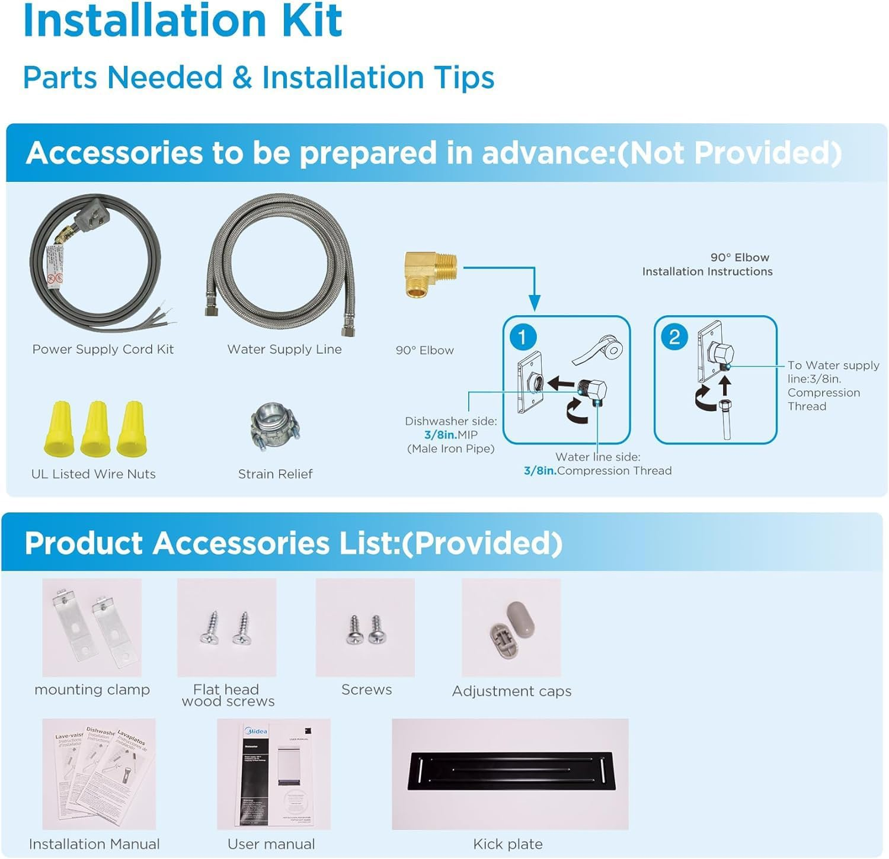

## 新图

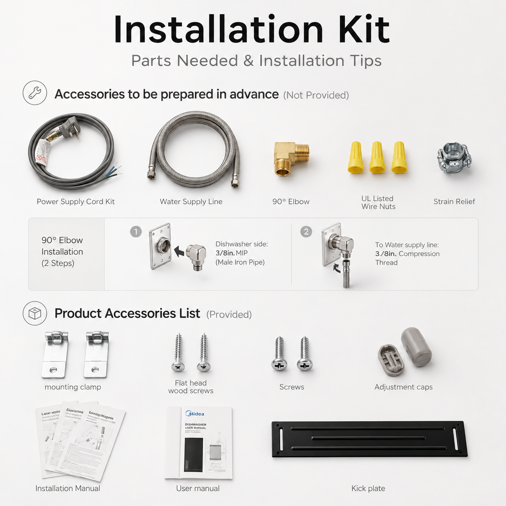

## 旧图主要问题

旧图同时出现：

- 蓝色渐变主标题条
- "Accessories to be prepared in advance (Not Provided)" 彩色边框分区
- 5 个配件大小不一、间距不均
- 安装步骤图嵌入配件区域
- "Product Accessories List (Provided)" 另一彩色边框分区
- 7 个配件分布不均
- 蓝色标题抢视觉，配件本身反而被弱化

## 新图改造逻辑

新图只回答一个问题：

> **安装这台洗碗机需要准备什么 + 随机附赠什么？**

只保留：

```text
Accessories to be prepared in advance (Not Provided)
5 个统一尺寸配件卡片

90° Elbow Installation (2 Steps)
2 步安装说明卡片

Product Accessories List (Provided)
7 个统一尺寸配件卡片
```

用圆角卡片、柔和阴影、浅米灰背景实现统一感。

## 新图优点

1. **分区清晰**  
   预置配件 / 安装说明 / 随机配件三大块一目了然。

2. **配件统一展示**  
   每个配件独立卡片，尺寸一致，拍摄角度一致。

3. **图标辅助**  
   预置用工具图标，附赠用包装盒图标，帮助快速扫读。

4. **去除促销感**  
   无蓝色横幅、无彩色边框，更像产品规格页。

5. **信息密度降低**  
   小字说明减少，重点在配件本身。

## 中文生成提示词

```text
生成一张 Amazon 副图风格的高级电商产品图片，目标尺寸 2048×2048 px，采用 Apple-inspired 极简高级电商产品图风格。

主题是 18 英寸嵌入式洗碗机的安装配件清单。

画面背景为暖白色，大面积留白，柔和自然光，现代无衬线字体，黑色标题，灰色副标题。

画面分为三个主要区域，不要使用彩色边框、蓝色横幅或波浪分隔。

第一区域，顶部左侧：
一个简洁扳手工具图标（圆形轮廓），旁边黑色粗体文字：

Installation Kit
Parts Needed & Installation Tips

第二区域，"Accessories to be prepared in advance"（Not Provided）部分：
在暖白半透明圆角卡片中，以统一的产品摄影风格展示 5 个配件，每个配件独立：

- Power Supply Cord Kit（带插头的电源线缆）
- Water Supply Line（不锈钢编织进水管）
- 90° Elbow（黄铜 90 度弯头）
- UL Listed Wire Nuts（黄色电线连接器，3 个一组）
- Strain Relief（银色应力消除接头）

每个配件下方使用黑色现代无衬线字体标注英文名。

同时在左下角，放入一个浅灰边框的小卡片，展示两步安装说明：

90° Elbow Installation (2 Steps)
Step 1: Dishwasher side 3/8in. MIP (Male Iron Pipe)
Step 2: To Water supply line 3/8in. Compression Thread

步骤图使用极简线条示意图，不要真实照片。

第三区域，"Product Accessories List"（Provided）部分：
在暖白半透明圆角卡片中，以统一的产品摄影风格展示 7 个附赠配件：

- mounting clamp × 2
- flat head wood screws × 2
- screws × 4
- adjustment caps × 2
- Installation Manual（纸质手册）
- User Manual（纸质手册）
- Kick plate（黑色踢脚板）

整体排版对称、克制、高级。不要蓝色横幅，不要彩色边框，不要杂乱布局，不要长段说明，不要低端促销风。
```

## English prompt

```text
Create a premium Amazon secondary image, targeting a 2048x2048 square composition, in an Apple-inspired minimalist premium product image style.

The theme is the installation kit for an 18-inch built-in slim dishwasher.

Use a warm white background, generous negative space, soft natural light, clean modern sans-serif typography, black bold headlines, and gray subtitles. Do not use colored borders, blue banners, or wave separators.

The image has three main content areas:

Area 1, top left:
A simple wrench tool icon in a circle outline, next to bold black text:

Installation Kit
Parts Needed & Installation Tips

Area 2, "Accessories to be prepared in advance (Not Provided)":
In a warm white translucent rounded card, show 5 accessories with consistent product photography angles:

- Power Supply Cord Kit (power cord with plug)
- Water Supply Line (stainless steel braided hose)
- 90° Elbow (brass 90-degree pipe fitting)
- UL Listed Wire Nuts (yellow wire connectors, set of 3)
- Strain Relief (silver strain relief connector)

Label each accessory with clean black modern sans-serif text below.

Also in the lower-left, place a light gray bordered card showing two installation steps using minimal line-art diagrams:

90° Elbow Installation (2 Steps)
Step 1: Dishwasher side 3/8in. MIP (Male Iron Pipe)
Step 2: To Water supply line 3/8in. Compression Thread

Area 3, "Product Accessories List (Provided)":
In a warm white translucent rounded card, show 7 included accessories with consistent product photography:

- mounting clamp × 2
- flat head wood screws × 2
- screws × 4
- adjustment caps × 2
- Installation Manual (paper manual)
- User Manual (paper manual)
- Kick plate (black kick plate)

The overall layout should feel symmetrical, restrained, and premium. No blue banners, no colored borders, no cluttered layout, no long paragraphs, no cheap promotional style.
```

---

# 7. Case 02 · 8 Place Settings

## 旧图

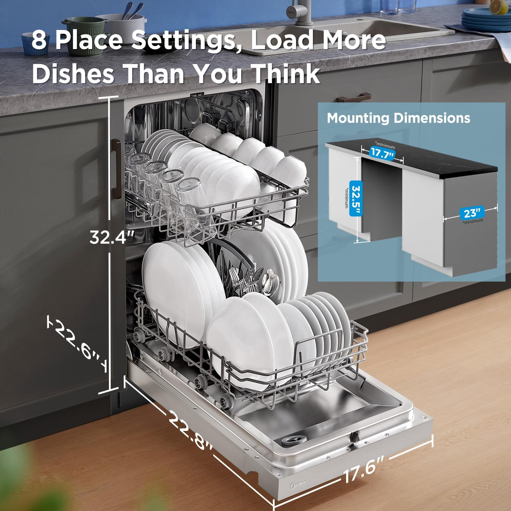

## 新图

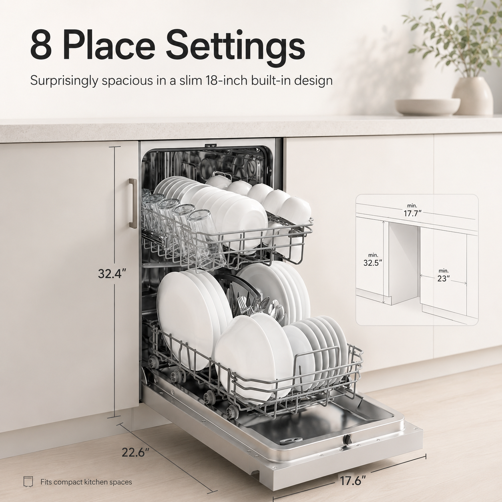

## 旧图主要问题

旧图同时出现：

- 蓝色大标题 + 副标题
- 洗碗机开放式构图但视角略显杂乱
- 四个尺寸箭头分散在不同位置（32.4" 左 + 22.6" 左下 + 22.8" 右下 + 17.6" 前）
- 右上角安装尺寸 inset 框（蓝色边框 + 蓝色数值高亮）
- 整体色调偏蓝

## 新图改造逻辑

新图只表达：

```text
8 Place Settings
Surprisingly spacious in a slim 18-inch built-in design
```

尺寸标注只保留三处必要值，安装尺寸放入右下角圆角卡片。

## 新图优点

- 主标题黑色粗体，一眼看到 "8 Place Settings"
- 开放式洗碗机展示内部容量，视觉证据充分
- 尺寸标注克制，只标核心长宽高
- 安装尺寸卡片独立，不抢主视觉
- 整体色调温暖，接近真实厨房

## 中文生成提示词

```text
生成一张 2048×2048 px 的 Amazon 副图，采用 Apple-inspired 极简高级电商产品图风格。

主题是 18 英寸嵌入式洗碗机的 8 套餐具容量展示。

画面主体是一台不锈钢面板的洗碗机，门打开，双层碗篮中整齐摆放白色餐具（碗、盘、杯、刀叉）。产品嵌入浅灰白色橱柜中，橱柜台面为浅色石材。拍摄角度为正面略微俯视，能清晰看到内部碗篮布局和餐具。

顶部左侧黑色粗体大标题：

8 Place Settings

下方灰色副标题：

Surprisingly spacious in a slim 18-inch built-in design

使用非常细的黑色尺寸标尺标注：
- 左侧：32.4"（产品高度）
- 左下前方：22.6"（产品深度）
- 右下前方：17.6"（产品宽度）

右下角使用浅灰边框圆角卡片显示最小安装开口尺寸：
min. 17.7"（宽）
min. 32.5"（高）
min. 23"（深）

左下角放置一个小图标（方框内含对勾），旁边文字：

Fits compact kitchen spaces

背景为暖白墙面，柔和自然光从左侧窗户照入，有真实光影。橱柜使用浅色木纹色调。整体高级、克制、安静。

不要蓝色标题条，不要蓝色色调，不要彩色边框，不要长段说明，不要多个杂乱尺寸箭头，不要促销风。
```

## English prompt

```text
Create a 2048x2048 Amazon secondary image in an Apple-inspired minimalist premium product image style.

The theme is 8 place settings capacity for an 18-inch built-in slim dishwasher.

The hero product is a stainless steel dishwasher with its door open, showing two racks filled with neatly arranged white dinnerware (bowls, plates, cups, utensils). The dishwasher is installed into light gray-white cabinetry with a light stone countertop. Use a clean frontal view with slight elevation that clearly shows the interior rack layout and dish arrangement.

Top left bold black headline:

8 Place Settings

Below it, gray subtitle:

Surprisingly spacious in a slim 18-inch built-in design

Use very thin black dimension lines to show:
- Left side: 32.4" (product height)
- Lower-left front: 22.6" (product depth)
- Lower-right front: 17.6" (product width)

In the lower-right corner, place a light gray bordered rounded card showing minimum cabinet opening dimensions:
min. 17.7" (width)
min. 32.5" (height)
min. 23" (depth)

In the lower-left corner, place a small icon (box with checkmark) next to the text:

Fits compact kitchen spaces

Use a warm white wall background, soft natural light from a left-side window with realistic shadows. Cabinets use a light wood-tone color. Keep the overall feel premium, restrained, and calm.

No blue title bars, no blue color tint, no colored borders, no long paragraphs, no cluttered dimension arrows, no promotional style.
```

---

# 8. Case 03 · Energy Star 7.0 Certified

## 旧图

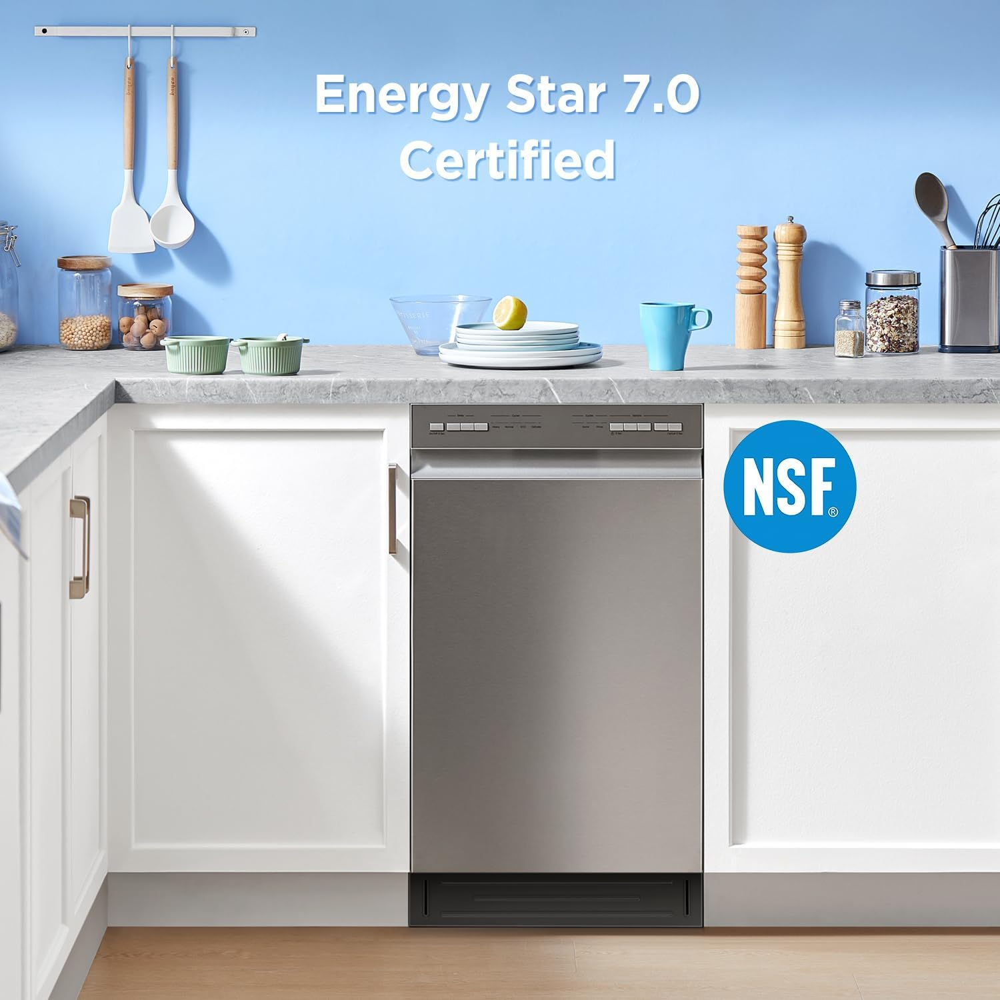

## 新图

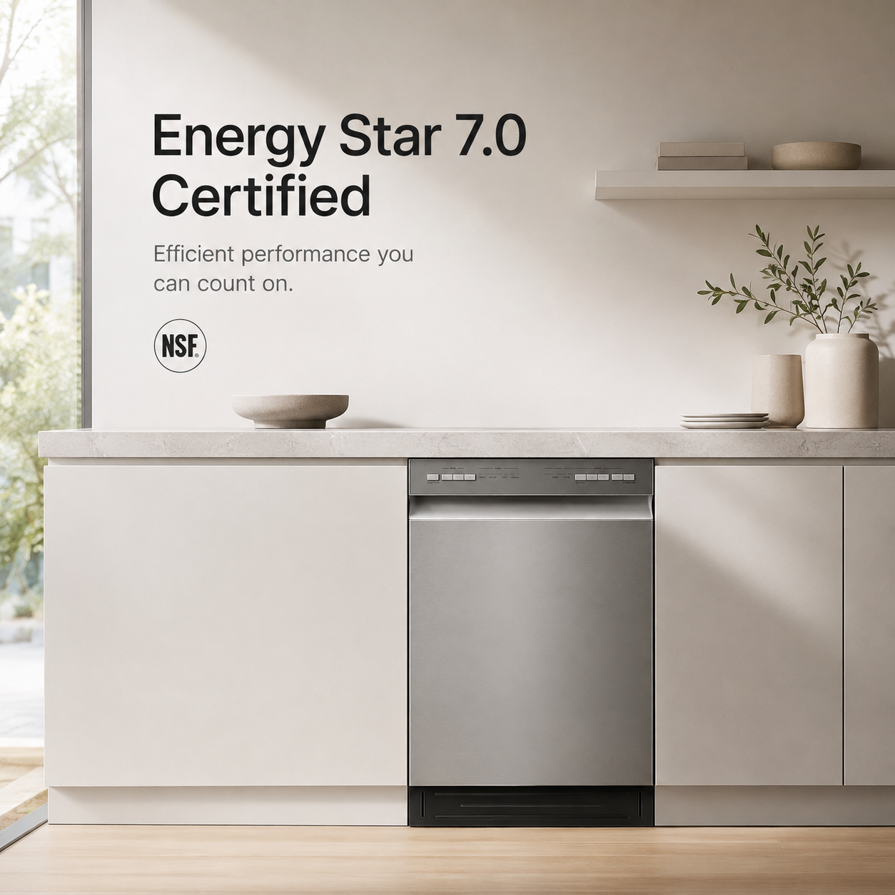

## 旧图主要问题

旧图同时出现：

- 蓝色大标题 "Energy Star 7.0 Certified"
- 厨房场景偏蓝色色调
- 彩色厨房用具（绿色容器、黄色柠檬、蓝色杯子）过多
- 右侧 NSF 大徽章为实心蓝色圆形
- 产品整机被厨房杂物抢视觉

## 新图改造逻辑

新图把主卖点固定为：

```text
Energy Star 7.0 Certified
Efficient performance you can count on.
```

认证徽章简化，厨房场景更干净。

## 新图优点

- 主标题黑色粗体，认证信息一目了然
- 厨房场景更真实、更高级，减少杂色
- NSF 变为简洁轮廓圆标，不喧宾夺主
- 自然光从左侧窗户照入，光影自然
- 产品整机成为场景中心

## 中文生成提示词

```text
生成一张 2048×2048 px 的 Amazon 副图，采用 Apple-inspired 极简高级电商产品图风格。

主题是洗碗机的能效认证展示。

画面主体是一台不锈钢面板的嵌入式洗碗机，嵌入浅灰白色橱柜中。产品正面居中展示，控制面板可见但不要过度放大。

厨房场景为明亮现代浅色厨房，有大窗户引入柔和自然光。橱柜为浅灰白色调，台面为浅色石材。台面上只放置少量极简摆件：一个米白色碗、一个浅灰色托盘、叠放的白色盘子。背景墙上方有一个白色极简搁架，上面放一个米色花瓶和一个浅灰色盒子。

顶部左侧黑色粗体大标题：

Energy Star 7.0 Certified

下方灰色副标题：

Efficient performance you can count on.

左下角放一个简洁的圆形轮廓徽章（非实心填充），里面文字：

NSF

整体色调为暖白、浅灰、米白。柔和自然光，真实光影。不锈钢面板有真实细腻反光。

不要蓝色标题条，不要蓝色色调，不要彩色厨房用具，不要实心蓝色徽章，不要杂乱背景，不要促销风。
```

## English prompt

```text
Create a 2048x2048 Amazon secondary image in an Apple-inspired minimalist premium product image style.

The theme is energy efficiency certification for a dishwasher.

The hero product is a stainless steel built-in dishwasher installed into light gray-white cabinetry. Show the front of the product centered, with the control panel visible but not overly emphasized.

The kitchen scene is a bright modern light kitchen with a large window bringing in soft natural light. Cabinets are light gray-white, countertop is light stone. Place only a few minimal items on the counter: an off-white bowl, a light gray tray, and a stack of white plates. Above the counter on the background wall, there is a minimal white floating shelf with a beige vase and a light gray box.

Top left bold black headline:

Energy Star 7.0 Certified

Below it, gray subtitle:

Efficient performance you can count on.

In the lower-left, place a simple outlined circle badge (not filled solid) with the text:

NSF

Overall palette: warm white, light gray, off-white. Soft natural light, realistic shadows. Realistic brushed stainless steel reflections on the product door.

No blue title bars, no blue color tint, no colorful kitchen items, no solid blue badges, no cluttered background, no promotional style.
```

---

# 9. Case 04 · Digital Control Panel

## 旧图

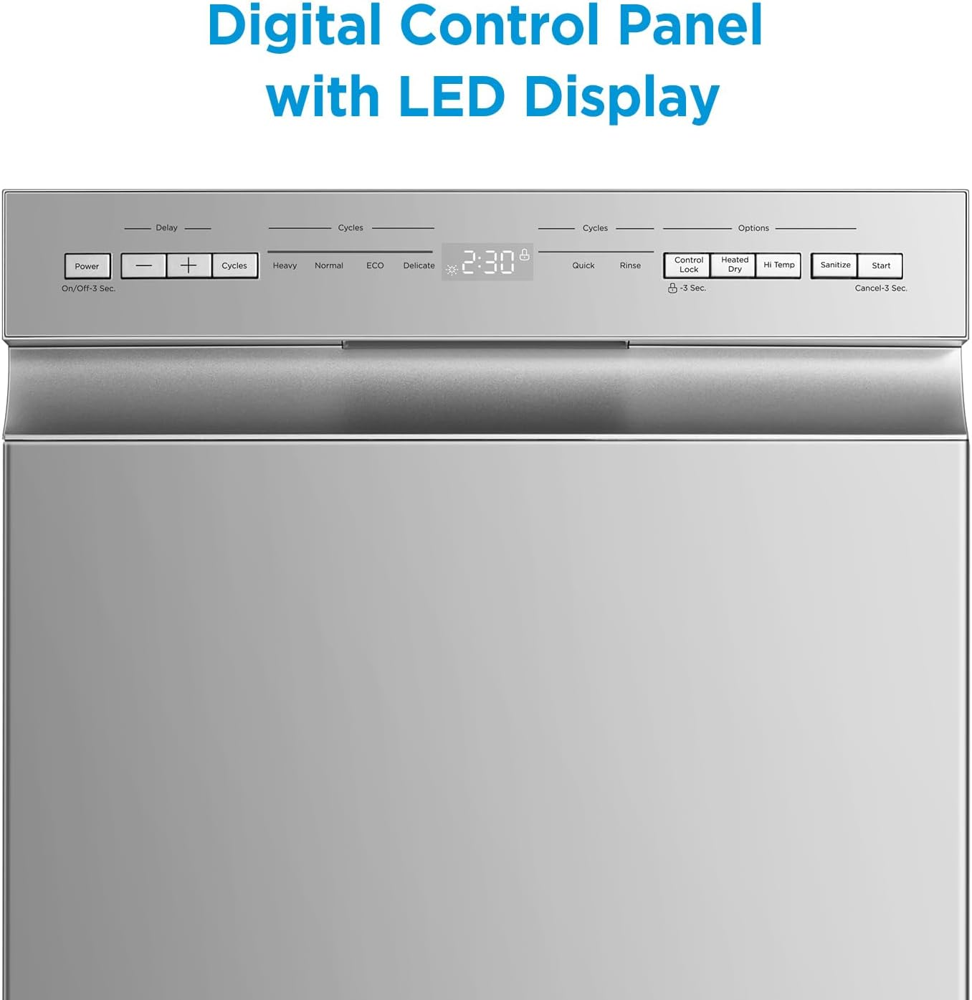

## 新图

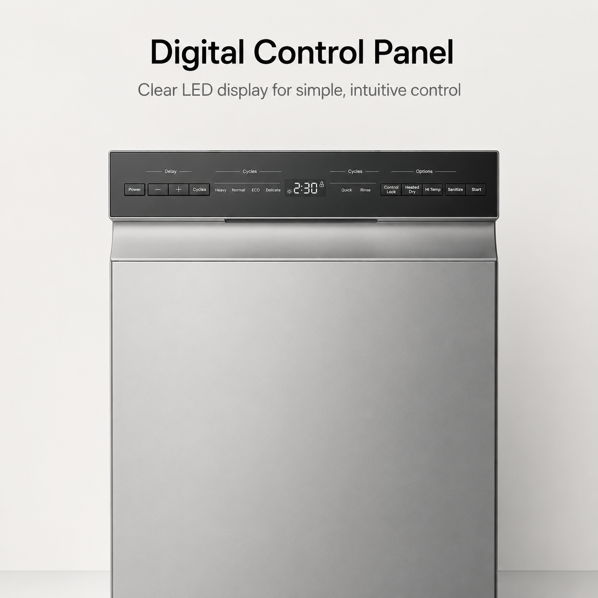

## 旧图主要问题

旧图同时出现：

- 蓝色大标题 "Digital Control Panel with LED Display"
- 控制面板特写 + 整机门体下半部分
- 按钮照片有蓝色色调
- 按钮文字全部可见但过于密集

## 新图改造逻辑

新图只保留：

```text
Digital Control Panel
Clear LED display for simple, intuitive control
```

只展示控制面板特写，背景干净。

## 新图优点

- 控制面板成为唯一视觉主体
- 白底突出黑色控制面板
- 按钮排列清晰，一目了然
- 没有多余的产品下半部分
- 黑色控制面板与白色背景形成高级对比

## 中文生成提示词

```text
生成一张 2048×2048 px 的 Amazon 副图，采用 Apple-inspired 极简高级电商产品图风格。

主题是洗碗机的数字控制面板展示。

画面仅展示洗碗机的黑色数字控制面板特写，背景为纯净浅灰色。不要展示产品门体、柜体或其他部分。

控制面板横向居中，按钮布局真实还原：

左侧：
- Power 按钮（On/Off 3 Sec）
- 减号 / 加号
- Cycles 按钮
- Delay 区域（-  + ）
- LED 数字显示屏（显示 2:30，右下角有一个图标）

中间：
- Cycles 文字下方列出 4 个程序名：Heavy Normal ECO Delicate
- 下一行列出 2 个快速程序：Quick Rinse
- 右侧：Control Lock（3 Sec）、Heated Dry、Hi Temp、Sanitize、Start（Cancel 3 Sec）

控制面板边框为银色不锈钢拉丝质感。

顶部黑色粗体大标题：

Digital Control Panel

下方灰色副标题：

Clear LED display for simple, intuitive control

整体背景为纯净浅灰色或暖白色，大面积留白，柔和均匀的棚拍光线。控制面板细节清晰，按钮质感真实。

不要蓝色标题条，不要蓝色色调，不要展示产品门体，不要杂乱背景，不要长段说明，不要促销风。
```

## English prompt

```text
Create a 2048x2048 Amazon secondary image in an Apple-inspired minimalist premium product image style.

The theme is a dishwasher digital control panel display.

Show only a close-up of the black digital control panel of a dishwasher, centered horizontally on a clean light gray background. Do not show the product door, cabinet, or any other parts.

The control panel button layout should be realistic:

Left side:
- Power button (On/Off 3 Sec)
- minus / plus
- Cycles button
- Delay area ( -  + )
- LED digital display (showing 2:30 with a small icon in the lower right)

Center:
- Under Cycles text, list 4 program names: Heavy Normal ECO Delicate
- Next row, list 2 quick programs: Quick Rinse
- Right side: Control Lock (3 Sec), Heated Dry, Hi Temp, Sanitize, Start (Cancel 3 Sec)

The control panel border has a brushed silver stainless steel texture.

Top bold black headline:

Digital Control Panel

Below it, gray subtitle:

Clear LED display for simple, intuitive control

Overall background: clean light gray or warm white, generous negative space, soft even studio lighting. Control panel details are sharp, button textures are realistic.

No blue title bars, no blue color tint, no product body shown, no cluttered background, no long paragraphs, no promotional style.
```

---

# 10. Case 05 · 1-Hour Quick Wash

## 旧图

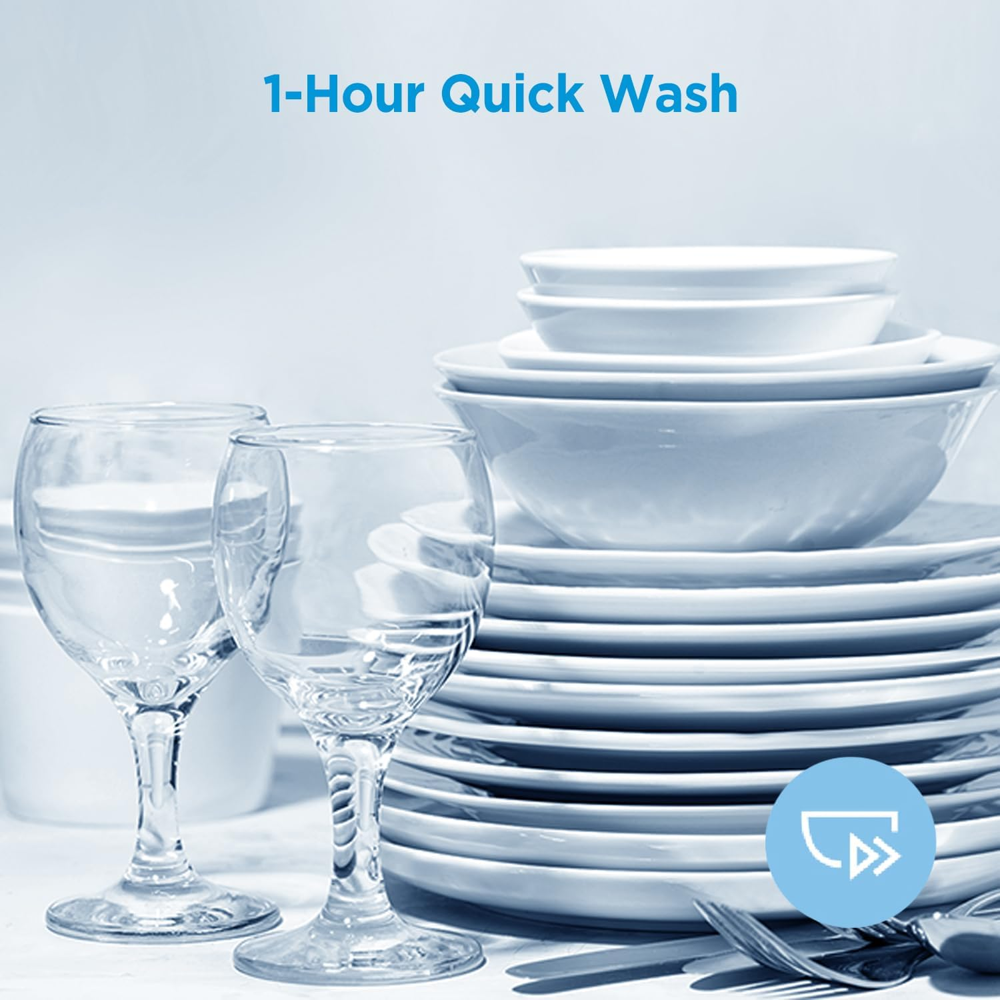

## 新图

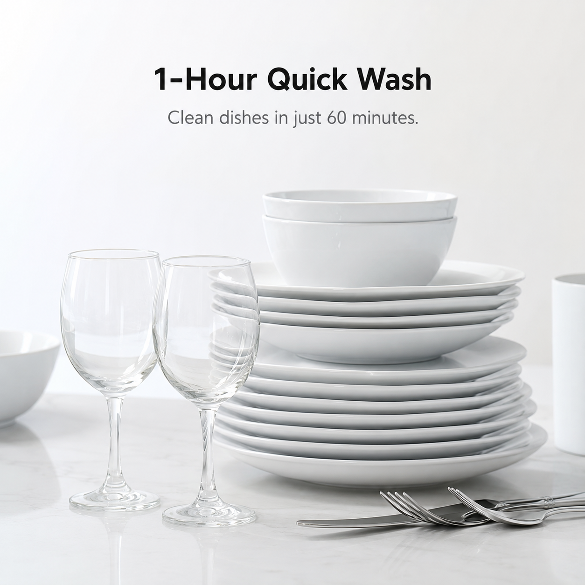

## 旧图主要问题

旧图同时出现：

- 蓝色大标题 "1-Hour Quick Wash"
- 餐具照片偏蓝色色调
- 右下角蓝色圆形播放图标
- 背景偏蓝，整体像旧照片

## 新图改造逻辑

新图只表达：

```text
1-Hour Quick Wash
Clean dishes in just 60 minutes.
```

用干净的白色餐具 + 大理石台面展示"干净"的结果。

## 新图优点

- 白色餐具本身就是卖点的视觉证据
- 大理石台面提升质感
- 没有多余图标，干净即正义
- 标题简洁有力

## 中文生成提示词

```text
生成一张 2048×2048 px 的 Amazon 副图，采用 Apple-inspired 极简高级电商产品图风格。

主题是洗碗机的 1 小时快洗功能。

画面主体是干净光亮的白色餐具，自然摆放在白色大理石台面上。具体包括：
- 前景两个透明玻璃酒杯（高脚杯）
- 一叠白色餐盘（5-6 个）
- 一个白色汤碗
- 一个白色方碗在叠盘后方
- 银色刀叉在餐盘旁边

餐具摆放自然、错落有致，像刚从洗碗机取出。表面有轻微自然反光和光泽。

顶部左侧黑色粗体大标题：

1-Hour Quick Wash

下方灰色副标题：

Clean dishes in just 60 minutes.

背景为纯净的暖白色，柔和自然光。大理石台面纹理细腻真实。餐具表面有自然光斑。

不要蓝色标题条，不要蓝色色调，不要播放图标，不要杂乱背景，不要促销风。
```

## English prompt

```text
Create a 2048x2048 Amazon secondary image in an Apple-inspired minimalist premium product image style.

The theme is 1-hour quick wash functionality for a dishwasher.

The hero subject is clean, shiny white dinnerware naturally arranged on a white marble countertop:
- Two clear glass wine glasses in the foreground
- A stack of white dinner plates (5-6 pieces)
- One white soup bowl
- One white square bowl behind the plate stack
- Silver forks and knives beside the plates

The arrangement should look natural and casually placed, as if just removed from the dishwasher. Include subtle natural reflections and shine on the clean surfaces.

Top left bold black headline:

1-Hour Quick Wash

Below it, gray subtitle:

Clean dishes in just 60 minutes.

Background is pure warm white, soft natural lighting. Marble countertop has delicate realistic veining. Natural light spots on dish surfaces.

No blue title bars, no blue color tint, no play button icon, no cluttered background, no promotional style.
```

---

# 11. Case 06 · Heated Dry

## 旧图

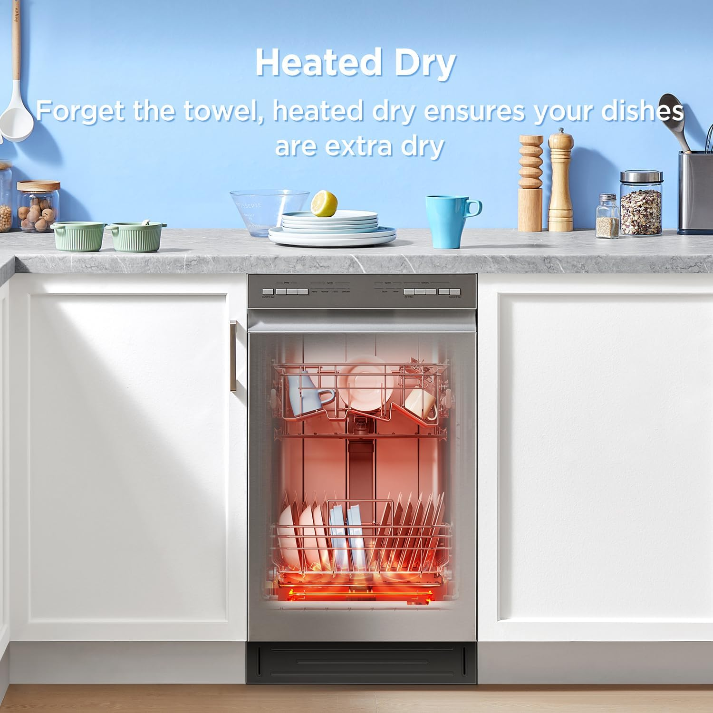

## 新图

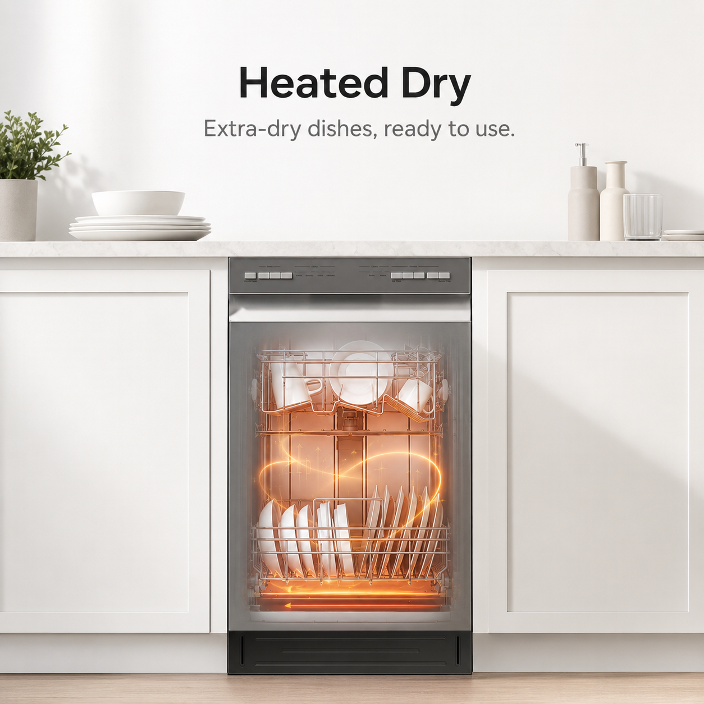

## 旧图主要问题

旧图同时出现：

- 蓝色大标题 "Heated Dry"
- 蓝色副标题 "Forget the towel..."
- 洗碗机内部蓝橙色对比过强
- 内部烘干效果看起来过于炽热
- 厨房场景偏蓝

## 新图改造逻辑

新图把主卖点固定为：

```text
Heated Dry
Extra-dry dishes, ready to use.
```

用优雅的热流箭头可视化替代直接炽热的橙光。

## 新图优点

- 热流箭头可视化让烘干过程更清晰
- 暖橙色光更温和，不刺眼
- 周围场景干净，突出产品内部
- 副标题更简洁

## 中文生成提示词

```text
生成一张 2048×2048 px 的 Amazon 副图，采用 Apple-inspired 极简高级电商产品图风格。

主题是洗碗机的热风烘干功能。

画面主体是一台嵌入式洗碗机，门关闭，黑色控制面板可见。洗碗机嵌入浅灰白色橱柜中。

通过半透明效果展示洗碗机内部：双层碗篮中有白色餐具，底部有温和的暖橙色加热光。使用优雅的热流可视化箭头（向上流动的细线条 + 轻微暖光），表现热风循环烘干效果。箭头为细曲线或直线，颜色为柔和的暖橙色。

厨房场景简洁：橱柜两侧只有极少量极简摆件（一个米色花瓶、几本书），背景为暖白墙面。柔和自然光从窗户照入。

顶部左侧黑色粗体大标题：

Heated Dry

下方灰色副标题：

Extra-dry dishes, ready to use.

整体色调为暖白、浅灰、米白、柔和暖橙。高级商业摄影质感。

不要蓝色标题条，不要蓝色色调，不要过度炽热的橙光，不要杂乱厨房，不要促销风。
```

## English prompt

```text
Create a 2048x2048 Amazon secondary image in an Apple-inspired minimalist premium product image style.

The theme is heated dry functionality for a dishwasher.

The hero product is a built-in dishwasher with its door closed, black control panel visible, installed into light gray-white cabinetry.

Use a semi-transparent effect to show inside the dishwasher: two racks with white dinnerware, and a gentle warm orange heating glow at the bottom. Visualize the hot air circulation using elegant thin flowing arrows (curved or straight lines) in soft warm orange, showing upward-flowing heat.

The kitchen scene is minimal: only a few tiny simple items on the cabinets (a beige vase, a couple books). Background is warm white wall. Soft natural light from a window.

Top left bold black headline:

Heated Dry

Below it, gray subtitle:

Extra-dry dishes, ready to use.

Overall palette: warm white, light gray, off-white, soft warm orange. Premium commercial photography quality.

No blue title bars, no blue color tint, no overly intense orange glow, no cluttered kitchen, no promotional style.
```

---

# 12. Case 07 · Stainless Steel Tub

## 旧图

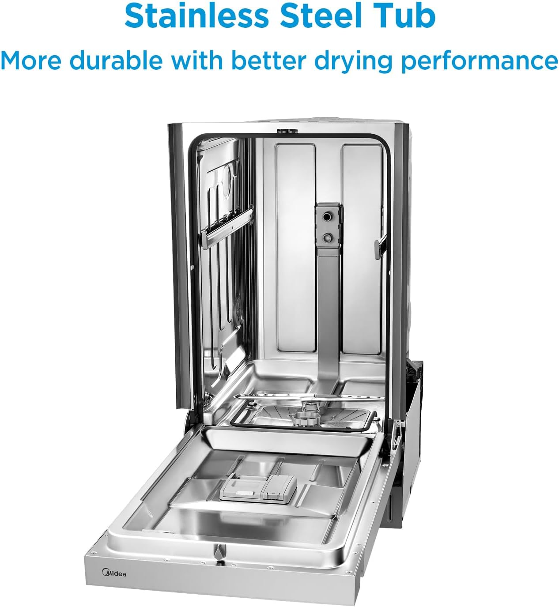

## 新图

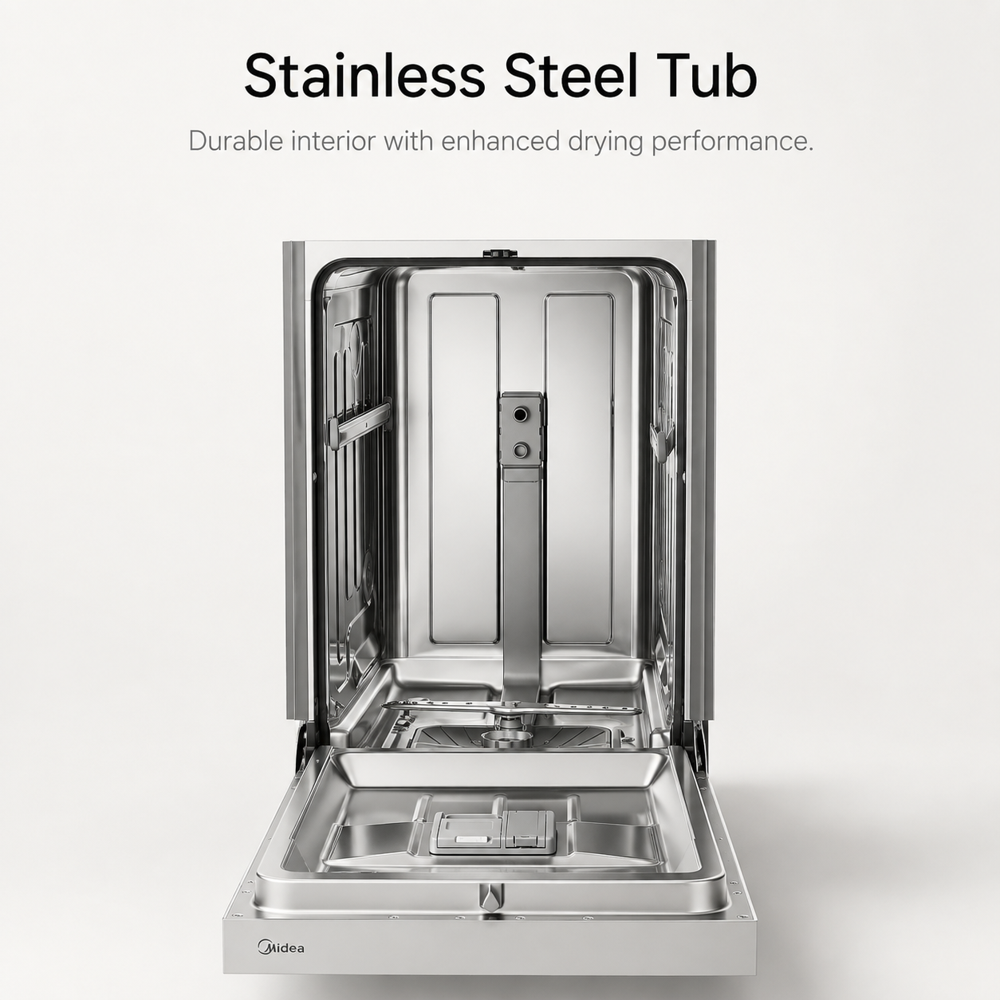

## 旧图主要问题

旧图同时出现：

- 蓝色大标题 "Stainless Steel Tub"
- 黑白照片（去饱和处理）
- 洗碗机门体完全打开，视角偏俯视
- 内部结构显得杂乱（水管、喷嘴、滤网全部可见）

## 新图改造逻辑

新图只表达：

```text
Stainless Steel Tub
Durable interior with enhanced drying performance.
```

用正面角度展示内胆内部的整洁和质感。

## 新图优点

- 正面角度更像产品规格页
- 不锈钢内胆反光真实细腻
- 内部结构更清晰
- 黑色面板和不锈钢内胆的对比明显
- 整体色调统一

## 中文生成提示词

```text
生成一张 2048×2048 px 的 Amazon 副图，采用 Apple-inspired 极简高级电商产品图风格。

主题是洗碗机的不锈钢内胆展示。

画面主体是一台洗碗机的正面内胆视角，门体向下打开但不占据画面主要部分。拍摄角度为正面略微俯视，能清晰看到：
- 顶部黑色控制面板区域
- 不锈钢内胆的四壁和底部
- 顶部旋转喷水臂
- 底部旋转喷水臂
- 双层碗篮的侧面结构
- 底部过滤网和排水口

不锈钢内胆有真实细腻的拉丝反光和柔和光影。内部结构完整但不显杂乱。

顶部黑色粗体大标题：

Stainless Steel Tub

下方灰色副标题：

Durable interior with enhanced drying performance.

背景为纯净的暖白色，大面积留白，柔和均匀的棚拍光线。

不要蓝色标题条，不要黑白/去饱和处理，不要俯视过度的视角，不要杂乱背景，不要促销风。
```

## English prompt

```text
Create a 2048x2048 Amazon secondary image in an Apple-inspired minimalist premium product image style.

The theme is stainless steel interior tub display for a dishwasher.

Show the inside of a dishwasher from a frontal slightly elevated angle, with the door lowered but not dominating the composition. Clearly show:
- Top black control panel area
- Stainless steel interior walls and bottom
- Top rotating spray arm
- Bottom rotating spray arm
- Side structure of the two dish racks
- Bottom filter and drain area

The stainless steel interior should have realistic brushed metal reflections and soft light play. Interior structure is complete but not cluttered.

Top bold black headline:

Stainless Steel Tub

Below it, gray subtitle:

Durable interior with enhanced drying performance.

Background is pure warm white, generous negative space, soft even studio lighting.

No blue title bars, no black-and-white/desaturated treatment, no overly top-down angle, no cluttered background, no promotional style.
```

---

# 13. 七张旧图与新图的整体区别

## 13.1 标题条

### 旧图

```text
每张图都有蓝色大标题条 + 蓝色副标题
蓝色成为第一视觉，产品反而弱
```

### 新图

```text
黑色粗体主标题 + 灰色副标题
文字是信息，不是装饰
产品是视觉主体
```

---

## 13.2 色彩

### 旧图

```text
蓝色标题
彩色厨房用具
蓝色色调照片
实心蓝色徽章
```

### 新图

```text
暖白
米白
浅灰
黑色（文字）
柔和暖橙（加热光）
不锈钢银
```

---

## 13.3 构图

### 旧图

```text
大横幅
彩色边框分区
多个杂乱尺寸箭头
彩色图标
蓝色调产品照片
```

### 新图

```text
大面积留白
产品 Hero
简洁圆角卡片
统一尺寸标尺
真实暖光产品照
```

---

## 13.4 文字层级

### 旧图

```text
蓝色大标题
蓝色副标题
大量说明
小字参数
彩色标签
```

### 新图

```text
黑色粗体主标题
灰色副标题
必要数字
极简图标辅助
```

---

# 14. 新图最明显的 8 个优点

## 1. 更快扫读

Amazon 用户不会逐字阅读副图。
新图采用：

```text
大标题
黑色文字
清晰分区
```

用户可以 3 秒理解卖点。

## 2. 更适合手机端

旧图的蓝色横幅在手机上会显得过重。
新图使用：

```text
黑色粗体大标题
灰色副标题
大面积留白
```

在手机上更清爽。

## 3. 产品更高级

不锈钢面板最重要的是：

```text
材质反光
边缘比例
结构真实
灯光柔和
```

新图给产品更多展示空间。

## 4. 认证更简洁

旧图的蓝色大徽章会让人觉得是临时加的。
新图用简洁轮廓圆标，更像产品本身的认证。

## 5. 图片之间风格统一

七张图统一使用：

```text
暖白 / 浅灰背景
黑色无衬线字体
灰色副标题
柔和自然光
克制排版
真实产品摄影
```

放在 Amazon Listing 中更像一套完整品牌视觉。

## 6. 更容易模板化

Case 01 的配件卡片结构，可以直接迁移到：

```text
washing machine parts
refrigerator accessories
oven installation kit
range hood parts
```

## 7. 更适合开源提示词案例

旧图很难提炼成模板。
新图可以直接拆成：

```text
产品主体
卖点
场景
信息模块
排版
光线
负面要求
```

## 8. 更适合后续做视频

这七张图已经天然形成视频脚本：

```text
01 安装配件
02 8 套餐具容量
03 Energy Star 认证
04 数字控制面板
05 1 小时快洗
06 热风烘干
07 不锈钢内胆
```

---

# 15. 新手怎么把旧图变成这种新图

## 第一步：上传旧图

不要先写长提示词。
先上传一组旧 Amazon 副图。

例如上传：

```text
蓝色标题 + 安装配件 + 尺寸箭头 + 厨房场景
```

这一组旧图。

---

## 第二步：让 AI 先识别旧图

可以输入：

```text
分析这组 Amazon 洗碗机副图。

请告诉我：

1. 这是什么产品
2. 每张图的核心卖点是什么
3. 哪些参数必须保留
4. 哪些文字可以删除
5. 哪些元素导致画面显得杂乱
6. 如果改成 Apple-inspired 极简高级商品图，每张图应该只保留什么
```

先分析。不要立即生图。

---

## 第三步：输入风格口令

```text
Apple-inspired minimalist premium product image style
```

或者中文：

```text
苹果启发式极简高级电商产品图风格
```

然后说：

```text
学习这种极简商品视觉逻辑。

不要复制品牌 Logo、官方图片或具体网页素材。

只学习：
留白
构图
光影
字体层级
产品 Hero 展示
极简功能表达
```

---

## 第四步：每张图只保留一个卖点

例如旧图有：

```text
蓝色横幅
主标题
副标题
长说明
彩色边框
杂乱尺寸
多图拼图
```

你不要全部保留。

输入：

```text
这张新图只表达 [核心卖点]。

只保留：
- 主标题
- 副标题
- 必要数字 / 参数

删除：
- 蓝色横幅
- 彩色边框
- 长段说明
- 多余图标
```

这一步非常重要。

---

## 第五步：要求 AI 先写最终生图提示词

输入：

```text
先不要生成图片。

根据旧图的产品结构和核心卖点，
按照 Apple-inspired 极简高级电商产品图风格，
帮我写一份 2048×2048 px Amazon 副图生图提示词。

提示词必须包括：

1. 产品主体
2. 产品结构
3. 使用场景
4. 核心卖点
5. 允许出现的文字
6. 信息模块
7. 背景
8. 光线
9. 材质
10. 构图
11. 负面要求

单图只表达一个核心卖点。
```

---

## 第六步：检查提示词

重点检查：

```text
产品有没有被改型？
控制面板布局对不对？
尺寸参数有没有写错？
是否删除了蓝色横幅？
文字是不是太多？
有没有偷偷增加新功能？
```

---

## 第七步：生成

确认提示词后：

```text
按照这个提示词生成。
```

---

## 第八步：二次修正

不要一张图不满意就全部推翻。
按问题修：

### 产品结构错

```text
保持洗碗机结构不变。
不锈钢面板正确。
控制面板布局不要改变。
双篮结构正确。
```

### 文字太多

```text
删除所有其他小字。
画面只保留：
[主标题]
[副标题]
[必要参数]
```

### 画面不够高级

```text
增加大面积留白。
减少背景摆件。
背景改为暖白和浅灰。
使用柔和自然光。
降低装饰元素数量。
强化产品 Hero 构图。
```

### 太像说明书

```text
删除表格。
删除长段说明。
删除多个局部放大图。
每张图只表达一个核心卖点。
```

---

# 16. 可复用提示词公式

```text
[目标尺寸]
+
[平台与图片类型]
+
[风格]
+
[产品主体]
+
[必须保持的产品结构]
+
[一个核心卖点]
+
[真实使用场景]
+
[允许出现的文字]
+
[极简信息模块]
+
[背景]
+
[光线]
+
[材质]
+
[构图]
+
[负面要求]
```

示例：

```text
2048×2048
+
Amazon secondary image
+
Apple-inspired minimalist premium product image style
+
18-inch built-in slim dishwasher
+
stainless steel door / black control panel / dual racks
+
8 Place Settings
+
open door with neatly arranged white dinnerware
+
headline + subtitle + dimensions
+
thin dimension lines + small cabinet opening card
+
light warm white kitchen
+
soft natural light from window
+
realistic brushed stainless steel reflections
+
hero composition with negative space
+
no blue banner / no blue tint / no clutter / no promo banner
```

---

# 17. 质量检查清单

生成完成后逐项检查：

## 产品

- [ ] 洗碗机类型正确（18" built-in slim，不是 countertop）
- [ ] 不锈钢面板门体正确
- [ ] 黑色控制面板正确
- [ ] 双篮结构正确
- [ ] 面板颜色没有被改成其他材质
- [ ] 控制面板按钮布局基本一致
- [ ] LED 显示屏位置正确

## 功能

- [ ] 8 Place Settings 没有写成其他数字
- [ ] 尺寸 32.4" / 22.6" / 17.6" 没有写错
- [ ] 安装开口尺寸 17.7" / 32.5" / 23" 没有写错
- [ ] Energy Star 7.0 没有变成其他版本
- [ ] NSF 认证符号正确
- [ ] 加热烘干效果合理
- [ ] 程序名称 Heavy/Normal/ECO/Delicate/Quick/Rinse 正确

## 视觉

- [ ] 主标题清晰
- [ ] 副标题清晰
- [ ] 没有乱码
- [ ] 没有多余小字
- [ ] 没有蓝色横幅
- [ ] 没有蓝色色调
- [ ] 没有杂乱图标
- [ ] 产品是主视觉
- [ ] 留白充足
- [ ] 整套风格统一

---

# 18. GitHub 推荐目录

```text
cases/
└── appliances/
    └── dishwashers/
        └── 18-inch-builtin-slim-dishwasher/
            ├── README.md
            └── images/
                ├── 01-old/
                │   ├── 1.png  (Installation Kit)
                │   ├── 2.png  (8 Place Settings)
                │   ├── 3.png  (Energy Star 7.0)
                │   ├── 4.png  (Digital Control Panel)
                │   ├── 5.png  (1-Hour Quick Wash)
                │   ├── 6.png  (Heated Dry)
                │   └── 7.png  (Stainless Steel Tub)
                └── 02-new/
                    ├── 1.png
                    ├── 2.png
                    ├── 3.png
                    ├── 4.png
                    ├── 5.png
                    ├── 6.png
                    └── 7.png
```

---

# 19. 关于图片尺寸

本案例的**目标生图尺寸**是：

```text
2048 × 2048 px
1:1 square
```

当前案例包中保存的新图为本次对话上传的预览文件。因此：

> 提示词仍然按 2048×2048 Amazon 副图目标编写；实际发布到 Amazon 或开源库时，应优先保存原始 2048×2048 生成文件。

---

# 20. 开源说明

本案例用于：

- AI 电商生图学习
- Prompt 结构研究
- Amazon 副图视觉改造教程
- 视觉风格提炼方法演示

请注意：

```text
Apple-inspired
```

表示学习极简产品页的通用视觉语言。

本项目不建议：

- 复制 Apple 官方图片
- 使用 Apple Logo
- 复制 Apple 官网具体页面
- 冒充 Apple 产品
- 直接复制第三方品牌素材作为商业成品

建议公开案例使用：

```text
generic product
unbranded product
brand removed
logo removed
```

---

# 21. 最终总结

这次改造最重要的不是"把旧图变漂亮"。

真正有价值的是建立了一套可以复用的方法：

```text
旧图负责提供事实
↓
AI 负责识别卖点
↓
人工决定单图核心信息
↓
风格口令负责视觉语言
↓
结构化提示词负责生成
↓
人工检查产品和参数
↓
形成可复用案例
```

最核心原则：

> **不要让 AI 自动决定一张图表达多少信息。**

应该由你先决定：

```text
这张图只卖什么？
```

然后提示词围绕这个卖点生成。

对于本案例：

```text
图 01 = Installation Kit
图 02 = 8 Place Settings
图 03 = Energy Star 7.0 Certified
图 04 = Digital Control Panel
图 05 = 1-Hour Quick Wash
图 06 = Heated Dry
图 07 = Stainless Steel Tub
```

这就是从"蓝色标题 + 杂乱 Amazon 副图"升级成"极简高级电商产品视觉"的完整逻辑。
