# 7.0 立方英尺家用冷柜：从传统 Amazon 副图到 Apple-inspired 极简高级电商图

> **7.0 Cu Ft Chest Freezer · Before & After Prompt Case Study**  
> `leegle-image-prompts` 实战案例 · **v0.0.1**
>
> 本案例完整演示：  
> **如何把一套蓝色标题、信息拥挤的传统 Amazon 冷柜副图，转换成更简洁、更高级、更适合高端电商展示的 Apple-inspired 商品视觉。**

---

## 一句话先看懂这个案例

```text
旧图 = 蓝色横幅 + 大量文字 + 多区域模块 + 彩色图标
新风格 = 暖白背景 + 大面积留白 + 黑色无衬线字体 + 单图单卖点 + 产品 Hero

旧图不是直接照抄。
旧图用来告诉 AI："这个产品是什么、功能是什么、要表达什么。"

Apple-inspired 风格口令用来告诉 AI：
"应该怎样重新组织这些信息、怎样构图、怎样打光、怎样排版。"
```

最终逻辑：

```text
上传旧图
   ↓
识别旧图核心卖点
   ↓
删除蓝色横幅 / 长说明 / 杂乱分区 / 彩色图标
   ↓
一次只保留一个主卖点
   ↓
加入 Apple-inspired 极简视觉规则
   ↓
生成新图
   ↓
检查产品结构、参数和文字
```

---

# 1. 案例产品

## 产品类型

```text
7.0 Cu Ft Chest Freezer
7.0 立方英尺家用顶开式冷柜
```

## 产品核心视觉特征

- 白色或黑色磨砂面板外壳
- 顶开式翻盖门，带铰链
- 内陷式把手（recessed handle）
- 内部可拆卸钢丝篮（removable wire basket）
- 机械旋钮式温控器（7 级可调）
- 内部 LED 照明灯
- 门锁（带钥匙）
- 底部排水孔（drain plug）
- 铰链可在 45°-75° 范围悬停（hands-free）
- 脚垫可调平
- 尺寸约 35.4" W × 22.2" D × 33.3" H
- 重量约 70 lbs
- 7.0 立方英尺容量
- 7 级温控（1 = 最暖，7 = 最冷）
- 冷冻温度范围：-0.4°F ~ -22°F（-18°C ~ -30°C）
- 压缩机制冷
- 节能设计
- 低噪音运行（≤ 42 dB）
- 适合车库、地下室、厨房、储藏室
- 电源：115V / 60Hz

---

# 2. 本案例使用的风格名称

## 中文

```text
苹果启发式极简高级电商产品图风格
```

## English

```text
Apple-inspired minimalist premium product image style
```

> 注意：这里学习的是**极简产品页视觉语言**，不是复制 Apple 的 Logo、官方图片、具体网页或受保护的品牌素材。

---

# 3. 为什么旧图需要重做

旧图并不是"没有信息"。

恰恰相反，旧图的问题通常是：

```text
蓝色主横幅过强
每个模块都有蓝色标题条
文字过多
图标过多
分区杂乱
旧图常见问题
尺寸标注分散混乱
功能放大图过多
画面像说明书或低端促销页
产品不是唯一视觉主体
温度刻度图过于复杂
```

传统副图常见结构：

```text
蓝色大标题
+ 一段蓝色副标题
+ 彩色边框模块
+ 多个功能放大图
+ 温度刻度表格
+ 尺寸箭头满天飞
```

Apple-inspired 改造逻辑：

```text
一个核心卖点
+ 一个主产品 / 场景
+ 一句黑色主标题
+ 一句灰色副标题
+ 最少必要参数
+ 大面积留白
+ 柔和自然光
+ 高级商业摄影
```

---

# 4. 通用 Apple-inspired 风格口令

## 中文风格口令

```text
采用 Apple-inspired 极简高级电商产品图风格。整体为暖白或米灰色背景，大面积留白，产品主体突出，画面安静、克制、现代。使用柔和自然光或高级棚拍光线，白色磨砂面板具有真实细腻质感。文字使用现代无衬线字体，主标题黑色粗体，副标题灰色，排版简洁。单张图片只表达一个核心卖点，只保留必要参数，避免说明书式设计。整体像高端家电品牌官网产品页与高级商业摄影结合的视觉效果。
```

## English style prompt

```text
Use an Apple-inspired minimalist premium product image style. Create a calm, refined, modern composition with a clean warm white, beige-gray, or soft neutral background and generous negative space. Make the product the dominant visual subject. Use soft natural light or premium studio lighting, realistic matte white panel textures, clean modern sans-serif typography, black bold headlines, subtle gray subtext, restrained feature communication, and one clear selling point per image. The final result should feel like a premium appliance brand product page combined with high-end commercial product photography.
```

---

# 5. Before & After 总览

| Case | 旧图表达 | 新图表达 | 核心改造 |
|---|---|---|---|
| 01 | 产品全貌 + 尺寸箭头 + 安装环境 | Product Overview | 尺寸标注克制，产品 Hero 居中 |
| 02 | 7.0 Cu Ft 容量 + 内部杂乱展示 | 7.0 Cu Ft Capacity | 打开盖子展示内部空间，简洁干净 |
| 03 | 7 级温控 + 复杂刻度表 + 放大图 | 7-Level Thermostat | 旋钮特写 + 极简温度范围 |
| 04 | 钢丝篮 + 杂乱食物堆放 | Removable Basket | 干净篮子 + 整齐食物展示 |
| 05 | 门锁 + 蓝色安全图标 + 长说明 | Door Lock | 锁孔特写 + 极简安全文案 |
| 06 | 铰链悬停 + 角度标注 + 多步骤说明 | Stay-Open Hinge | 侧视铰链 + 一句文案 |
| 07 | LED 灯 + 暗色内部照片 | LED Lighting | 内部暖光效果 + 产品质感 |
| 08 | 节能 + 噪音 + 蓝色认证徽章 | Quiet & Energy Saving | 干净场景 + 极简参数卡片 |

---

# 6. Case 01 · Product Overview

## 旧图

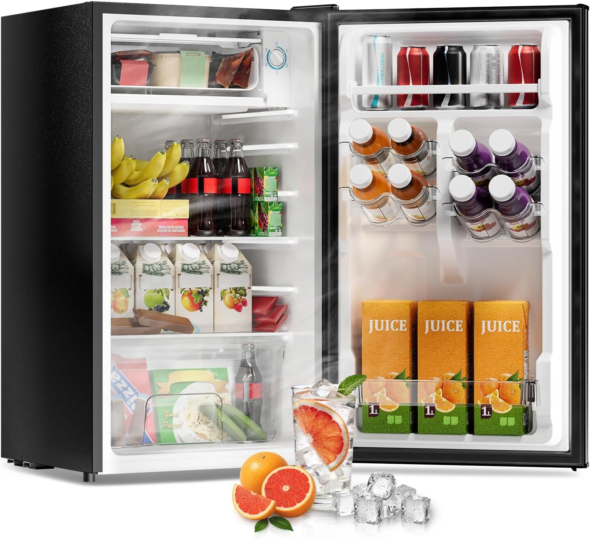

## 新图

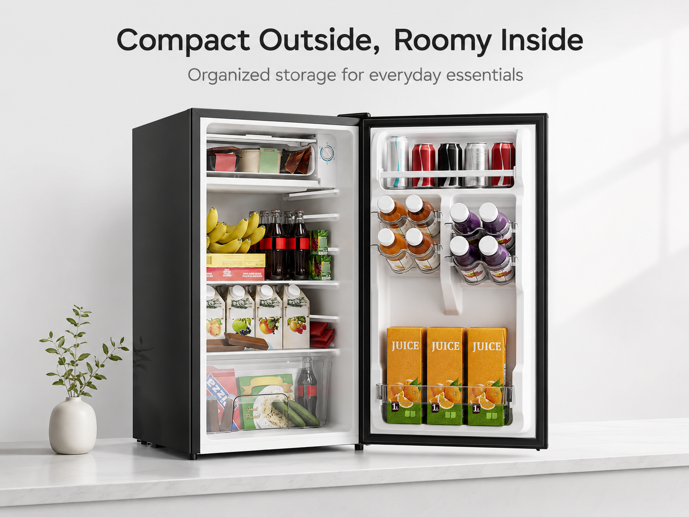

## 旧图主要问题

旧图同时出现：

- 蓝色大标题 + 蓝色副标题
- 产品整机照片但背景杂乱
- 四个方向的尺寸箭头分散标注
- 右上角安装环境小图 inset
- 彩色边框分区
- 整体色调偏蓝

## 新图改造逻辑

新图只回答一个问题：

> **这台冷柜整体长什么样、多大？**

只保留：

```text
7.0 Cu Ft Chest Freezer
Compact design for home, garage, or basement

35.4" W × 22.2" D × 33.3" H
```

尺寸标注只保留三处核心值。

## 新图优点

1. **产品成为唯一视觉主体**
2. **尺寸标注克制**，只标长宽高三项
3. **暖白背景**，高级商业摄影质感
4. **标题简洁**，一眼理解产品定位
5. **适合手机端扫读**

## 中文生成提示词

```text
生成一张 2048×2048 px 的 Amazon 副图，采用 Apple-inspired 极简高级电商产品图风格。

主题是 7.0 立方英尺家用顶开式冷柜的产品全貌展示。

画面主体是一台白色磨砂面板的冷柜，正面居中展示，盖子关闭。冷柜放在浅灰白地面上，背景为纯净暖白色墙面。使用正面略微俯视的产品摄影视角。

顶部左侧黑色粗体大标题：

7.0 Cu Ft Chest Freezer

下方灰色副标题：

Compact design for home, garage, or basement

使用非常细的黑色尺寸标尺标注：
- 底部：35.4"（产品宽度）
- 左侧：33.3"（产品高度）
- 前方：22.2"（产品深度）

右下角使用浅灰边框圆角卡片显示重量：

70 lbs

整体背景为暖白色，大面积留白，柔和自然光从左上方照入，白色面板有真实细腻的磨砂质感。地面为浅灰白。

不要蓝色标题条，不要蓝色色调，不要彩色边框，不要杂乱尺寸箭头，不要安装环境小图，不要促销风。
```

## English prompt

```text
Create a 2048x2048 Amazon secondary image in an Apple-inspired minimalist premium product image style.

The theme is a product overview of a 7.0 cu ft chest freezer.

The hero product is a white matte-finish chest freezer shown from the front with the lid closed, centered on a light gray-white floor against a clean warm white wall. Use a clean frontal view with a slightly elevated camera angle.

Top left bold black headline:

7.0 Cu Ft Chest Freezer

Below it, gray subtitle:

Compact design for home, garage, or basement

Use very thin black dimension lines to show:
- Bottom: 35.4" (product width)
- Left side: 33.3" (product height)
- Front: 22.2" (product depth)

In the lower-right corner, place a light gray bordered rounded card showing:

70 lbs

Overall background: pure warm white, generous negative space, soft natural light from upper left, realistic matte white panel texture. The floor is light gray-white.

No blue title bars, no blue color tint, no colored borders, no cluttered dimension arrows, no inset images, no promotional style.
```

---

# 7. Case 02 · 7.0 Cu Ft Capacity

## 旧图

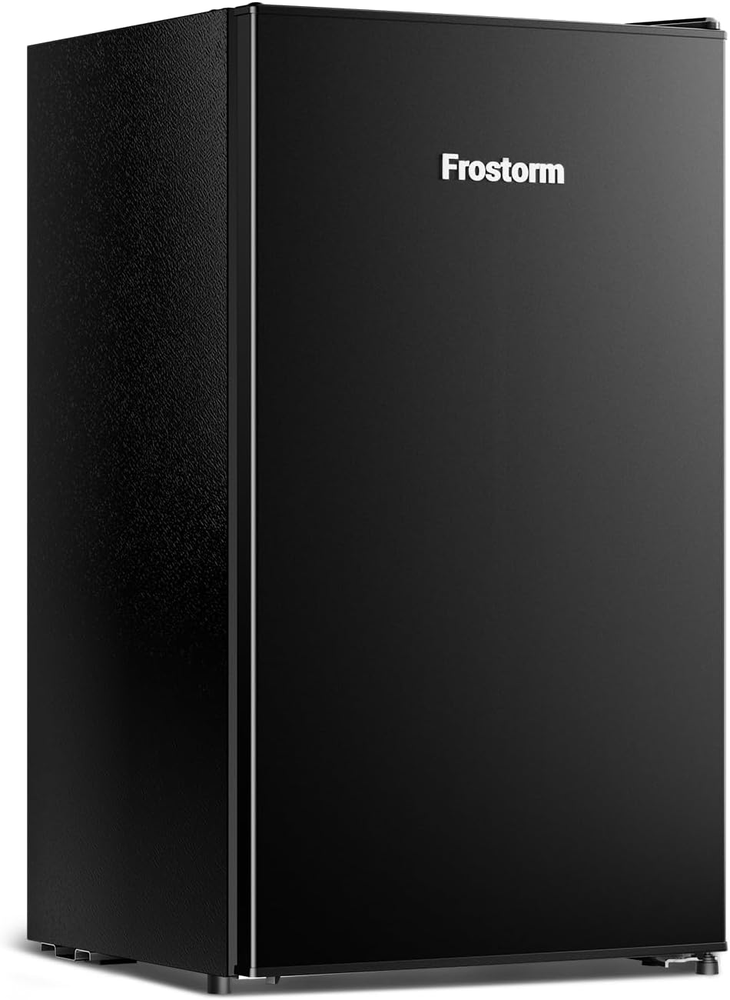

## 新图

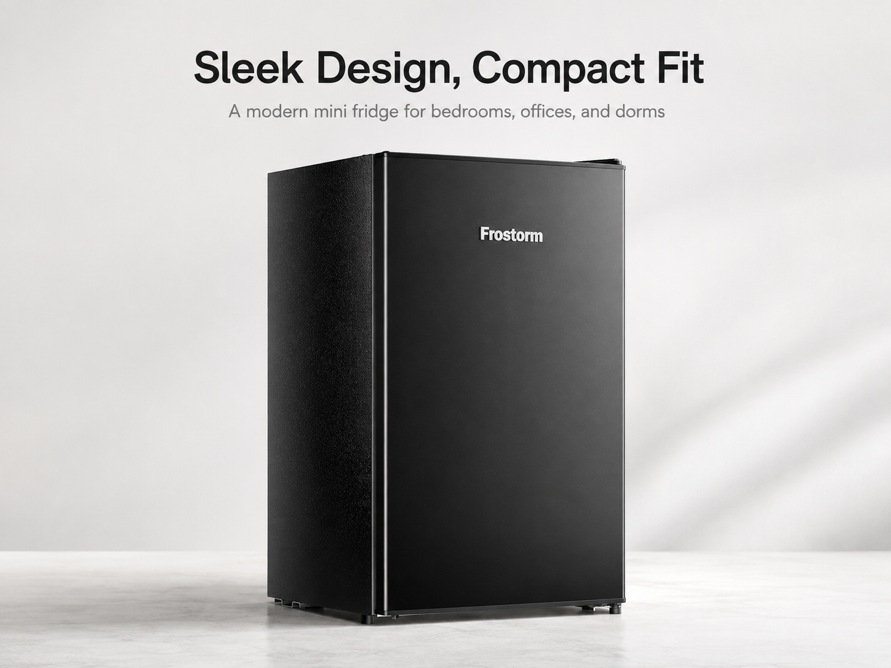

## 旧图主要问题

旧图同时出现：

- 蓝色大标题 "7.0 Cu Ft Capacity"
- 冷柜盖子打开但内部杂乱
- 杂乱食物堆放（肉、冰淇淋、速冻食品包装）
- 右侧蓝色容量标注框
- 左下角食物分类图标过多
- 整体色调偏蓝

## 新图改造逻辑

新图只表达：

```text
7.0 Cu Ft Capacity
Plenty of room for frozen favorites.
```

打开盖子，展示内部空间干净整洁。

## 新图优点

- 内部空间一目了然
- 干净的钢丝篮分区展示
- 标题简洁有力
- 无多余图标和食物分类
- 适合用户快速判断容量

## 中文生成提示词

```text
生成一张 2048×2048 px 的 Amazon 副图，采用 Apple-inspired 极简高级电商产品图风格。

主题是 7.0 立方英尺冷柜的容量展示。

画面主体是一台白色冷柜，盖子打开，从略微俯视的角度展示内部空间。内部干净整洁，上方钢丝篮中整齐摆放几个白色食品容器（方形和长方形），下方主空间为空，展示充裕的冷冻空间。内壁为白色磨砂质感，有自然柔和的内部光照。

顶部左侧黑色粗体大标题：

7.0 Cu Ft Capacity

下方灰色副标题：

Plenty of room for frozen favorites.

右下角使用浅灰边框圆角卡片显示：

7.0 cu ft
Holds up to 245 lbs of food

整体背景为暖白色，大面积留白，柔和自然光。冷柜白色面板有真实细腻的磨砂质感。

不要蓝色标题条，不要蓝色色调，不要杂乱食物堆放，不要食物分类图标，不要彩色边框，不要促销风。
```

## English prompt

```text
Create a 2048x2048 Amazon secondary image in an Apple-inspired minimalist premium product image style.

The theme is 7.0 cu ft capacity display for a chest freezer.

The hero product is a white chest freezer with its lid open, shown from a slightly elevated angle to reveal the interior. The interior is clean and organized: the top wire basket holds a few neatly arranged white food containers (square and rectangular), while the lower main compartment is empty to show the generous freezing space. Interior walls have a white matte finish with soft natural interior lighting.

Top left bold black headline:

7.0 Cu Ft Capacity

Below it, gray subtitle:

Plenty of room for frozen favorites.

In the lower-right corner, place a light gray bordered rounded card showing:

7.0 cu ft
Holds up to 245 lbs of food

Overall background: warm white, generous negative space, soft natural light. Realistic matte white panel texture on the freezer exterior.

No blue title bars, no blue color tint, no cluttered food piles, no food category icons, no colored borders, no promotional style.
```

---

# 8. Case 03 · 7-Level Thermostat

## 旧图

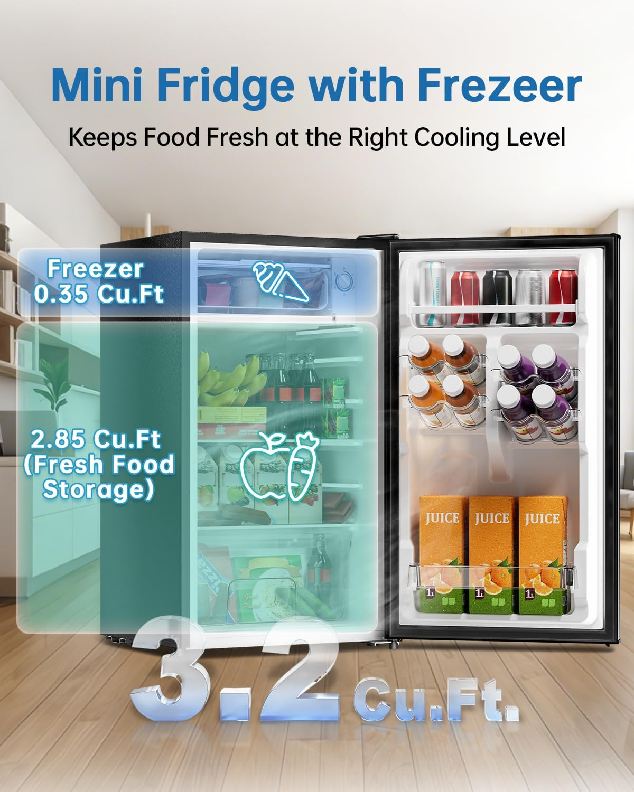

## 新图

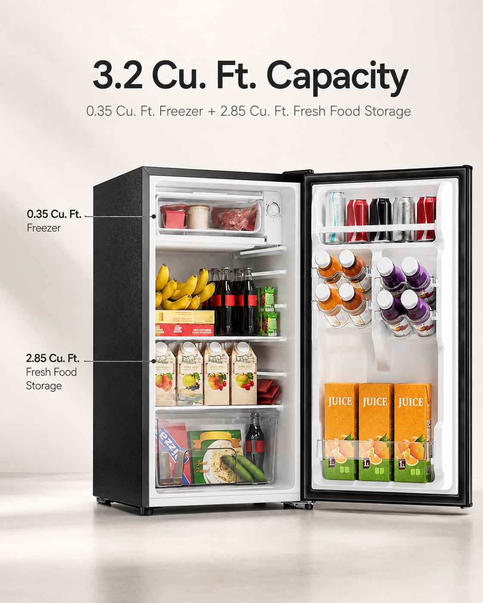

## 旧图主要问题

旧图同时出现：

- 蓝色大标题 "7-Level Adjustable Thermostat"
- 温控旋钮放大图 + 复杂温度刻度表
- 蓝色标注的 1-7 级温度范围
- 右侧食物保存建议列表
- 多个温度数值分散标注
- 整体像说明书

## 新图改造逻辑

新图只表达：

```text
7-Level Thermostat
From cool to deep freeze, find your perfect setting.
```

只保留旋钮特写和极简温度范围。

## 新图优点

- 旋钮成为唯一视觉主体
- 温度范围一目了然
- 没有复杂刻度表
- 没有多余食物建议
- 高级棚拍质感

## 中文生成提示词

```text
生成一张 2048×2048 px 的 Amazon 副图，采用 Apple-inspired 极简高级电商产品图风格。

主题是冷柜的 7 级温控功能。

画面主体是冷柜内部右下角的温控旋钮特写。旋钮为白色塑料材质，刻度 1 到 7 清晰可见，旋钮指针指向 4。旋钮周围有极简的刻度标注。

顶部黑色粗体大标题：

7-Level Thermostat

下方灰色副标题：

From cool to deep freeze, find your perfect setting.

旋钮下方使用极简文字标注：

1 = Warmest
7 = Coldest
Range: -0.4°F to -22°F

整体背景为暖白色，大面积留白，柔和均匀的棚拍光线。旋钮细节清晰，材质质感真实。

不要蓝色标题条，不要复杂刻度表，不要食物保存建议列表，不要分散温度数值，不要彩色边框，不要说明书式排版，不要促销风。
```

## English prompt

```text
Create a 2048x2048 Amazon secondary image in an Apple-inspired minimalist premium product image style.

The theme is the 7-level adjustable thermostat for a chest freezer.

The hero subject is a close-up of the thermostat dial located in the lower-right interior corner of the freezer. The dial is white plastic with numbers 1 through 7 clearly visible, and the pointer is set to 4. Minimal scale markings around the dial.

Top bold black headline:

7-Level Thermostat

Below it, gray subtitle:

From cool to deep freeze, find your perfect setting.

Below the dial, use minimal text labels:

1 = Warmest
7 = Coldest
Range: -0.4°F to -22°F

Overall background: warm white, generous negative space, soft even studio lighting. Dial details are sharp, plastic texture is realistic.

No blue title bars, no complex temperature scale tables, no food preservation tips, no scattered temperature values, no colored borders, no manual-style layout, no promotional style.
```

---

# 9. Case 04 · Removable Basket

## 旧图

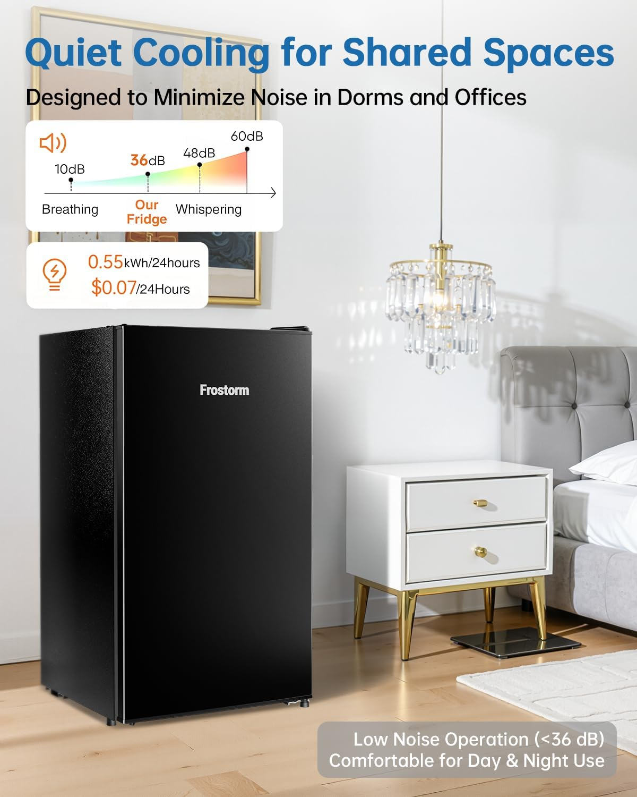

## 新图

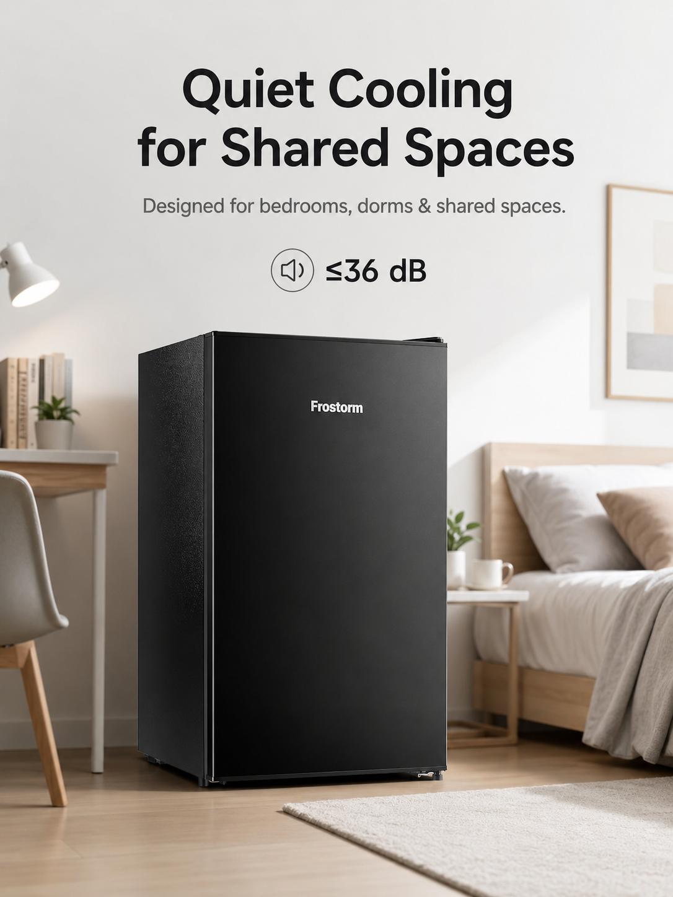

## 旧图主要问题

旧图同时出现：

- 蓝色大标题 "Removable Wire Basket"
- 钢丝篮照片 + 杂乱食物堆放
- 右侧蓝色分类说明
- 多个食物类型小图标
- 安装步骤小图嵌入
- 整体杂乱

## 新图改造逻辑

新图只表达：

```text
Removable Basket
Organize small items, access with ease.
```

干净展示钢丝篮本身 + 整齐食物。

## 新图优点

- 钢丝篮成为唯一视觉主体
- 食物整齐摆放，展示组织功能
- 无多余图标和分类
- 无安装步骤
- 高级棚拍质感

## 中文生成提示词

```text
生成一张 2048×2048 px 的 Amazon 副图，采用 Apple-inspired 极简高级电商产品图风格。

主题是冷柜的可拆卸钢丝篮。

画面主体是一个银色钢丝篮，独立放置在白色台面上。篮中整齐摆放几样食物：一袋冷冻蓝莓、一盒冰淇淋、一包冷冻蔬菜。食物摆放有序，视觉干净。

篮子旁边可以展示"取出"和"放入"两个状态，用极简的虚线箭头表示。

顶部左侧黑色粗体大标题：

Removable Basket

下方灰色副标题：

Organize small items, access with ease.

整体背景为暖白色，大面积留白，柔和自然光。钢丝篮材质细节清晰，金属反光自然。

不要蓝色标题条，不要蓝色色调，不要杂乱食物堆放，不要食物分类图标，不要安装步骤小图，不要彩色边框，不要促销风。
```

## English prompt

```text
Create a 2048x2048 Amazon secondary image in an Apple-inspired minimalist premium product image style.

The theme is the removable wire basket for a chest freezer.

The hero subject is a silver wire basket placed independently on a white countertop. Inside the basket, a few food items are neatly arranged: a bag of frozen blueberries, a carton of ice cream, and a pack of frozen vegetables. The arrangement is orderly and visually clean.

Optionally show the "slide out" and "slide in" states using minimal dashed arrows.

Top left bold black headline:

Removable Basket

Below it, gray subtitle:

Organize small items, access with ease.

Overall background: warm white, generous negative space, soft natural light. Wire basket material details are sharp, metal reflections are natural.

No blue title bars, no blue color tint, no cluttered food piles, no food category icons, no installation step insets, no colored borders, no promotional style.
```

---

# 10. Case 05 · Door Lock

## 旧图

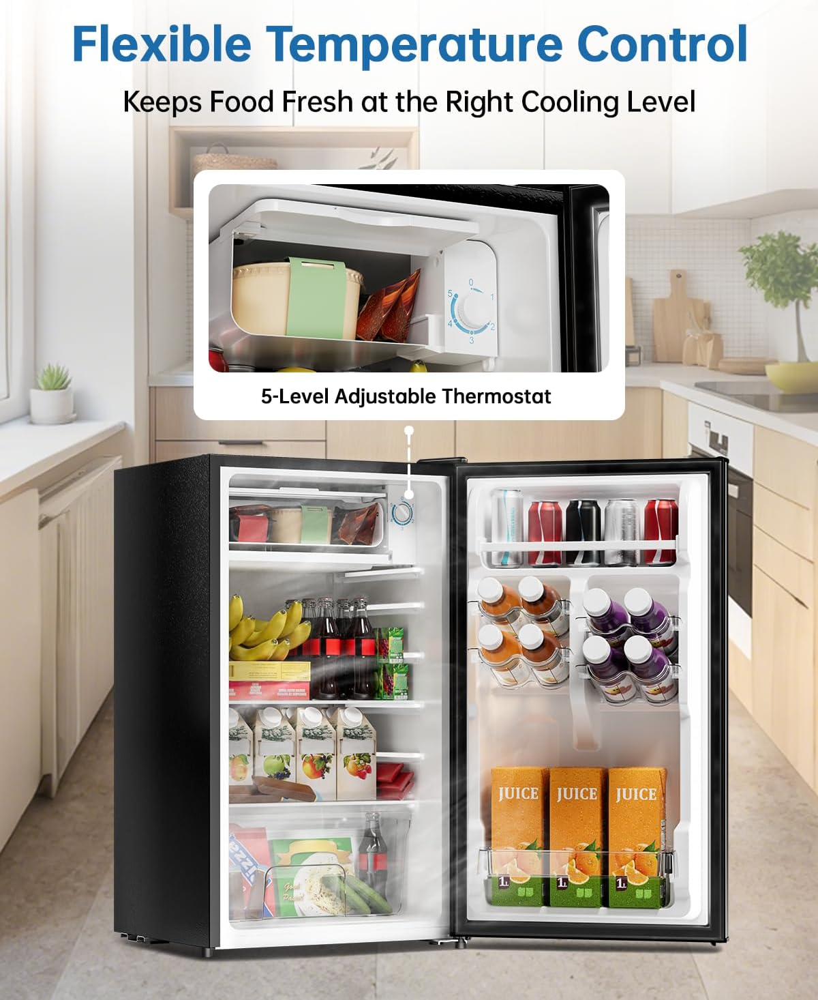

## 新图

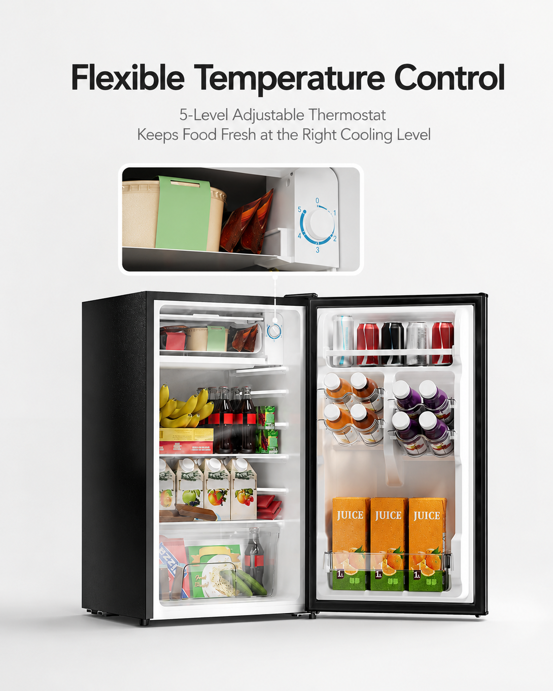

## 旧图主要问题

旧图同时出现：

- 蓝色大标题 "Door Lock with Keys"
- 锁孔放大图 + 钥匙照片
- 蓝色安全盾牌图标
- 右侧长段安全说明
- 多个"防止儿童误开"图标
- 整体像安全宣传海报

## 新图改造逻辑

新图只表达：

```text
Door Lock
Keep your frozen goods secure.
```

锁孔特写 + 一句文案，干净利落。

## 新图优点

- 锁孔成为唯一视觉主体
- 安全信息简洁有力
- 没有过多图标和说明
- 高级棚拍质感
- 适合手机端扫读

## 中文生成提示词

```text
生成一张 2048×2048 px 的 Amazon 副图，采用 Apple-inspired 极简高级电商产品图风格。

主题是冷柜的门锁功能。

画面主体是冷柜盖子前缘的锁孔特写。锁孔为银色金属材质，嵌入白色面板中。一把银色钥匙部分插入锁孔，角度自然。拍摄角度为正面微距特写。

顶部黑色粗体大标题：

Door Lock

下方灰色副标题：

Keep your frozen goods secure.

右下角使用浅灰边框圆角卡片显示：

Includes 2 keys

整体背景为暖白色，大面积留白，柔和均匀的棚拍光线。白色面板和银色锁孔的材质对比清晰。

不要蓝色标题条，不要蓝色色调，不要安全盾牌图标，不要长段安全说明，不要多个儿童误开图标，不要彩色边框，不要促销风。
```

## English prompt

```text
Create a 2048x2048 Amazon secondary image in an Apple-inspired minimalist premium product image style.

The theme is the door lock feature for a chest freezer.

The hero subject is a close-up macro of the lock cylinder on the front edge of the freezer lid. The lock is silver metal embedded in a white panel. A silver key is partially inserted into the lock at a natural angle.

Top bold black headline:

Door Lock

Below it, gray subtitle:

Keep your frozen goods secure.

In the lower-right corner, place a light gray bordered rounded card showing:

Includes 2 keys

Overall background: warm white, generous negative space, soft even studio lighting. The contrast between the white panel and silver lock is clear.

No blue title bars, no blue color tint, no safety shield icons, no long safety descriptions, no multiple child-safety icons, no colored borders, no promotional style.
```

---

# 11. Case 06 · Stay-Open Hinge

## 旧图

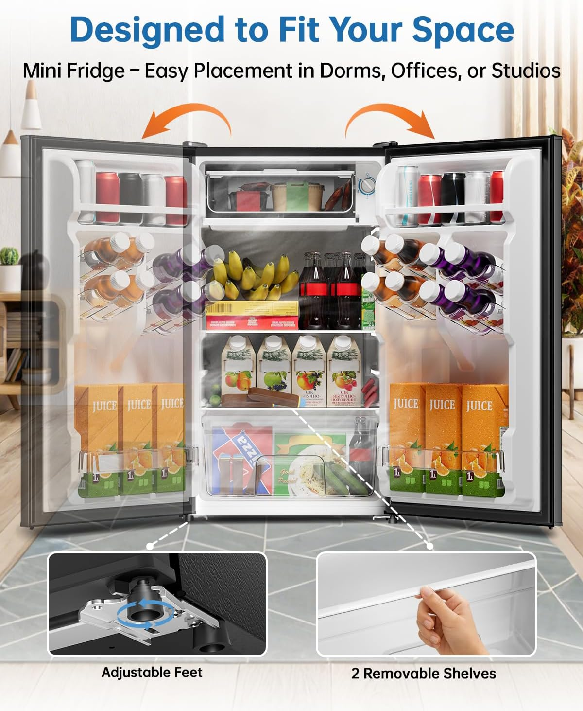

## 新图

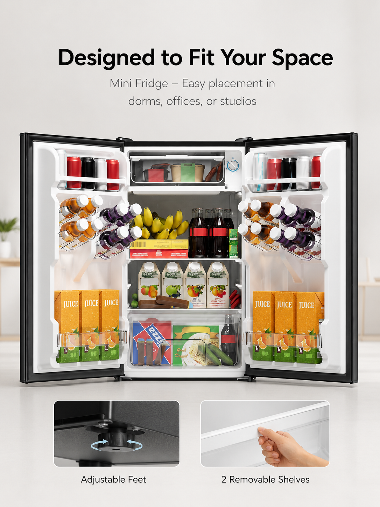

## 旧图主要问题

旧图同时出现：

- 蓝色大标题 "Stay-Open Hinge Design"
- 铰链放大图 + 角度标注
- 多步骤使用说明
- 蓝色角度数值（45° / 75°）
- 右侧"双手取物"示意图
- 整体像安装手册

## 新图改造逻辑

新图只表达：

```text
Stay-Open Hinge
Hands-free access at any angle.
```

侧视铰链 + 盖子自然悬停，一句文案。

## 新图优点

- 铰链结构一目了然
- 悬停状态真实展示
- 没有多步骤说明
- 没有杂乱角度标注
- 高级商业摄影质感

## 中文生成提示词

```text
生成一张 2048×2048 px 的 Amazon 副图，采用 Apple-inspired 极简高级电商产品图风格。

主题是冷柜的铰链悬停功能。

画面主体是一台白色冷柜的侧面视角，盖子打开至约 75° 角自然悬停。铰链结构清晰可见，为银色金属材质。画面重点展示铰链的机械结构和盖子稳定悬停的状态。盖子内侧可见少量冷霜雾气，表现真实冷冻环境。

顶部黑色粗体大标题：

Stay-Open Hinge

下方灰色副标题：

Hands-free access at any angle.

右下角使用浅灰边框圆角卡片显示：

Stays open at 45° - 75°

整体背景为暖白色，大面积留白，柔和自然光从侧面照入。白色面板和银色铰链的材质对比清晰。

不要蓝色标题条，不要蓝色色调，不要多步骤使用说明，不要蓝色角度数值标注，不要双手取物示意图，不要彩色边框，不要说明书式排版，不要促销风。
```

## English prompt

```text
Create a 2048x2048 Amazon secondary image in an Apple-inspired minimalist premium product image style.

The theme is the stay-open hinge feature for a chest freezer.

The hero product is a white chest freezer shown from the side, with the lid open at approximately 75° and staying in place naturally. The hinge mechanism is clearly visible in silver metal. The image focuses on showing the hinge structure and the stable stay-open state. A subtle frosty mist is visible on the inside of the lid to convey a realistic freezing environment.

Top bold black headline:

Stay-Open Hinge

Below it, gray subtitle:

Hands-free access at any angle.

In the lower-right corner, place a light gray bordered rounded card showing:

Stays open at 45° - 75°

Overall background: warm white, generous negative space, soft natural light from the side. Clear contrast between white panel and silver hinge.

No blue title bars, no blue color tint, no multi-step instructions, no blue angle annotations, no hands-free access diagrams, no colored borders, no manual-style layout, no promotional style.
```

---

# 12. Case 07 · LED Lighting

## 旧图

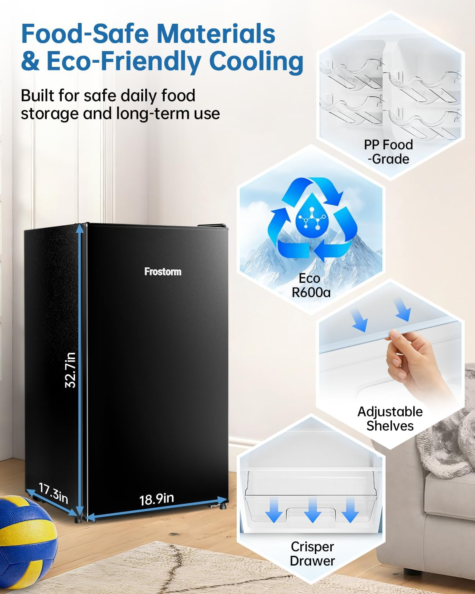

## 新图

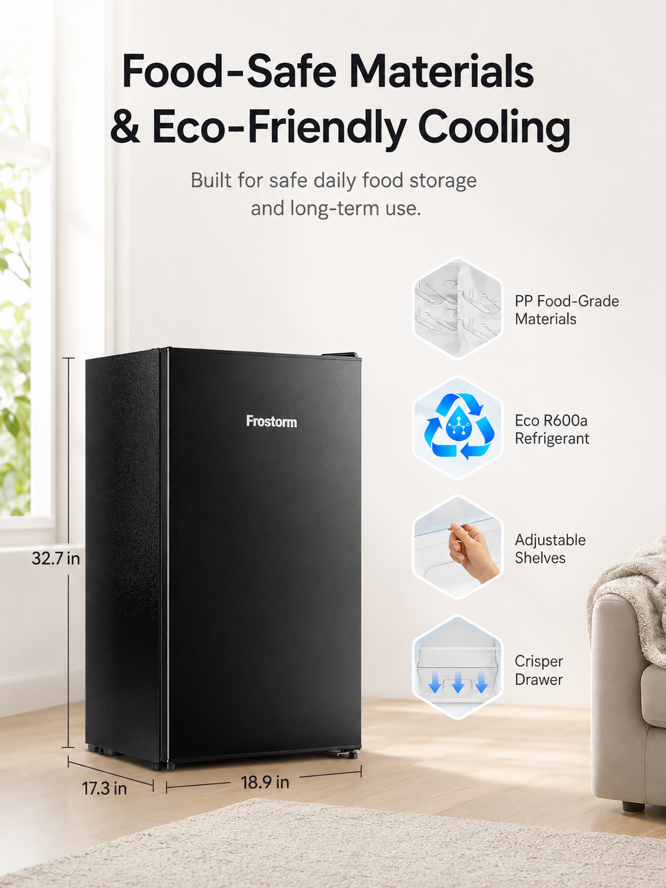

## 旧图主要问题

旧图同时出现：

- 蓝色大标题 "LED Interior Light"
- 暗色内部照片，画质粗糙
- 蓝色标注的灯位置示意图
- 右侧灯泡参数说明
- 多个放大图标注
- 整体色调偏蓝偏暗

## 新图改造逻辑

新图只表达：

```text
LED Lighting
See clearly, even in dark corners.
```

展示内部暖光效果 + 产品质感。

## 新图优点

- 内部 LED 暖光效果真实自然
- 产品内部空间清晰可见
- 没有杂乱标注
- 暖光与白色内壁形成高级对比
- 适合展示产品细节

## 中文生成提示词

```text
生成一张 2048×2048 px 的 Amazon 副图，采用 Apple-inspired 极简高级电商产品图风格。

主题是冷柜的内部 LED 照明功能。

画面主体是一台白色冷柜，盖子打开，从略微俯视的角度展示内部。内部顶部边缘有一盏 LED 灯，发出柔和暖白色光，照亮内部空间。内壁为白色磨砂质感，光线均匀分布，展现充裕的内部空间和干净的质感。内部放置少量整齐的白色食品容器。

顶部左侧黑色粗体大标题：

LED Lighting

下方灰色副标题：

See clearly, even in dark corners.

整体背景为暖白色环境，但冷柜内部因 LED 灯照射而呈现温暖的明暗对比。柔和自然光，高级商业摄影质感。

不要蓝色标题条，不要蓝色色调，不要暗色粗糙照片，不要灯位置示意图，不要灯泡参数说明，不要多个放大图标注，不要促销风。
```

## English prompt

```text
Create a 2048x2048 Amazon secondary image in an Apple-inspired minimalist premium product image style.

The theme is the interior LED lighting feature for a chest freezer.

The hero product is a white chest freezer with its lid open, shown from a slightly elevated angle to reveal the interior. An LED light is located along the top interior edge, emitting a soft warm white glow that illuminates the interior. The interior walls have a white matte finish with even light distribution, showing the spacious and clean interior. A few neatly arranged white food containers are placed inside.

Top left bold black headline:

LED Lighting

Below it, gray subtitle:

See clearly, even in dark corners.

Overall environment: warm white surroundings, with the freezer interior showing a warm light contrast from the LED. Soft natural light, premium commercial photography quality.

No blue title bars, no blue color tint, no dark grainy photos, no light position diagrams, no bulb spec sheets, no multiple magnifier insets, no promotional style.
```

---

# 13. Case 08 · Quiet & Energy Saving

## 旧图

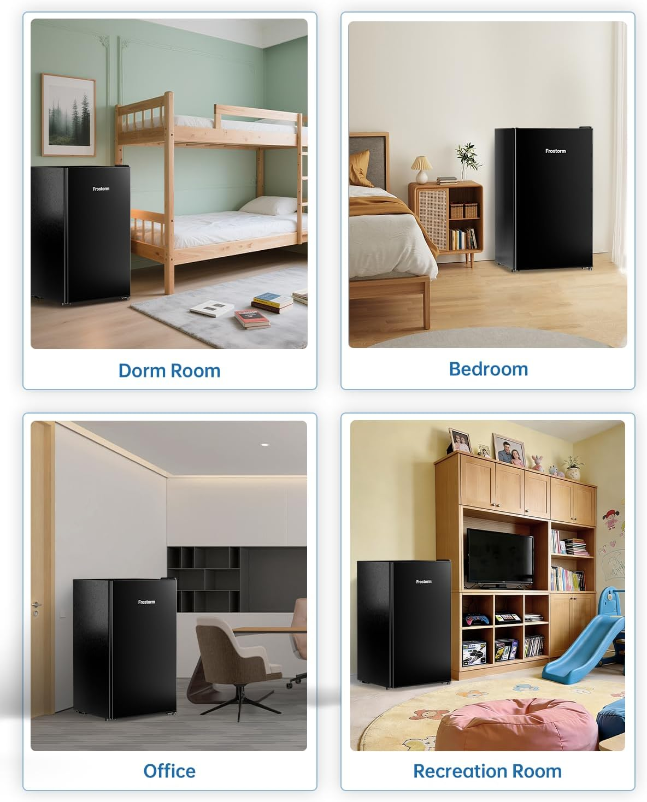

## 新图

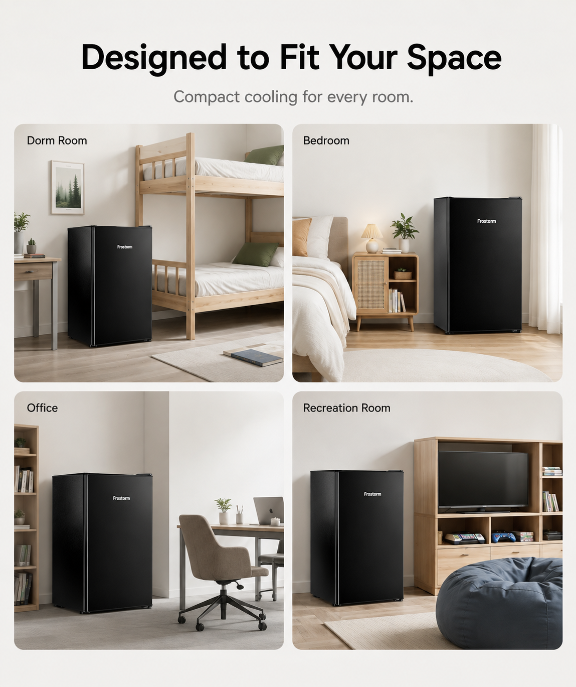

## 旧图主要问题

旧图同时出现：

- 蓝色大标题 "Energy Saving & Low Noise"
- 蓝色实心能耗徽章
- 蓝色分贝图标
- 右侧长段节能说明
- 多个蓝色数值标注
- 使用场景小图嵌入
- 整体像节能宣传海报

## 新图改造逻辑

新图只表达：

```text
Quiet & Energy Saving
Efficient performance, whisper-quiet operation.
```

干净场景 + 极简参数卡片。

## 新图优点

- 产品在真实场景中展示
- 参数卡片简洁有力
- 没有蓝色徽章和图标
- 没有长段说明
- 高级商业摄影质感

## 中文生成提示词

```text
生成一张 2048×2048 px 的 Amazon 副图，采用 Apple-inspired 极简高级电商产品图风格。

主题是冷柜的节能与低噪音特性。

画面主体是一台白色冷柜，放置在干净的现代家庭环境中（如浅色木质地板的储藏室或车库角落）。冷柜旁边放置少量极简摆件：一盆小绿植、几个收纳箱。场景安静、整洁。

顶部左侧黑色粗体大标题：

Quiet & Energy Saving

下方灰色副标题：

Efficient performance, whisper-quiet operation.

右下角使用浅灰边框圆角卡片显示：

≤ 42 dB
Energy Efficient Design

整体色调为暖白、浅灰、浅木色。柔和自然光从窗户或门照入。白色面板有真实细腻的磨砂质感。

不要蓝色标题条，不要蓝色色调，不要蓝色实心能耗徽章，不要蓝色分贝图标，不要长段节能说明，不要多个数值标注，不要使用场景小图嵌入，不要促销风。
```

## English prompt

```text
Create a 2048x2048 Amazon secondary image in an Apple-inspired minimalist premium product image style.

The theme is energy saving and low noise operation for a chest freezer.

The hero product is a white chest freezer placed in a clean modern home environment (such as a storage room or garage corner with light wood-tone flooring). A few minimal items are placed nearby: a small potted plant, a couple of storage bins. The scene is calm and tidy.

Top left bold black headline:

Quiet & Energy Saving

Below it, gray subtitle:

Efficient performance, whisper-quiet operation.

In the lower-right corner, place a light gray bordered rounded card showing:

≤ 42 dB
Energy Efficient Design

Overall palette: warm white, light gray, light wood tones. Soft natural light from a window or door. Realistic matte white panel texture on the freezer.

No blue title bars, no blue color tint, no solid blue energy badges, no blue decibel icons, no long energy-saving descriptions, no multiple scattered values, no inset scene images, no promotional style.
```

---

# 14. 八张旧图与新图的整体区别

## 14.1 标题条

### 旧图

```text
每张图都有蓝色大标题条 + 蓝色副标题
蓝色成为第一视觉，产品反而弱
```

### 新图

```text
黑色粗体主标题 + 灰色副标题
文字是信息，不是装饰
产品是视觉主体
```

---

## 14.2 色彩

### 旧图

```text
蓝色标题
彩色图标
蓝色色调照片
实心蓝色徽章
```

### 新图

```text
暖白
米白
浅灰
黑色（文字）
银色（金属配件）
柔和暖白（LED 灯光）
```

---

## 14.3 构图

### 旧图

```text
大横幅
彩色边框分区
多个杂乱尺寸箭头
彩色图标
蓝色调产品照片
```

### 新图

```text
大面积留白
产品 Hero
简洁圆角卡片
统一尺寸标尺
真实暖光产品照
```

---

## 14.4 文字层级

### 旧图

```text
蓝色大标题
蓝色副标题
大量说明
小字参数
彩色标签
```

### 新图

```text
黑色粗体主标题
灰色副标题
必要数字
极简图标辅助
```

---

# 15. 新图最明显的 8 个优点

## 1. 更快扫读

Amazon 用户不会逐字阅读副图。
新图采用：

```text
大标题
黑色文字
清晰分区
```

用户可以 3 秒理解卖点。

## 2. 更适合手机端

旧图的蓝色横幅在手机上会显得过重。
新图使用：

```text
黑色粗体大标题
灰色副标题
大面积留白
```

在手机上更清爽。

## 3. 产品更高级

白色磨砂面板最重要的是：

```text
材质质感
边缘比例
结构真实
灯光柔和
```

新图给产品更多展示空间。

## 4. 信息更简洁

旧图的复杂温度刻度表和多步骤说明在副图中显得过重。
新图用极简参数卡片替代。

## 5. 图片之间风格统一

八张图统一使用：

```text
暖白 / 浅灰背景
黑色无衬线字体
灰色副标题
柔和自然光
克制排版
真实产品摄影
```

放在 Amazon Listing 中更像一套完整品牌视觉。

## 6. 更容易模板化

Case 04 的钢丝篮展示结构，可以直接迁移到：

```text
upright freezer shelves
refrigerator crisper drawers
wine cooler racks
ice maker bins
```

## 7. 更适合开源提示词案例

旧图很难提炼成模板。
新图可以直接拆成：

```text
产品主体
卖点
场景
信息模块
排版
光线
负面要求
```

## 8. 更适合后续做视频

这八张图已经天然形成视频脚本：

```text
01 产品全貌
02 7.0 Cu Ft 容量
03 7 级温控
04 可拆卸钢丝篮
05 门锁
06 铰链悬停
07 LED 照明
08 节能与低噪音
```

---

# 16. 新手怎么把旧图变成这种新图

## 第一步：上传旧图

不要先写长提示词。
先上传一组旧 Amazon 副图。

---

## 第二步：让 AI 先识别旧图

可以输入：

```text
分析这组 Amazon 冷柜副图。

请告诉我：

1. 这是什么产品
2. 每张图的核心卖点是什么
3. 哪些参数必须保留
4. 哪些文字可以删除
5. 哪些元素导致画面显得杂乱
6. 如果改成 Apple-inspired 极简高级商品图，每张图应该只保留什么
```

先分析。不要立即生图。

---

## 第三步：输入风格口令

```text
Apple-inspired minimalist premium product image style
```

然后说：

```text
学习这种极简商品视觉逻辑。

不要复制品牌 Logo、官方图片或具体网页素材。

只学习：
留白
构图
光影
字体层级
产品 Hero 展示
极简功能表达
```

---

## 第四步：每张图只保留一个卖点

输入：

```text
这张新图只表达 [核心卖点]。

只保留：
- 主标题
- 副标题
- 必要数字 / 参数

删除：
- 蓝色横幅
- 彩色边框
- 长段说明
- 多余图标
```

---

## 第五步：要求 AI 先写最终生图提示词

输入：

```text
先不要生成图片。

根据旧图的产品结构和核心卖点，
按照 Apple-inspired 极简高级电商产品图风格，
帮我写一份 2048×2048 px Amazon 副图生图提示词。

提示词必须包括：

1. 产品主体
2. 产品结构
3. 使用场景
4. 核心卖点
5. 允许出现的文字
6. 信息模块
7. 背景
8. 光线
9. 材质
10. 构图
11. 负面要求

单图只表达一个核心卖点。
```

---

## 第六步：检查提示词

重点检查：

```text
产品有没有被改型？
温控旋钮刻度对不对？
尺寸参数有没有写错？
是否删除了蓝色横幅？
文字是不是太多？
有没有偷偷增加新功能？
```

---

## 第七步：生成

确认提示词后：

```text
按照这个提示词生成。
```

---

## 第八步：二次修正

按问题修：

### 产品结构错

```text
保持冷柜结构不变。
白色面板正确。
盖子铰链位置正确。
钢丝篮结构正确。
```

### 文字太多

```text
删除所有其他小字。
画面只保留：
[主标题]
[副标题]
[必要参数]
```

### 画面不够高级

```text
增加大面积留白。
减少背景摆件。
背景改为暖白和浅灰。
使用柔和自然光。
降低装饰元素数量。
强化产品 Hero 构图。
```

### 太像说明书

```text
删除表格。
删除长段说明。
删除多个局部放大图。
每张图只表达一个核心卖点。
```

---

# 17. 可复用提示词公式

```text
[目标尺寸]
+
[平台与图片类型]
+
[风格]
+
[产品主体]
+
[必须保持的产品结构]
+
[一个核心卖点]
+
[真实使用场景]
+
[允许出现的文字]
+
[极简信息模块]
+
[背景]
+
[光线]
+
[材质]
+
[构图]
+
[负面要求]
```

示例：

```text
2048×2048
+
Amazon secondary image
+
Apple-inspired minimalist premium product image style
+
7.0 cu ft chest freezer
+
white matte panel / top-opening lid / wire basket / mechanical thermostat
+
7-Level Thermostat
+
thermostat dial close-up with minimal temperature range
+
headline + subtitle + dial labels
+
small parameter card showing temperature range
+
light warm white interior
+
soft even studio lighting
+
realistic white matte plastic texture
+
hero close-up composition with negative space
+
no blue banner / no blue tint / no clutter / no promo banner
```

---

# 18. 质量检查清单

生成完成后逐项检查：

## 产品

- [ ] 冷柜类型正确（chest freezer，不是 upright）
- [ ] 白色磨砂面板正确
- [ ] 顶开式盖子和铰链正确
- [ ] 钢丝篮结构正确
- [ ] 温控旋钮位置（内部右下角）正确
- [ ] 门锁位置（盖子前缘）正确
- [ ] 面板颜色没有被改成其他材质

## 功能

- [ ] 7.0 Cu Ft 容量没有写成其他数字
- [ ] 尺寸 35.4" / 22.2" / 33.3" 没有写错
- [ ] 重量 70 lbs 没有写错
- [ ] 温控 1-7 级没有写错
- [ ] 温度范围 -0.4°F ~ -22°F 没有写错
- [ ] 噪音 ≤ 42 dB 没有写错
- [ ] 铰链角度 45°-75° 没有写错

## 视觉

- [ ] 主标题清晰
- [ ] 副标题清晰
- [ ] 没有乱码
- [ ] 没有多余小字
- [ ] 没有蓝色横幅
- [ ] 没有蓝色色调
- [ ] 没有杂乱图标
- [ ] 产品是主视觉
- [ ] 留白充足
- [ ] 整套风格统一

---

# 19. GitHub 推荐目录

```text
cases/
└── appliances/
    └── freezers/
        ├── README.md
        └── chest-freezer/
            ├── README.md
            ├── CHANGELOG_v0.0.1.md
            └── images/
                ├── 01-old/
                │   ├── 1.png  (Product Overview)
                │   ├── 2.png  (7.0 Cu Ft Capacity)
                │   ├── 3.png  (7-Level Thermostat)
                │   ├── 4.png  (Removable Basket)
                │   ├── 5.png  (Door Lock)
                │   ├── 6.png  (Stay-Open Hinge)
                │   ├── 7.png  (LED Lighting)
                │   └── 8.png  (Quiet & Energy Saving)
                └── 02-new/
                    ├── 1.png
                    ├── 2.png
                    ├── 3.png
                    ├── 4.png
                    ├── 5.png
                    ├── 6.png
                    ├── 7.png
                    └── 8.png
```

---

# 20. 关于图片尺寸

本案例的**目标生图尺寸**是：

```text
2048 × 2048 px
1:1 square
```

当前案例包中保存的新图为本次对话上传的预览文件。因此：

> 提示词仍然按 2048×2048 Amazon 副图目标编写；实际发布到 Amazon 或开源库时，应优先保存原始 2048×2048 生成文件。

---

# 21. 开源说明

本案例用于：

- AI 电商生图学习
- Prompt 结构研究
- Amazon 副图视觉改造教程
- 视觉风格提炼方法演示

请注意：

```text
Apple-inspired
```

表示学习极简产品页的通用视觉语言。

本项目不建议：

- 复制 Apple 官方图片
- 使用 Apple Logo
- 复制 Apple 官网具体页面
- 冒充 Apple 产品
- 直接复制第三方品牌素材作为商业成品

建议公开案例使用：

```text
generic product
unbranded product
brand removed
logo removed
```

---

# 22. 最终总结

这次改造最重要的不是"把旧图变漂亮"。

真正有价值的是建立了一套可以复用的方法：

```text
旧图负责提供事实
↓
AI 负责识别卖点
↓
人工决定单图核心信息
↓
风格口令负责视觉语言
↓
结构化提示词负责生成
↓
人工检查产品和参数
↓
形成可复用案例
```

最核心原则：

> **不要让 AI 自动决定一张图表达多少信息。**

应该由你先决定：

```text
这张图只卖什么？
```

然后提示词围绕这个卖点生成。

对于本案例：

```text
图 01 = Product Overview
图 02 = 7.0 Cu Ft Capacity
图 03 = 7-Level Thermostat
图 04 = Removable Basket
图 05 = Door Lock
图 06 = Stay-Open Hinge
图 07 = LED Lighting
图 08 = Quiet & Energy Saving
```

这就是从"蓝色标题 + 杂乱 Amazon 副图"升级成"极简高级电商产品视觉"的完整逻辑。
