# 台式制冰机：从传统 Amazon 副图到 Apple-inspired 极简高级电商图

> **Countertop Ice Maker · Before & After Prompt Case Study**  
> `leegle-image-prompts` 实战案例 · **v0.0.1**
>
> 本案例完整演示：  
> **如何把一套蓝色标题、信息拥挤的传统 Amazon 制冰机副图，转换成更简洁、更高级、更适合高端电商展示的 Apple-inspired 商品视觉。**

---

## 一句话先看懂这个案例

```text
旧图 = 蓝色横幅 + 大量文字 + 多区域模块 + 彩色图标
新风格 = 暖白背景 + 大面积留白 + 黑色无衬线字体 + 单图单卖点 + 产品 Hero

旧图不是直接照抄。
旧图用来告诉 AI："这个产品是什么、功能是什么、要表达什么。"

Apple-inspired 风格口令用来告诉 AI：
"应该怎样重新组织这些信息、怎样构图、怎样打光、怎样排版。"
```

最终逻辑：

```text
上传旧图
   ↓
识别旧图核心卖点
   ↓
删除蓝色横幅 / 长说明 / 杂乱分区 / 彩色图标
   ↓
一次只保留一个主卖点
   ↓
加入 Apple-inspired 极简视觉规则
   ↓
生成新图
   ↓
检查产品结构、参数和文字
```

---

# 1. 案例产品

## 产品类型

```text
Countertop Ice Maker
紧凑型台式制冰机
```

## 产品核心视觉特征

- 黑色紧凑型机身（compact black body）
- 透明上盖（transparent lid / window），可观察内部制冰过程
- 侧面散热格栅（side ventilation grille）
- 便携手柄（portable handle），方便移动
- 可取出的钢丝冰篮（removable ice basket）
- 配套冰铲（ice scoop）
- 前置黑色控制面板：按钮 + 指示灯
- 子弹形冰块（bullet-shaped ice cubes）
- 两种冰块大小可选（S / L）
- 顶部接水口（water inlet）
- 容量：约 2.2 L 水箱
- 日产冰量：26 lbs / 24h
- 首个制冰周期：约 6 分钟
- 一次出冰：约 9 颗子弹形冰块
- 自清洁功能（Self-Cleaning）
- 水位指示灯 / 冰满指示灯
- 电源：115V / 60Hz
- 功率：约 150W
- 操作安静（≤ 45 dB）
- 适合厨房台面、客厅、户外派对、RV

---

# 2. 本案例使用的风格名称

## 中文

```text
苹果启发式极简高级电商产品图风格
```

## English

```text
Apple-inspired minimalist premium product image style
```

> 注意：这里学习的是**极简产品页视觉语言**，不是复制 Apple 的 Logo、官方图片、具体网页或受保护的品牌素材。

---

# 3. 为什么旧图需要重做

旧图并不是"没有信息"。

恰恰相反，旧图的问题通常是：

```text
蓝色主横幅过强
每个模块都有蓝色标题条
文字过多
图标过多
分区杂乱
旧图常见问题
制冰过程动画拼接过多
冰块放大图杂乱
尺寸标注分散混乱
控制面板有蓝色色调
画面像说明书或低端促销页
产品不是唯一视觉主体
```

传统副图常见结构：

```text
蓝色大标题
+ 一段蓝色副标题
+ 彩色边框模块
+ 多个局部放大图
+ 制冰步骤拼图
+ 尺寸箭头满天飞
```

Apple-inspired 改造逻辑：

```text
一个核心卖点
+ 一个主产品 / 场景
+ 一句黑色主标题
+ 一句灰色副标题
+ 最少必要参数
+ 大面积留白
+ 柔和自然光
+ 高级商业摄影
```

---

# 4. 通用 Apple-inspired 风格口令

## 中文风格口令

```text
采用 Apple-inspired 极简高级电商产品图风格。整体为暖白或米灰色背景，大面积留白，产品主体突出，画面安静、克制、现代。使用柔和自然光或高级棚拍光线，黑色机身具有真实细腻质感，透明上盖有真实光泽和反光。文字使用现代无衬线字体，主标题黑色粗体，副标题灰色，排版简洁。单张图片只表达一个核心卖点，只保留必要参数，避免说明书式设计。整体像高端家电品牌官网产品页与高级商业摄影结合的视觉效果。
```

## English style prompt

```text
Use an Apple-inspired minimalist premium product image style. Create a calm, refined, modern composition with a clean warm white, beige-gray, or soft neutral background and generous negative space. Make the product the dominant visual subject. Use soft natural light or premium studio lighting, realistic matte black body texture, realistic transparent lid reflections, clean modern sans-serif typography, black bold headlines, subtle gray subtext, restrained feature communication, and one clear selling point per image. The final result should feel like a premium appliance brand product page combined with high-end commercial product photography.
```

---

# 5. Before & After 总览

| Case | 旧图表达 | 新图表达 | 核心改造 |
|---|---|---|---|
| 01 | 产品全貌 + 多尺寸箭头 + 环境图 | Product Overview | 尺寸标注克制，产品 Hero 居中 |
| 02 | 6分钟出冰 + 制冰步骤拼图 + 时间轴 | 6-Min Fast Ice Making | 只保留 6 分钟 + 首篮冰块结果 |
| 03 | 26Lbs 日产 + 大量冰块堆图 | 26 Lbs Daily Capacity | 干净冰篮 + 冰块自然摆放 |
| 04 | 冰篮冰铲 + 零件分解图 | Removable Basket & Scoop | 统一展示冰篮 + 冰铲 + 冰块 |
| 05 | 两种冰块大小 + S/L 对比放大图 | Two Ice Sizes (S & L) | 左右对比 S 和 L |
| 06 | 自清洁功能 + 蓝色步骤图 | Self-Cleaning | 控制面板特写 + 简洁文字 |
| 07 | 静音运行 + 分贝计图 | Quiet Operation | 安静场景 + 参数卡片 |
| 08 | 便携手柄 + 搬运示意图 | Portable Handle | 真实手握手柄场景 |
| 09 | 透明观察窗 + 内部放大图 | Transparent Window | 从上方俯拍透明盖效果 |

---

# 6. Case 01 · Product Overview

## 旧图

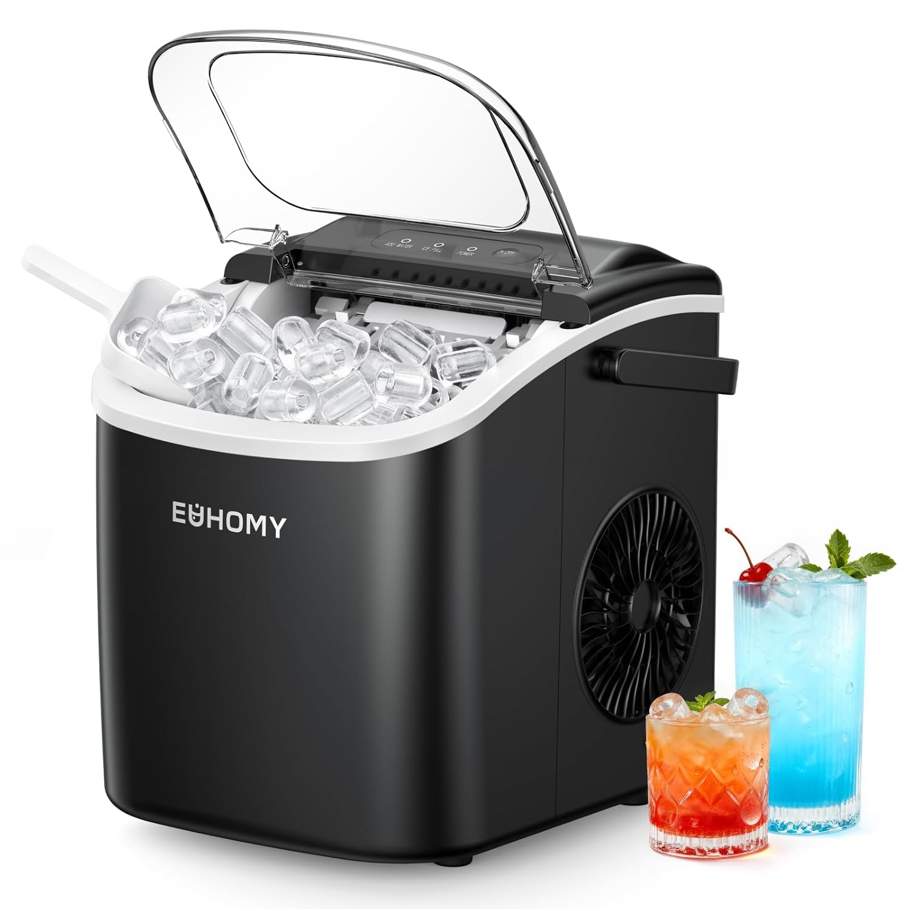

## 新图

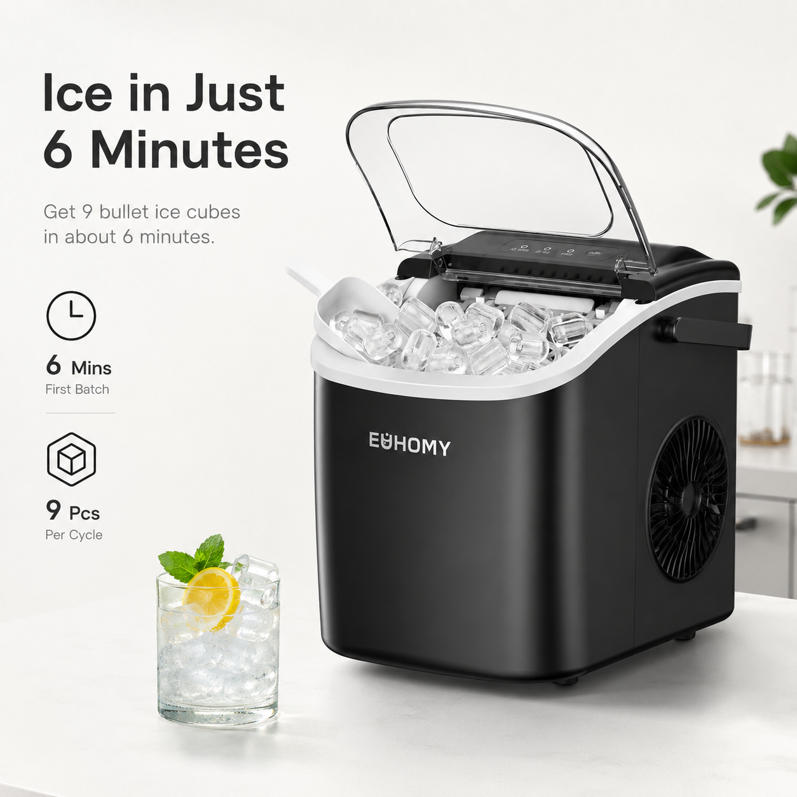

## 旧图主要问题

旧图同时出现：

- 蓝色大标题 + 蓝色副标题
- 产品整机但背景杂乱
- 四个方向尺寸箭头分散
- 右上角厨房场景小图 inset
- 彩色边框分区
- 整体色调偏蓝

## 新图改造逻辑

新图只回答一个问题：

> **这台制冰机长什么样、多大？**

只保留：

```text
Countertop Ice Maker
Compact design fits any kitchen counter

14.3" W × 11.4" D × 13.5" H
```

## 新图优点

1. **产品成为唯一视觉主体**
2. **尺寸标注克制**，只标长宽高
3. **暖白背景**，高级棚拍质感
4. **黑色机身 + 透明盖对比明确**
5. **适合手机端扫读**

## 中文生成提示词

```text
生成一张 2048×2048 px 的 Amazon 副图，采用 Apple-inspired 极简高级电商产品图风格。

主题是紧凑型台式制冰机的产品全貌展示。

画面主体是一台黑色紧凑型制冰机，正面略微右倾 15°，产品居中。特征：透明上盖、侧面散热格栅、前置控制面板、便携手柄。产品放置在浅灰白台面上，背景为纯净暖白色墙面。高级棚拍光线，黑色机身有真实细腻的哑光质感，透明上盖有自然反光。

顶部左侧黑色粗体大标题：

Countertop Ice Maker

下方灰色副标题：

Compact design fits any kitchen counter

使用非常细的黑色尺寸标尺标注：
- 底部：14.3"（宽）
- 左侧：13.5"（高）
- 前方：11.4"（深）

右下角浅灰边框圆角卡片：

Net weight: 20.3 lbs

整体背景暖白、大面积留白、柔和自然光。不要蓝色标题条、不要蓝色色调、不要彩色边框、不要杂乱尺寸箭头、不要场景小图 inset、不要促销风。
```

## English prompt

```text
Create a 2048x2048 Amazon secondary image in an Apple-inspired minimalist premium product image style.

The theme is a product overview of a compact countertop ice maker.

The hero product is a compact black countertop ice maker, shown from a front view with a 15° right angle rotation, centered. Key features: transparent lid, side ventilation grille, front control panel, portable handle. Place it on a light gray-white countertop against a pure warm white wall. Use premium studio lighting, realistic matte black body texture, and natural reflections on the transparent lid.

Top left bold black headline:

Countertop Ice Maker

Below it, gray subtitle:

Compact design fits any kitchen counter

Use very thin black dimension lines:
- Bottom: 14.3" (width)
- Left side: 13.5" (height)
- Front: 11.4" (depth)

Lower-right light gray bordered rounded card:

Net weight: 20.3 lbs

Overall: warm white background, generous negative space, soft natural light. No blue title bars, no blue tint, no colored borders, no cluttered dimension arrows, no inset scene images, no promotional style.
```

---

# 7. Case 02 · 6-Min Fast Ice Making

## 旧图

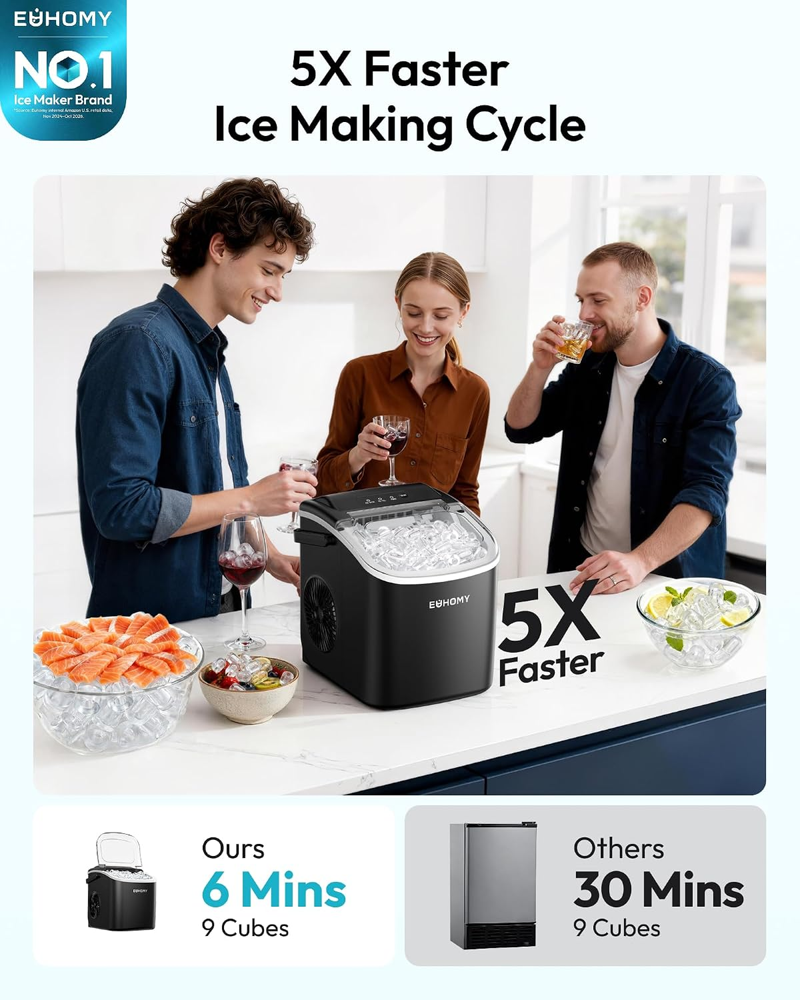

## 新图

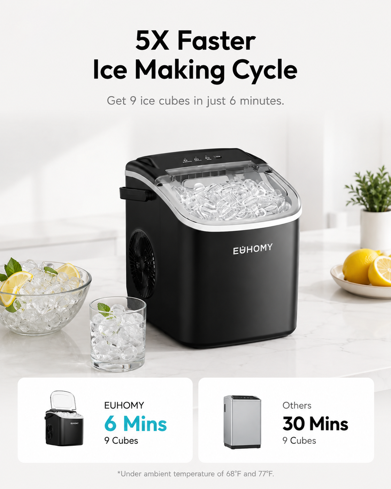

## 旧图主要问题

旧图同时出现：

- 蓝色大标题 "6-Minutes Fast Ice Making"
- 制冰步骤 1→2→3→4 拼图
- 蓝色时间轴标注
- 冰块多帧拼接动画感
- 多个局部放大图
- 整体像使用说明书

## 新图改造逻辑

新图只表达：

```text
6-Min Fast Ice Making
First batch of ice in as little as 6 minutes.
```

用一篮刚出好的冰块做视觉证明。

## 新图优点

- 6 分钟大字一眼看懂
- 冰块篮作为真实结果证据
- 没有步骤拼图和多帧动画
- 适合用户快速判断出冰速度
- 高级商业摄影质感

## 中文生成提示词

```text
生成一张 2048×2048 px 的 Amazon 副图，采用 Apple-inspired 极简高级电商产品图风格。

主题是制冰机的 6 分钟快速出冰功能。

画面主体是一台黑色制冰机（正面右倾角度），旁边放着刚取出的银灰色钢丝冰篮。冰篮中装满新鲜的子弹形透明冰块，冰块有真实的光泽和反光。产品上盖微微打开，内部可见新形成的冰块。浅灰白色台面。

顶部左侧黑色粗体大标题：

6-Min Fast Ice Making

下方灰色副标题：

First batch of ice in as little as 6 minutes.

右下角浅灰边框圆角卡片：

~ 9 bullets per cycle
~ 26 lbs / 24h

整体背景暖白，大面积留白，柔和自然光从左上方照入。冰块光泽真实，黑色机身质感细腻。不要蓝色标题条，不要蓝色色调，不要步骤拼图，不要多帧动画感，不要局部放大图，不要促销风。
```

## English prompt

```text
Create a 2048x2048 Amazon secondary image in an Apple-inspired minimalist premium product image style.

The theme is the 6-minute fast ice making feature.

Hero product: a black ice maker (front view angled right) next to a just-removed silver wire ice basket. The basket is full of fresh, clear bullet-shaped ice cubes with realistic shine and reflections. The product lid is slightly open, with newly formed ice cubes visible inside. Light gray-white countertop.

Top left bold black headline:

6-Min Fast Ice Making

Below it, gray subtitle:

First batch of ice in as little as 6 minutes.

Lower-right light gray bordered rounded card:

~ 9 bullets per cycle
~ 26 lbs / 24h

Overall: warm white background, generous negative space, soft natural light from upper left. Realistic ice cube shine, subtle matte black body. No blue title bars, no blue tint, no step-by-step collages, no frame-animation feel, no magnifier insets, no promotional style.
```

---

# 8. Case 03 · 26 Lbs Daily Capacity

## 旧图

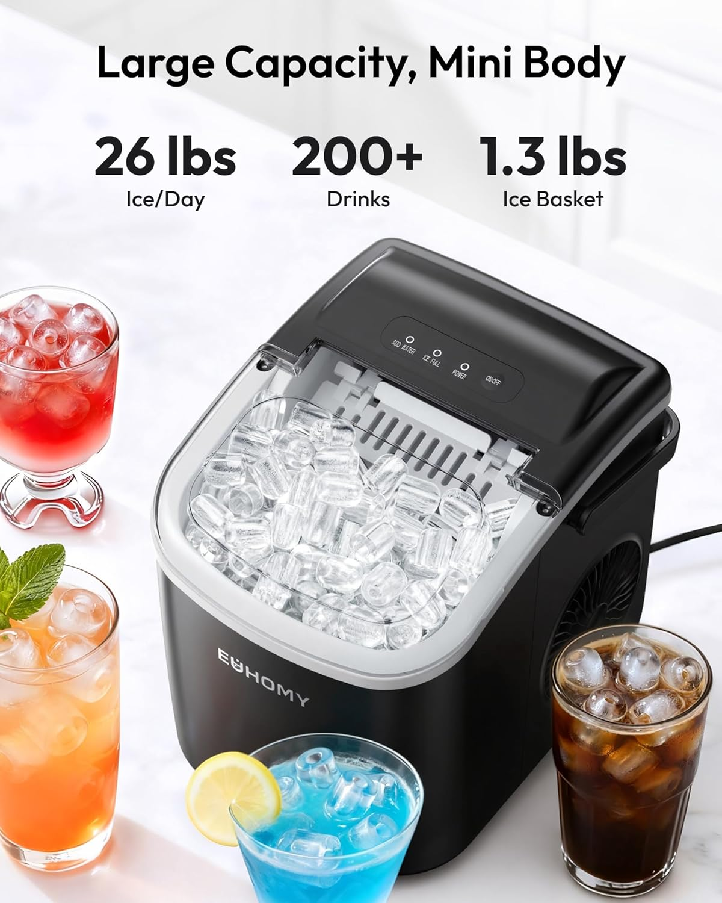

## 新图

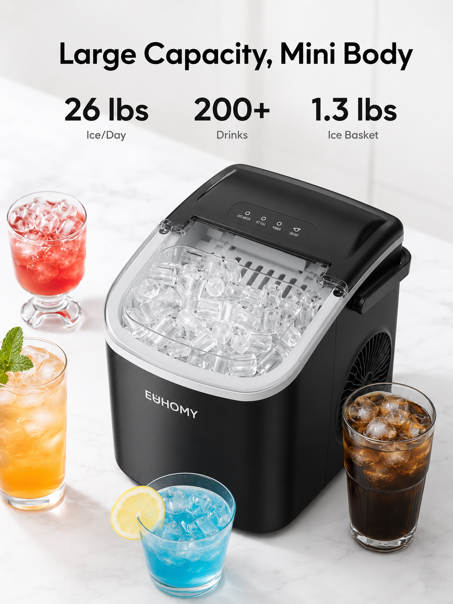

## 旧图主要问题

旧图同时出现：

- 蓝色大标题 "Make 26 Lbs Ice Daily"
- 大量冰块堆在机身周围
- 右侧蓝色标注的容量换算图
- 多个杯装饮料配图
- 冰块散落场景过于杂乱
- 整体像促销海报

## 新图改造逻辑

新图只表达：

```text
26 Lbs Daily Capacity
Ready for any gathering, big or small.
```

用整齐的多篮冰块展示容量。

## 新图优点

- 容量数字一目了然
- 多篮冰块作为证据
- 没有杂乱散落
- 没有容量换算的复杂标注
- 干净克制的排版

## 中文生成提示词

```text
生成一张 2048×2048 px 的 Amazon 副图，采用 Apple-inspired 极简高级电商产品图风格。

主题是制冰机的 26 磅日产冰量。

画面主体是一台黑色制冰机放在中间。产品前方整齐摆放了三个银灰色钢丝冰篮，每个冰篮都装满子弹形透明冰块。三个冰篮平行排列，冰块饱满有光泽。左侧和右侧各放一杯冰镇饮品（柠檬水杯和透明玻璃杯），作为使用场景点缀。浅灰白色台面，暖白背景。

顶部左侧黑色粗体大标题：

26 Lbs Daily Capacity

下方灰色副标题：

Ready for any gathering, big or small.

整体背景暖白，大面积留白，柔和自然光。冰块有真实光泽和冷冽感。不要蓝色标题条，不要蓝色色调，不要冰块杂乱散落，不要容量换算图标，不要促销风。
```

## English prompt

```text
Create a 2048x2048 Amazon secondary image in an Apple-inspired minimalist premium product image style.

The theme is 26 lbs daily ice capacity.

Hero product: a black ice maker in the center. In front of it, neatly arrange three silver wire ice baskets, each filled with clear bullet-shaped ice cubes. Baskets aligned, cubes plump with shine. Place one iced drink on the left (glass with lemon water) and one on the right (clear glass cup) as subtle scene accents. Light gray-white countertop, warm white background.

Top left bold black headline:

26 Lbs Daily Capacity

Below it, gray subtitle:

Ready for any gathering, big or small.

Overall: warm white background, generous negative space, soft natural light. Cubes have realistic shine and cold crispness. No blue title bars, no blue tint, no scattered ice cubes, no capacity conversion charts, no promotional style.
```

---

# 9. Case 04 · Removable Basket & Scoop

## 旧图

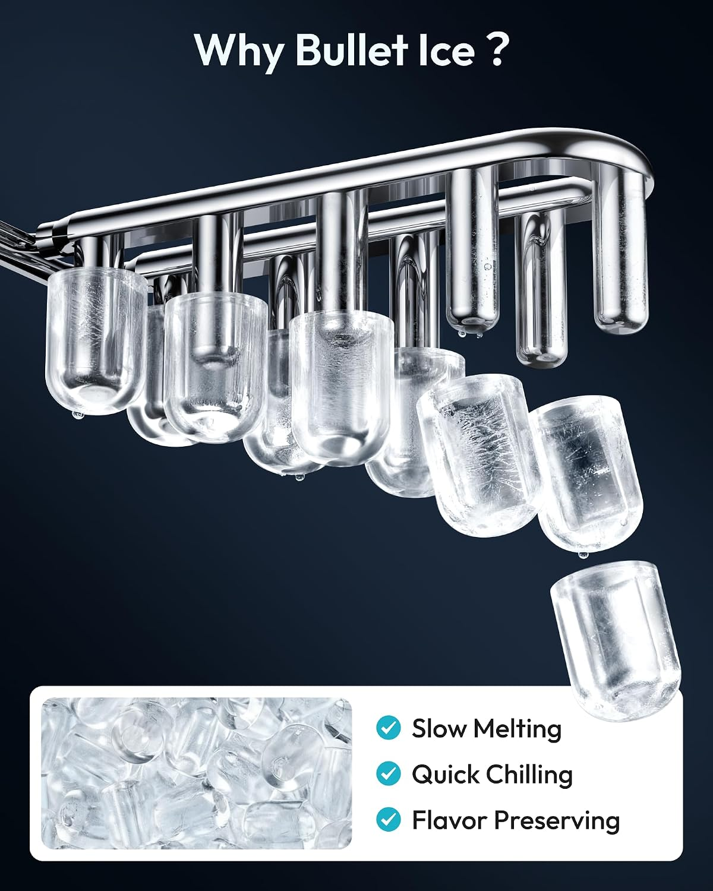

## 新图

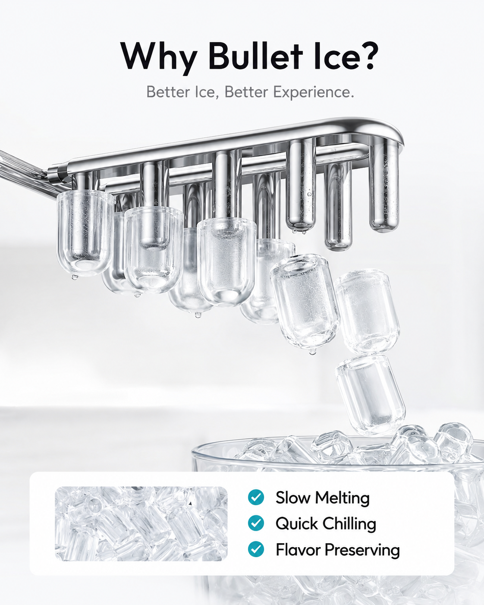

## 旧图主要问题

旧图同时出现：

- 蓝色大标题 "Removable Ice Basket and Scoop"
- 零件分解式展示（机身 + 冰篮 + 冰铲分开）
- 右侧蓝色箭头标注图
- 多个功能小图标
- 整体像产品拆装说明书

## 新图改造逻辑

新图只表达：

```text
Removable Basket & Scoop
Easy to transfer ice, easy to serve.
```

干净展示冰篮 + 冰铲 + 冰块，自然组合。

## 新图优点

- 冰篮冰铲成为视觉主体
- 冰块饱满真实
- 没有拆装箭头
- 没有多余小图标
- 高级棚拍质感

## 中文生成提示词

```text
生成一张 2048×2048 px 的 Amazon 副图，采用 Apple-inspired 极简高级电商产品图风格。

主题是制冰机的可拆卸冰篮和配套冰铲。

画面主体独立展示：一只银灰色钢丝冰篮放在中央，内装满子弹形透明冰块，一把白色塑料冰铲斜放在冰篮右侧，铲中盛有几颗冰块。整体排列自然，有取冰的真实感。浅灰白色台面，暖白背景。

顶部左侧黑色粗体大标题：

Removable Basket & Scoop

下方灰色副标题：

Easy to transfer ice, easy to serve.

整体背景暖白，大面积留白，柔和棚拍光线。冰块光泽真实，钢丝篮质感清晰。不要蓝色标题条，不要蓝色色调，不要分解式标注箭头，不要功能小图标，不要促销风。
```

## English prompt

```text
Create a 2048x2048 Amazon secondary image in an Apple-inspired minimalist premium product image style.

The theme is the removable ice basket and included ice scoop.

Hero composition: a silver wire ice basket in the center, filled with clear bullet-shaped ice cubes. A white plastic ice scoop rests diagonally on the right side of the basket, with a few cubes inside. Natural arrangement, feels like a real moment of serving ice. Light gray-white countertop, warm white background.

Top left bold black headline:

Removable Basket & Scoop

Below it, gray subtitle:

Easy to transfer ice, easy to serve.

Overall: warm white background, generous negative space, soft studio lighting. Realistic ice cube shine, clear wire basket texture. No blue title bars, no blue tint, no exploded-view arrows, no feature icons, no promotional style.
```

---

# 10. Case 05 · Two Ice Sizes (S & L)

## 旧图

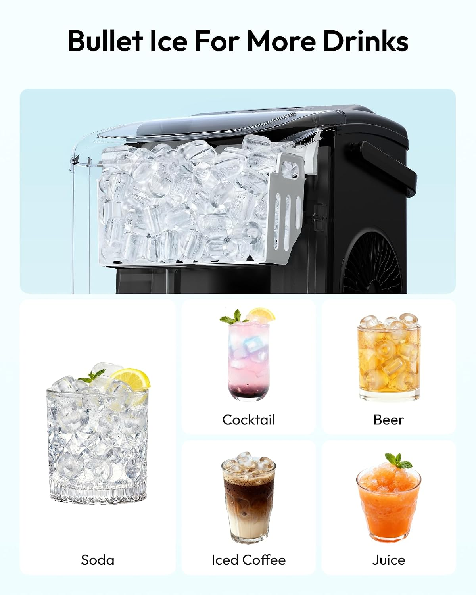

## 新图

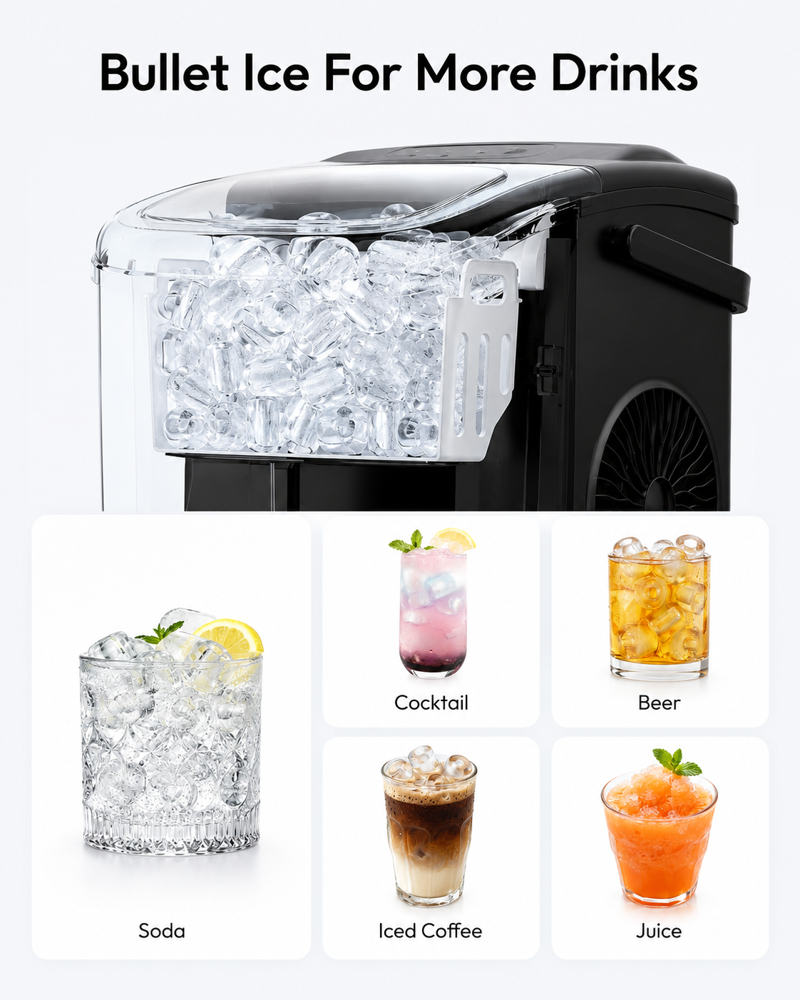

## 旧图主要问题

旧图同时出现：

- 蓝色大标题 "Selectable Two Ice Size (S/L)"
- S 和 L 两栏对比图
- 放大特写圆图标注
- 蓝色使用场景推荐表
- "饮料用 S / 冷冻食品用 L" 彩色说明
- 整体信息过于密集

## 新图改造逻辑

新图只表达：

```text
Two Ice Sizes
Small cubes for drinks, large cubes for chilling.
```

左右并排对比 S 和 L，干净利落。

## 新图优点

- S / L 对比一目了然
- 真实冰块大小对比
- 没有场景推荐表
- 没有放大圆形标注
- 高级对比构图

## 中文生成提示词

```text
生成一张 2048×2048 px 的 Amazon 副图，采用 Apple-inspired 极简高级电商产品图风格。

主题是两种冰块大小选择（S 和 L）。

画面采用左右对称对比构图。左侧：一只白色小碟，上面整齐摆放一小堆 S 型号子弹形冰块，冰块较小。右侧：一只同样的白色小碟，上面摆放 L 型号子弹形冰块，冰块明显更大。两碟对称，光线一致。

画面顶部中央黑色粗体大标题：

Two Ice Sizes

下方灰色副标题：

Small cubes for drinks, large cubes for chilling.

左侧碟子上方极简标签：
S
Small

右侧碟子上方极简标签：
L
Large

整体背景纯净暖白，大面积留白，柔和棚拍光线。冰块透明有光泽。不要蓝色标题条，不要蓝色色调，不要放大圆图标注，不要场景推荐表，不要促销风。
```

## English prompt

```text
Create a 2048x2048 Amazon secondary image in an Apple-inspired minimalist premium product image style.

The theme is two selectable ice sizes (S and L).

Symmetric left-right contrast composition. Left: a small white dish with a neat pile of S-sized bullet ice cubes. Right: the same style white dish with L-sized bullet ice cubes, visibly larger. Both dishes aligned, same lighting.

Top center bold black headline:

Two Ice Sizes

Below it, gray subtitle:

Small cubes for drinks, large cubes for chilling.

Minimal labels above each dish:
Left: S — Small
Right: L — Large

Overall: pure warm white background, generous negative space, soft studio lighting. Cubes are clear and glossy. No blue title bars, no blue tint, no magnifier insets, no usage recommendation tables, no promotional style.
```

---

# 11. Case 06 · Self-Cleaning

## 旧图

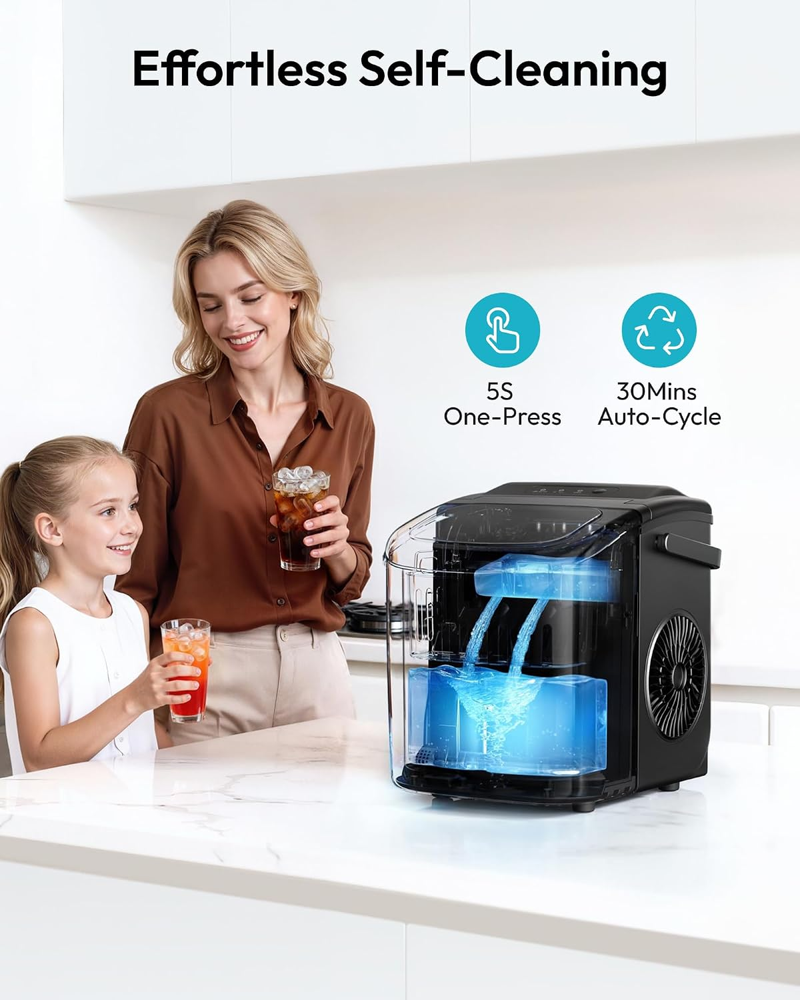

## 新图

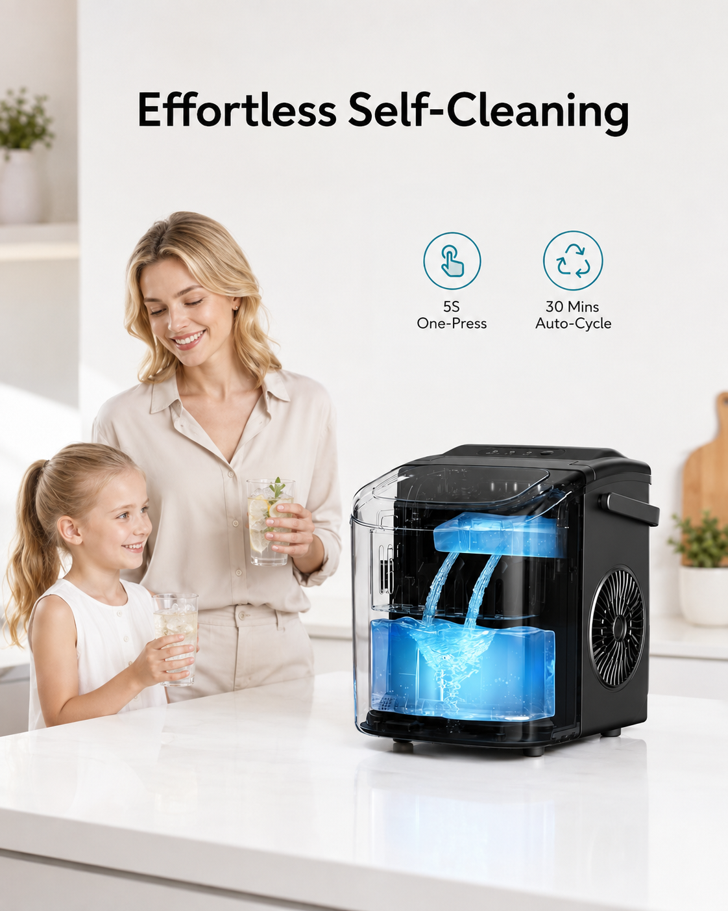

## 旧图主要问题

旧图同时出现：

- 蓝色大标题 "Self-Cleaning Function"
- 自清洁步骤 1→2→3 蓝色流程图
- 清洁剂 + 水流彩色图标
- 控制面板局部放大图
- 整体像用户手册

## 新图改造逻辑

新图只表达：

```text
Self-Cleaning
One-touch maintenance, effortlessly clean.
```

只显示控制面板的 Self-Clean 按钮特写。

## 新图优点

- 一触即达的卖点清晰
- 没有多步骤流程图
- 没有清洁剂图标
- 简洁特写适合扫读
- 高级棚拍质感

## 中文生成提示词

```text
生成一张 2048×2048 px 的 Amazon 副图，采用 Apple-inspired 极简高级电商产品图风格。

主题是制冰机的自清洁功能。

画面主体是黑色控制面板的特写，横向居中。面板上有几个按钮：电源键、冰块大小 S/L 切换键、自清洁键（标有 "Self-Clean"），以及 LED 指示灯。按键为黑色哑光质感，指示灯有轻微亮斑。

顶部黑色粗体大标题：

Self-Cleaning

下方灰色副标题：

One-touch maintenance, effortlessly clean.

整体背景纯净浅灰色。不要蓝色标题条，不要蓝色色调，不要步骤流程图，不要清洁剂图标，不要多步骤说明，不要促销风。
```

## English prompt

```text
Create a 2048x2048 Amazon secondary image in an Apple-inspired minimalist premium product image style.

The theme is the self-cleaning function.

Hero: a close-up of the black control panel, horizontally centered. Buttons on the panel: Power, Ice Size (S / L toggle), Self-Clean button (labeled "Self-Clean"), and LED indicators. Matte black buttons with subtle indicator highlights.

Top bold black headline:

Self-Cleaning

Below it, gray subtitle:

One-touch maintenance, effortlessly clean.

Overall: pure light gray background. No blue title bars, no blue tint, no step flowcharts, no cleaning agent icons, no multi-step instructions, no promotional style.
```

---

# 12. Case 07 · Quiet Operation

## 旧图

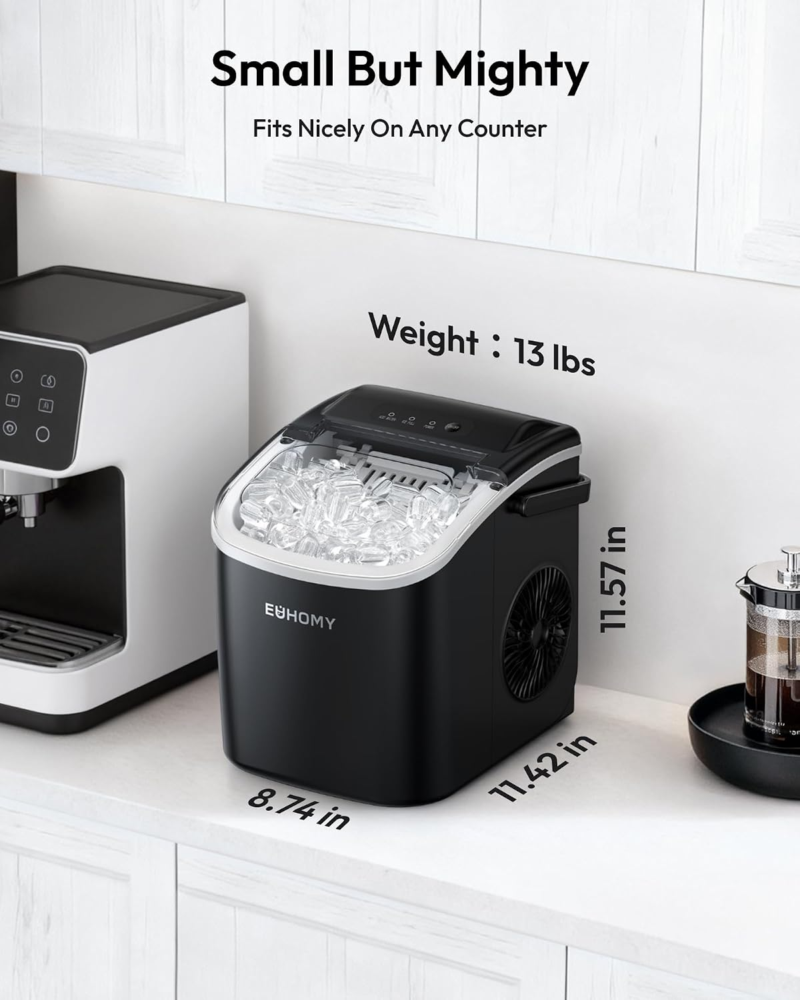

## 新图

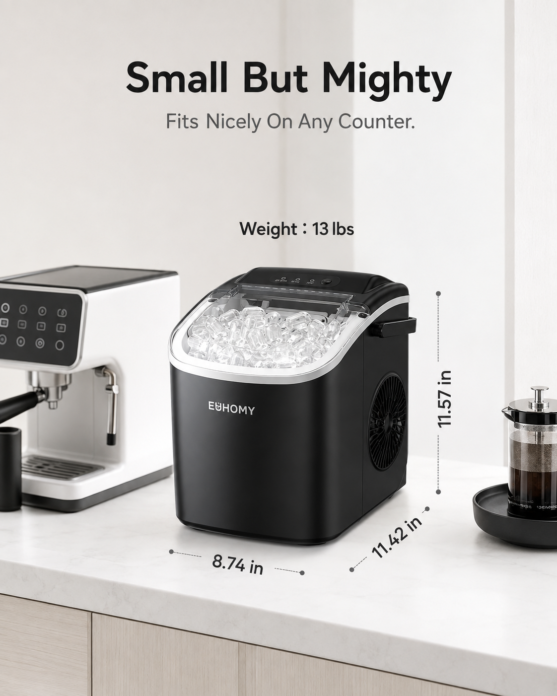

## 旧图主要问题

旧图同时出现：

- 蓝色大标题 "Quiet Ice Making"
- 蓝色分贝计图标 + 45dB 数值
- "像图书馆一样安静"的比喻插图
- 卧室场景小图
- 多个声音波浪图标
- 整体像降噪耳机广告

## 新图改造逻辑

新图只表达：

```text
Quiet Operation
Enjoy fresh ice without the noise.
```

干净厨房场景 + 极简参数卡片。

## 新图优点

- 产品在安静场景中自然展示
- 参数简洁
- 没有分贝计和声音波浪
- 没有图书馆比喻
- 高级商业摄影质感

## 中文生成提示词

```text
生成一张 2048×2048 px 的 Amazon 副图，采用 Apple-inspired 极简高级电商产品图风格。

主题是制冰机的静音运行。

画面主体是一台黑色制冰机放在干净的现代厨房台面上。台面为浅色石材，背景是暖白墙面，旁边只有极简点缀：一只玻璃水杯、一盆小绿植。整体安静、整洁。柔和自然光从左窗照入。

顶部左侧黑色粗体大标题：

Quiet Operation

下方灰色副标题：

Enjoy fresh ice without the noise.

右下角浅灰边框圆角卡片：

≤ 45 dB
Whisper-quiet performance

整体色调暖白、浅灰、黑色。不要蓝色标题条，不要蓝色色调，不要分贝计图标，不要声音波浪图标，不要图书馆插图，不要卧室场景图，不要促销风。
```

## English prompt

```text
Create a 2048x2048 Amazon secondary image in an Apple-inspired minimalist premium product image style.

The theme is quiet operation.

Hero: a black ice maker on a clean modern kitchen counter. Light stone countertop, warm white wall. Minimal accents only: a glass of water, a tiny potted plant. Scene is calm, tidy. Soft natural light from left window.

Top left bold black headline:

Quiet Operation

Below it, gray subtitle:

Enjoy fresh ice without the noise.

Lower-right light gray bordered rounded card:

≤ 45 dB
Whisper-quiet performance

Overall palette: warm white, light gray, black. No blue title bars, no blue tint, no decibel-meter icons, no sound wave icons, no library metaphors, no bedroom scene insets, no promotional style.
```

---

# 13. Case 08 · Portable Handle

## 旧图

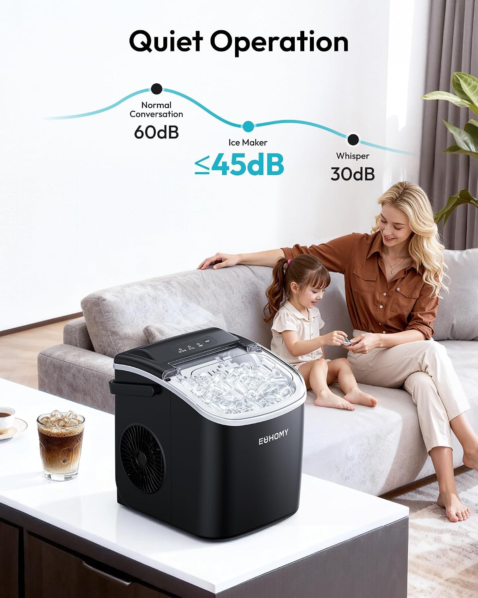

## 新图

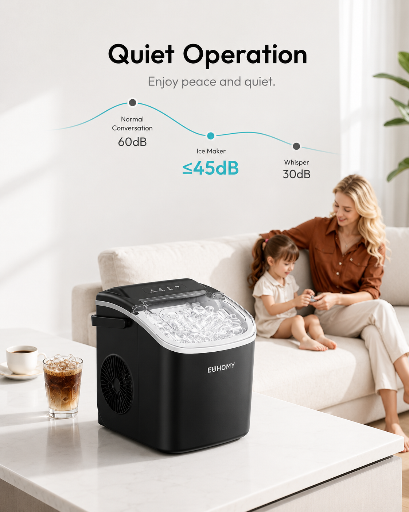

## 旧图主要问题

旧图同时出现：

- 蓝色大标题 "Portable Design with Handle"
- 多场景搬运示意图（厨房 → 阳台 → RV）
- 蓝色路径箭头
- 多个使用场景小图
- 手柄局部放大圆图
- 整体像搬家指南海报

## 新图改造逻辑

新图只表达：

```text
Portable Handle
Take cold drinks anywhere.
```

真实手握手柄的场景，一句文案。

## 新图优点

- 手柄成为视觉焦点
- 手握动作自然直观
- 没有多场景箭头路径
- 没有放大圆图
- 高级商业摄影质感

## 中文生成提示词

```text
生成一张 2048×2048 px 的 Amazon 副图，采用 Apple-inspired 极简高级电商产品图风格。

主题是制冰机的便携手柄。

画面主体是一台黑色制冰机，一位穿着浅灰色上衣的人（只露出手臂和手）正用一只手握住侧面的便携手柄，另一只手在机身下方辅助支撑。动作自然，像要把制冰机从台面上拿起或移动。机身正面略朝镜头。场景为浅色台面 + 暖白背景。

顶部左侧黑色粗体大标题：

Portable Handle

下方灰色副标题：

Take cold drinks anywhere.

右下角浅灰边框圆角卡片：

Built-in side handle
Easy to move

整体背景暖白，大面积留白，柔和自然光。不要蓝色标题条，不要蓝色色调，不要多场景搬运示意图，不要路径箭头，不要放大圆图，不要促销风。
```

## English prompt

```text
Create a 2048x2048 Amazon secondary image in an Apple-inspired minimalist premium product image style.

The theme is the portable handle.

Hero: a black ice maker with a person (arm and hand only, in light gray top) naturally gripping the built-in side handle, while the other hand supports under the body. Movement is as if lifting or moving the ice maker. Product front faces slightly toward camera. Light counter + warm white wall.

Top left bold black headline:

Portable Handle

Below it, gray subtitle:

Take cold drinks anywhere.

Lower-right light gray bordered rounded card:

Built-in side handle
Easy to move

Overall: warm white background, generous negative space, soft natural light. No blue title bars, no blue tint, no multi-scene transport diagrams, no path arrows, no magnifier insets, no promotional style.
```

---

# 14. Case 09 · Transparent Window

## 旧图

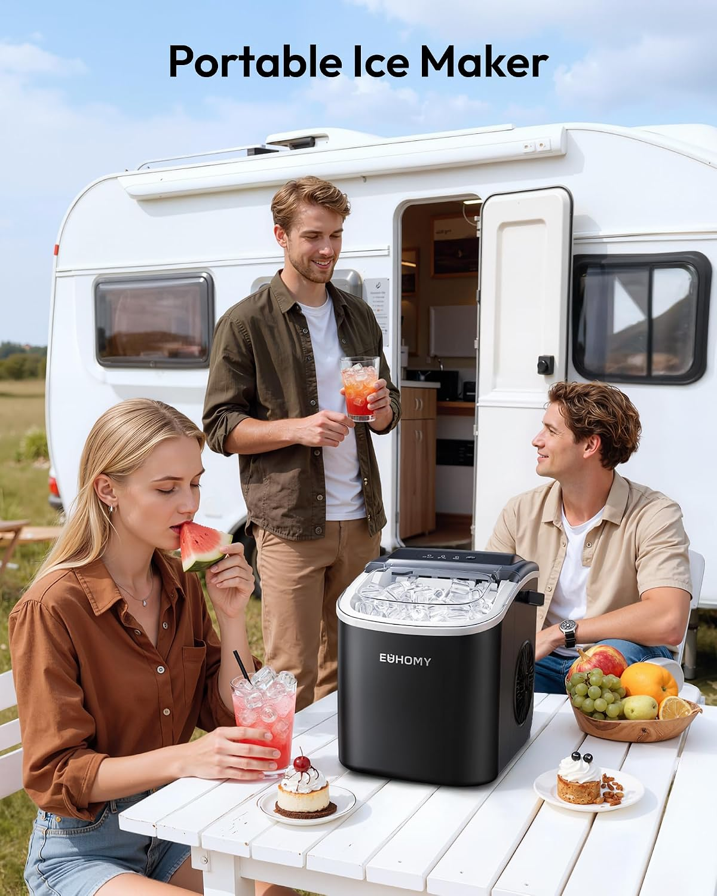

## 新图

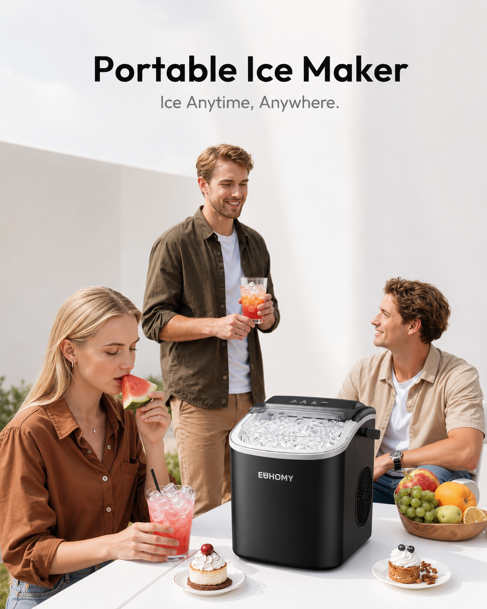

## 旧图主要问题

旧图同时出现：

- 蓝色大标题 "Transparent Observation Window"
- 观察窗放大圆图
- 内部制冰过程分帧小图（水→冰→冰篮满）
- 蓝色流程箭头
- 观察窗尺寸标注
- 整体像产品说明书

## 新图改造逻辑

新图只表达：

```text
Transparent Window
Watch ice being made, right before your eyes.
```

从上方俯拍透明上盖 + 内部清晰冰块。

## 新图优点

- 透过透明盖的内部清晰可见
- 真实俯视角度，自然直观
- 没有分帧过程图
- 没有流程箭头
- 高级棚拍质感

## 中文生成提示词

```text
生成一张 2048×2048 px 的 Amazon 副图，采用 Apple-inspired 极简高级电商产品图风格。

主题是制冰机的透明观察窗。

画面主体是一台黑色制冰机，采用正上方俯视角度拍摄。透明上盖清晰可见，透过盖子可以清楚看到内部的子弹形冰块正在形成中，以及冰篮布局。透明盖表面有自然柔和的反光，但不遮挡内部视线。产品顶部完整、细节清晰。

顶部黑色粗体大标题：

Transparent Window

下方灰色副标题：

Watch ice being made, right before your eyes.

整体背景纯净暖白，大面积留白，柔和均匀的棚拍光线，透明盖反光真实。不要蓝色标题条，不要蓝色色调，不要观察窗放大圆图，不要分帧过程图，不要流程箭头，不要尺寸标注，不要促销风。
```

## English prompt

```text
Create a 2048x2048 Amazon secondary image in an Apple-inspired minimalist premium product image style.

The theme is the transparent observation window.

Hero: a black ice maker, shot from a clean top-down angle. The transparent lid is clearly visible. Through the lid, you can clearly see bullet-shaped ice cubes forming inside and the ice basket layout. The transparent lid surface has natural soft reflections without blocking the view. Product top details are complete and sharp.

Top bold black headline:

Transparent Window

Below it, gray subtitle:

Watch ice being made, right before your eyes.

Overall: pure warm white background, generous negative space, soft even studio lighting, realistic transparent lid reflections. No blue title bars, no blue tint, no window magnifier insets, no frame-by-frame process diagr ams, no flow arrows, no dimension annotations, no promotional style.
```

---

# 15. 九张旧图与新图的整体区别

## 15.1 标题条

### 旧图

```text
每张图都有蓝色大标题条 + 蓝色副标题
蓝色成为第一视觉，产品反而弱
```

### 新图

```text
黑色粗体主标题 + 灰色副标题
文字是信息，不是装饰
产品是视觉主体
```

---

## 15.2 色彩

### 旧图

```text
蓝色标题
彩色图标
蓝色色调照片
实心蓝色徽章
```

### 新图

```text
暖白
米白
浅灰
黑色（文字 / 机身）
银色（冰篮 / 冰块光泽）
透明（上盖）
```

---

## 15.3 构图

### 旧图

```text
大横幅
彩色边框分区
多个杂乱尺寸箭头
步骤拼图
分帧过程图
```

### 新图

```text
大面积留白
产品 Hero
简洁圆角卡片
统一尺寸标尺
真实棚拍光线
```

---

## 15.4 文字层级

### 旧图

```text
蓝色大标题
蓝色副标题
大量步骤说明
小字参数
彩色标签
```

### 新图

```text
黑色粗体主标题
灰色副标题
必要数字
极简标签辅助
```

---

# 16. 新图最明显的 8 个优点

## 1. 更快扫读

Amazon 用户不会逐字阅读副图。
新图大标题 + 大数字，3 秒理解卖点。

## 2. 更适合手机端

黑色粗体大标题 + 灰色副标题 + 大面积留白，在手机上更清爽。

## 3. 产品更高级

黑色机身和透明盖最重要的是质感和反光。新图给产品更多展示空间。

## 4. 冰块更真实

冰块作为核心视觉证据，光泽和冷冽感在新图中被重点强调。

## 5. 图片之间风格统一

九张图统一使用暖白浅灰背景、黑色无衬线字体、柔和自然光，放在 Listing 中像一套完整品牌视觉。

## 6. 更容易模板化

Case 04 冰篮 + 配件结构可迁移到：nugget ice maker 配件、wine cooler 配件、countertop appliance 配件展示等。

## 7. 更适合开源提示词案例

新图可以直接拆成：产品主体 / 卖点 / 场景 / 信息模块 / 排版 / 光线 / 负面要求。

## 8. 更适合后续做视频

这九张图已经天然形成视频脚本：

```text
01 产品全貌 → 02 6分钟快速出冰 → 03 26磅容量 → 04 冰篮与冰铲
→ 05 两种冰块大小 → 06 自清洁 → 07 静音运行 → 08 便携手柄 → 09 透明观察窗
```

---

# 17. 新手怎么把旧图变成这种新图

## 第一步：上传旧图

不要先写长提示词。先上传一组旧 Amazon 副图。

## 第二步：让 AI 先识别旧图

```text
分析这组 Amazon 制冰机副图。
请告诉我：1.这是什么产品 2.每张图核心卖点 3.哪些参数必须保留
4.哪些文字可以删除 5.哪些元素杂乱 6.改成极简商品图每张图只保留什么
```

## 第三步：输入风格口令

```text
Apple-inspired minimalist premium product image style
```

## 第四步：每张图只保留一个卖点

## 第五步：要求 AI 先写最终生图提示词

## 第六步：检查提示词

产品是否改型？控制面板按钮对不对？参数有没有写错？

## 第七步：生成

## 第八步：二次修正

---

# 18. 可复用提示词公式

```text
[目标尺寸]
+
[平台与图片类型]
+
[风格]
+
[产品主体]
+
[必须保持的产品结构]
+
[一个核心卖点]
+
[真实使用场景]
+
[允许出现的文字]
+
[极简信息模块]
+
[背景]
+
[光线]
+
[材质]
+
[构图]
+
[负面要求]
```

---

# 19. 质量检查清单

## 产品

- [ ] 制冰机类型正确（countertop，不是 built-in / undercounter）
- [ ] 黑色机身正确
- [ ] 透明上盖正确
- [ ] 侧面散热格栅正确
- [ ] 冰篮钢丝结构正确
- [ ] 控制面板按钮布局合理
- [ ] 便携手柄位置正确（侧面）

## 功能

- [ ] 6 分钟首冰没有写成其他数字
- [ ] 26 lbs / 24h 没有写错
- [ ] 尺寸 14.3" / 11.4" / 13.5" 没有写错
- [ ] 冰块形状为子弹形 bullet-shaped
- [ ] S / L 两种大小关系正确
- [ ] 噪音 ≤ 45 dB 没有写错
- [ ] Self-Clean 按钮存在

## 视觉

- [ ] 主标题清晰
- [ ] 副标题清晰
- [ ] 没有乱码
- [ ] 没有多余小字
- [ ] 没有蓝色横幅
- [ ] 没有蓝色色调
- [ ] 没有杂乱图标
- [ ] 产品是主视觉
- [ ] 留白充足
- [ ] 整套风格统一

---

# 20. GitHub 推荐目录

```text
cases/
└── appliances/
    └── ice-makers/
        ├── README.md
        └── countertop-ice-maker/
            ├── README.md
            ├── case-001-countertop-ice-maker-bilingual.md
            ├── CHANGELOG_v0.0.1.md
            └── images/
                ├── 01-old/
                │   ├── 1.png  (Product Overview)
                │   ├── 2.png  (6-Min Fast Ice Making)
                │   ├── 3.png  (26 Lbs Daily Capacity)
                │   ├── 4.png  (Removable Basket & Scoop)
                │   ├── 5.png  (Two Ice Sizes)
                │   ├── 6.png  (Self-Cleaning)
                │   ├── 7.png  (Quiet Operation)
                │   ├── 8.png  (Portable Handle)
                │   └── 9.png  (Transparent Window)
                └── 02-new/
                    ├── 1.png ~ 9.png
```

---

# 21. 关于图片尺寸

本案例的**目标生图尺寸**是：

```text
2048 × 2048 px
1:1 square
```

> 提示词按 2048×2048 Amazon 副图目标编写；实际发布时优先保存原始 2048×2048 生成文件。

---

# 22. 开源说明

本案例用于 AI 电商生图学习、Prompt 结构研究、Amazon 副图视觉改造教程。

```text
Apple-inspired = 学习极简产品页的通用视觉语言
```

不建议复制 Apple 官方图片、使用 Apple Logo、复制具体页面。建议公开案例使用：

```text
generic product
unbranded product
brand removed
logo removed
```

---

# 23. 最终总结

这次改造最重要的不是"把旧图变漂亮"，而是建立一套可复用的方法：

```text
旧图负责提供事实
↓ AI 识别卖点
↓ 人工决定单图核心信息
↓ 风格口令负责视觉语言
↓ 结构化提示词负责生成
↓ 人工检查产品和参数
↓ 形成可复用案例
```

最核心原则：

> **不要让 AI 自动决定一张图表达多少信息。**

对于本案例：

```text
图 01 = Product Overview
图 02 = 6-Min Fast Ice Making
图 03 = 26 Lbs Daily Capacity
图 04 = Removable Basket & Scoop
图 05 = Two Ice Sizes (S & L)
图 06 = Self-Cleaning
图 07 = Quiet Operation
图 08 = Portable Handle
图 09 = Transparent Window
```

这就是从"蓝色标题 + 杂乱 Amazon 副图"升级成"极简高级电商产品视觉"的完整逻辑。
